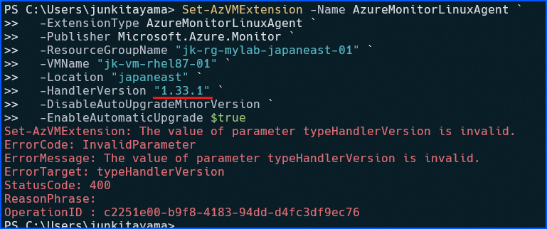
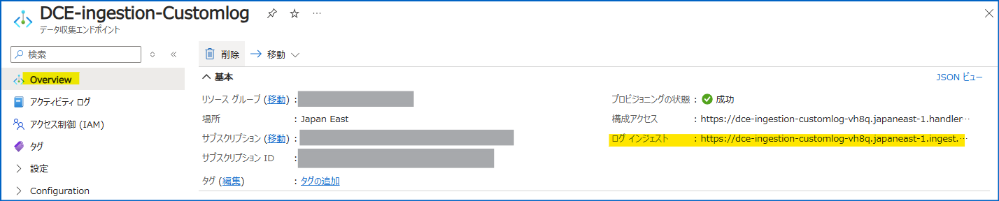
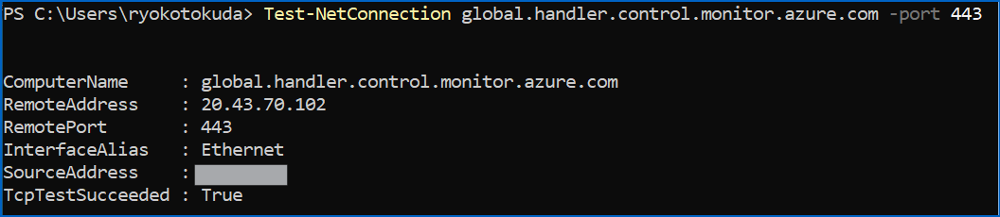
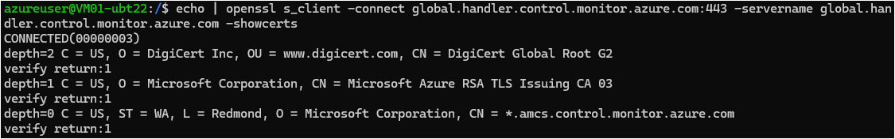
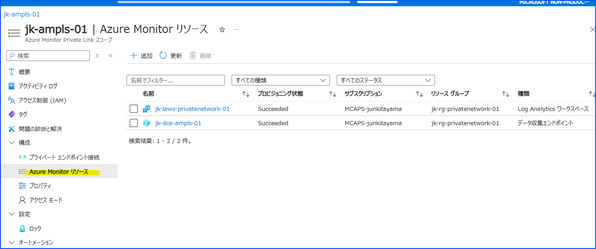
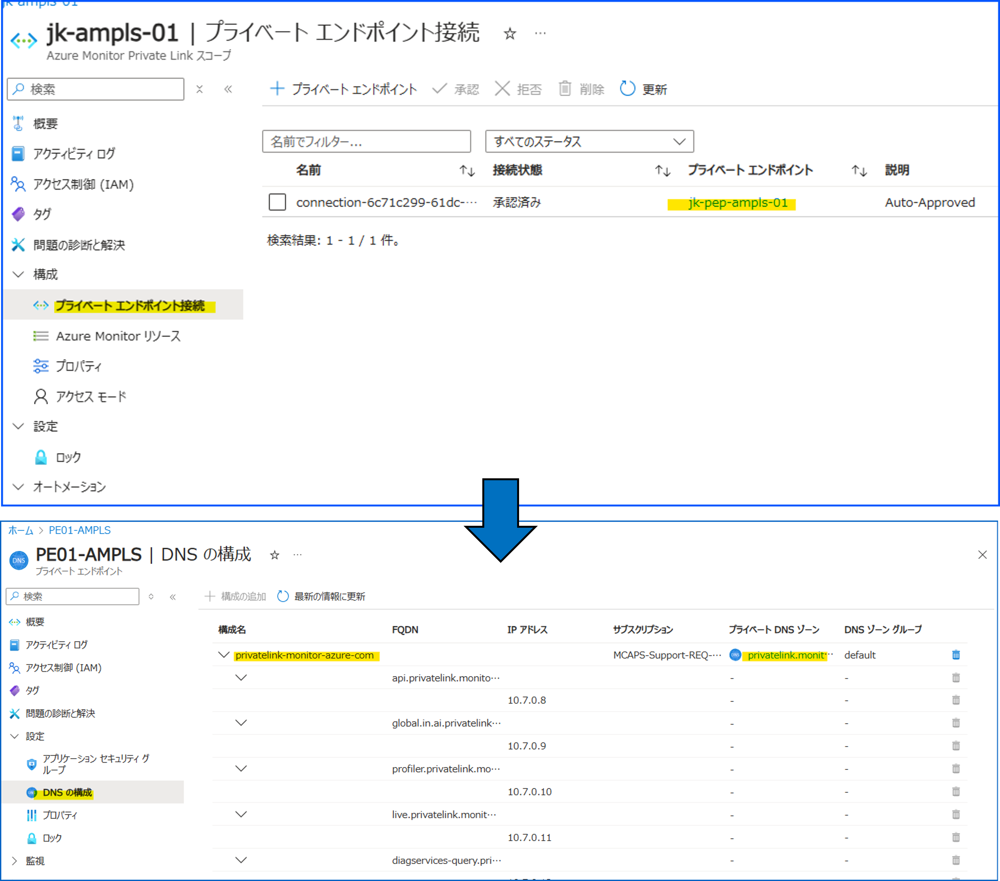
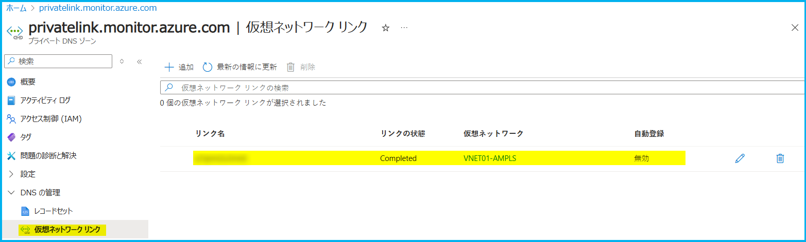
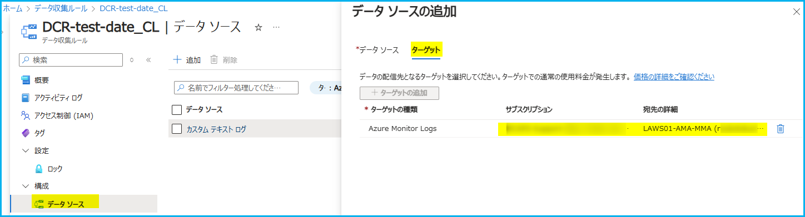

こんにちは、Azure Monitoring チームの徳田です。

Azure Monitor エージェントを使用したログ収集を行っている場合、Log Analytics ワークスペースには、Heartbeat と呼ばれるログが 1 分毎に収集されます。
この Heartbeat はマシンの死活監視にも使用されることがありますが、何らかの理由でこの Heartbeat が収集されないことがあります。
Heartbeat が収集できていない場合は、ログ収集設定以前もところで問題が発生していることも多く、その場合は、Heartbeat 以外のログ収集も停止してしまいます。

今回は、Heartbeat をはじめとしたログが収集されないときの、はじめのトラブルシューティング方法をご紹介します。

## 目次
- [はじめに](#はじめに)
- [サポート対象 OS の確認](#サポート対象-os-の確認)
- [マシンの起動状態の確認](#マシンの起動状態の確認)
    - [確認方法](#確認方法)
    - [マシンが起動していないときの対処方法](#マシンが起動していないときの対処方法)
- [Azure Monitor エージェントの状態の確認](#azure-monitor-エージェントの状態の確認)
    - [確認方法](#確認方法-1)
    - [Azure Monitor エージェントが正常に稼働していない場合の対処方法](#azure-monitor-エージェントが正常に稼働していない場合の対処方法)
- [通信要件の確認](#通信要件の確認)
    - [確認方法](#確認方法-2)
    - [エンドポイントへ接続できていない場合の対処方法](#エンドポイントへ接続できていない場合の対処方法)
- [通信要件の確認 (AMPLS を使用している場合)](#通信要件の確認-ampls-を使用している場合)
- [データ収集ルールの設定の確認](#データ収集ルールの設定の確認)
    - [確認方法](#確認方法-3)
    - [マシンとデータ収集ルールを関連付いていない場合の対処方法](#マシンとデータ収集ルールを関連付いていない場合の対処方法)
    - [ログ送信先となる Log Analytics ワークスペースを設定/変更する方法](#ログ送信先となる-log-analytics-ワークスペースを設定変更する方法)
- [マネージド ID の設定の確認](#マネージド-id-の設定の確認)
    - [確認方法](#確認方法-4)
    - [システム割り当てマネージド ID が割り当てられていないときの対処方法](#システム割り当てマネージド-id-が割り当てられていないときの対処方法)
- [おわりに](#おわりに)

## はじめに
Azure Monitor を使用したログ収集が行われない場合の要因は多岐にわたります。  
以下では、その中でもよくある原因の特定とその対処方法をご案内します。

## サポート対象 OS の確認
ご利用中のマシンの OS において Azure Monitor エージェントの利用がサポートされていない場合、当仮想マシン上でのエージェントの正常な動作は保証されておりません。  
そのため、まずはじめに、使用している OS が Azure Monitor エージェントのサポート対象であるかをご確認ください。  

Azure Monitor エージェントがサポートする OS は、以下公開情報にてご確認いただけます。  

[Azure Monitor エージェントでサポートされるオペレーティング システムと環境](https://learn.microsoft.com/ja-jp/azure/azure-monitor/agents/azure-monitor-agent-supported-operating-systems)

## マシンの起動状態の確認
サポート対象であることが分かったのち、次に確認すべきことは、マシンが正常に起動した状態であるかです。
マシンが起動していない場合は、ログ収集が行われません。  

### 確認方法
Azure portal では、対象のマシンの [概要] ページ内の "基本" > "状態" からご確認いただけます。

### マシンが起動していないときの対処方法
マシンが起動されていない場合 ("状態" が "停止済み" となっている場合) は、対象のマシンの [概要] ページ内の [開始] ボタンより起動させ、ログ収集が再開するかどうかをご確認ください。

## Azure Monitor エージェントの状態の確認
マシンが問題なく起動していても、Azure Monitor エージェントが正常に稼働しておらず、ログ収集が行われない場合があります。  

### 確認方法
Azure portal で対象のマシンを開き、左ペインの [設定] > [拡張機能とアプリケーション] を開きます。   
Linux の場合は "AzureMonitorLinuxAgent"、Windows の場合は "AzureMonitorWindowsAgent" の "状態" が "Provisioning Succeeded" となっている場合は、Azure Monitor エージェントが正常に稼働していることを意味します。

### Azure Monitor エージェントが正常に稼働していない場合の対処方法
- Azure Monitor エージェントの状態が "Provisioning Succeeded" になっていない場合は、一度マシン自体を再起動し、しばらく待って "Provisioning Succeeded" になるかをご確認ください。  
- それでも "Provisioning Succeeded" とならない場合は、下記の手順で、エージェントの再インストール をお試しください。これにより事象が解決する場合があります。

■ Azure Monitor エージェントの再インストール手順
1. Azure portal で対象のマシンを開き、左ペインの [拡張機能とアプリケーション] を開きます。
2. "種類" に "AzureMonitorLinuxAgent" (Linux の場合)、または "AzureMonitorWindowsAgent" (Windows の場合) が含まれるものを押下し、右ペインの [アンインストール] を押下します。
3. 2 のアンインストールの完了が確認出来たら、以下のコマンドを実行します。
    * <> の箇所はお客様の環境に合わせてご変更ください。実行時、<> は不要です
    * 自動アップグレード機能を有効化したくない場合は、`-EnableAutomaticUpgrade $true` を削除して実行してください。  
    * `-HandlerVersion` としてマイナー バージョンまでを指定することはできません。
      詳細については、本手順末尾の `インストール可能なバージョンの確認方法とコマンドでのバージョンの指定方法` をご参照ください。

    (Linux の場合)
   ```
   Set-AzVMExtension -Name AzureMonitorLinuxAgent -ExtensionType AzureMonitorLinuxAgent -Publisher Microsoft.Azure.Monitor -ResourceGroupName <resourcegroup-name> -VMName <vm-name> -Location <region-name> -HandlerVersion <version> -DisableAutoUpgradeMinorVersion -EnableAutomaticUpgrade $true
   ```

   (Windows の場合)
   ```
   Set-AzVMExtension -Name AzureMonitorWindowsAgent -ExtensionType AzureMonitorWindowsAgent -Publisher Microsoft.Azure.Monitor -ResourceGroupName <resourcegroup-name> -VMName <vm-name> -Location <region-name> -HandlerVersion <version> -DisableAutoUpgradeMinorVersion -EnableAutomaticUpgrade $true
   ```
4. 1 の  [拡張機能とアプリケーション]  にて、Azure Monitor エージェントの "状態" が "Provisioning Succeeded" となれば、完了です。  

> [!NOTE] インストール可能なバージョンの確認方法とコマンドでのバージョンの指定方法  
> - 使用可能なエージェントのバージョンの一覧は、以下の PowerShell コマンドを実行することで確認できます。  
  (`<region>` には、マシンが存在するリージョンを指定してください。)
> ```  
> # Windows の場合
> ((Get-AzVMExtensionImage -Location "<region>" -PublisherName "Microsoft.Azure.Monitor" -Type "AzureMonitorWindowsAgent").Version | Sort-Object -Property { [Version]$_})  
>  
> # Linux の場合  
> ((Get-AzVMExtensionImage -Location "<region>" -PublisherName "Microsoft.Azure.Monitor" -Type "AzureMonitorLinuxAgent").Version | Sort-Object -Property { [Version]$_})
> ```  
> - 注意点として、コマンドを使用して Azure Monitor エージェントをインストールする場合、マイナー バージョンは指定することができかねます。  
> 例えばもし 1.31.1 をご指定いただいた場合、下図のように `The value of parameter typeHandlerVersion is invalid.` のエラーが発生します。  
> そのため、必ずマイナーバージョン ("1.xx.y" の ".y" の部分) を削除した状態で拡張機能のバージョンをご指定ください。 
> 

## 通信要件の確認
マシンにインストールされた Azure Monitor エージェントがマシンのログを Log Analytics ワークスペースに送信したい場合は、マシン (Azure Monitor エージェント) が必要なエンドポイントへ接続できるよう設定する必要があります。  

接続できる必要のあるエンドポイントは以下の通りです。  
(`<>` で囲まれた箇所は環境に合わせて変更してください。実行時に `<>` は不要です。)  

`global.handler.control.monitor.azure.com`  

`<virtual-machine-region-name>.handler.control.monitor.azure.com` 

`<log-analytics-workspace-id>.ods.opinsights.azure.com`  

Log Analytics ワークスペース内のカスタム ログ テーブルにデータを送信する場合は、以下のエンドポイントへの接続も必要です。   

`<data-collection-endpoint>.<virtual-machine-region-name>.ingest.monitor.azure.com`  

＊ `<data-collection-endpoint>` の値は、使用しているデータ収集ルールに設定しているデータ収集エンドポイントを Azure portal で開き、[概要] の "ログ インジェスト" を確認してください。  
   こちらに記載されている値から "https://" を除いたものがエンドポイントです。  
   

### 確認方法
上記エンドポイントへ接続できているかどうかは、以下の方法で確認可能です。  

**■ Windows の場合**  
PowerShell を開き、以下のコマンドを実行し、出力結果に `TcpTestSucceeded : True` が記載されていれば、エンドポイントに接続できています。  
( `<endpoint>` の箇所は、上記のエンドポイントのうち確認したいものに置き換えてください)
```
Test-NetConnection <endpoint> -port 443
```  
(結果例)  


**■ Linux の場合**  
ターミナルを開き、以下のコマンドを実行し、出力結果に `CONNECTED` が記載されていれば、エンドポイントに接続できています。  

```
echo | openssl s_client -connect <endpoint>:443 -servername <endpoint> -showcerts
```  
(結果例)  


### エンドポイントへ接続できていない場合の対処方法  
**エンドポイントへの接続を許可する**  
まずはネットワーク構成を確認し、エンドポイントへの接続を拒否するような設定が適用されていないかを確認してください。  
プロキシ サーバーやファイアウォールが設置されている場合は、これらの設定により、上記のエンドポイントへの接続が拒否されている可能性があります。

**名前解決の問題を解消する**  
上記のコマンドの実行結果で以下のように表示された場合は、何らかの要因でエンドポイントの名前解決に失敗しています。  
- Windows の場合：`RemoteAddress` が空欄
- Linux の場合：`Name or service not known` が表示される  

このように名前解決に失敗している場合は、お客様環境の DNS 構成の見直しをご検討ください。  
また、[AMPLS (Azure Monitor Private Link Scope)](https://learn.microsoft.com/ja-jp/azure/azure-monitor/logs/private-link-security) を使用している場合は、後述の[通信要件の確認 (AMPLS を使用している場合)](#通信要件の確認-ampls-を使用している場合)をご確認ください。

(ご参考)  
Azure Monitor エージェントを使用する上でのネットワーク要件については、以下の弊社公開情報でもご案内しています。  
[Azure Monitor エージェントのネットワーク構成](https://learn.microsoft.com/ja-jp/azure/azure-monitor/agents/azure-monitor-agent-network-configuration?tabs=PowerShellWindows)


## 通信要件の確認 (AMPLS を使用している場合)  
上記 `通信要件の確認` ではログ収集のために接続が必要なエンド ポイントを紹介しました。  
[AMPLS (Azure Monitor Private Link Scope)](https://learn.microsoft.com/ja-jp/azure/azure-monitor/logs/private-link-security) を使用している場合、名前解決の結果 Global IP への通信を試みてしまい、結果、必要なエンドポイントに接続できていない可能性もございます。  
AMPLS に関連するエンドポイントへの接続失敗のよくある原因といたしましては、下記の 2 点が考えられます。  
以下に、それぞれの確認方法と対処法をご紹介します。

### 原因 A: AMPLS に対して、Log Analytics ワークスペースやデータ収集エンドポイントが追加出来ていない  
**確認方法**  
Azure portal から、当該 AMPLS リソースの [構成] > [Azure Monitor リソース] よりご確認可能です。  


**対処方法**  
もし[通信要件の確認](#通信要件の確認) で紹介したエンドポイントが追加出来ていない場合は、[+ 追加] からこれらのエンドポイントの追加をお願いします。  

### 原因 B: AMPLS のプライベート エンドポイントに紐づくプライベート DNS ゾーンの設定がおかしい  
お客様環境によっては、AMPLS のためのプライベート DNS ゾーンが作成されます。  
＊ privatelink.monitor.azure.com や privatelink.ods.opinsights.azure.com などです。

これらのプライベート DNS ゾーンには、AMA がインストールされたマシンに関係する VNET (仮想ネットワーク) をリンクさせる必要があります。  
(例えば、ログ収集対象のマシンが存在する VNET がプライベート DNS ゾーンにリンクされていない、などです。)  
もし適切な VNET がリンクされていない場合は、AMA がインストールされたマシンから各エンドポイントの名前解決を実施しても Private IP に変換されず、結果、エンドポイントへの接続に失敗します。  

**確認方法**  
1. Azure portal から、当該 AMPLS リソースの [構成] > [プライベート エンドポイント接続] のページを開き、 "プライベート エンドポイント" を押下し、プライベート エンドポイントのリソース ページに移動します。  
2. つづいて、[設定] > [DNS の構成] を押下し、"構成名" が "privatelink-monitor-azure-com" である行の "プライベート DNS ゾーン" を押下します。  
  
3. プライベート DNS ゾーンのリソース ページに遷移したら、[DNS の管理] > [仮想ネットワーク リンク] を押下し、AMA がインストールされたマシンに関係する VNET が追加されているかを確認します。 
   

**対処方法**  
上記 3 で、AMA がインストールされたマシンに関係する VNET が追加されていなかった場合は、同ページの [+ 追加] から必要な VNET を追加してください。  

その他、AMPLS に関する設定方法については、下記公開情報をご参照ください。  
[プライベート リンクを構成する | 自分のプライベート リンク セットアップを確認および検証する](https://learn.microsoft.com/ja-jp/azure/azure-monitor/logs/private-link-configure#review-and-validate-your-private-link-setup)


## データ収集ルールの設定の確認
Azure Monitor エージェントを使用してログ収集を行う場合、データ収集ルールを使用して、対象のマシンと、ログ収集先の Log Analytics ワークスペースを指定します。  
確認対象のマシンが、データ収集ルールに関連付けられているか、ログ収集を確認している Log Analytics ワークスペースが合っているかを、確認してください。

### 確認方法
**■ マシンとデータ収集ルールの関連付け**  
1. Azure portal でデータ収集ルールのリソース ページを開きます。  
2. 左ペインの [構成] > [リソース] を開きます。  
   ここに、確認対象のマシンが表示されていることを確認してください。

**■ ログ収集先の Log Analytics ワークスペース**  
1. Azure portal でデータ収集ルールのリソース ページを開きます。  
2. 左ペインの [構成] > [データ ソース] を開きます。  
3. 表示されているデータ ソースを押下し、右ペインの [ターゲット] タブを開きます。  
   ここに表示される Log Analytics ワークスペースに、ログが収集されます。  
   

### マシンとデータ収集ルールを関連付いていない場合の対処方法
以下の手順でマシンとデータ収集ルールを関連付けます。
1. Azure portal でデータ収集ルールのリソース ページを開きます。  
2. 左ペインの [構成] > [リソース] を開きます。 
   [追加] を押下し、関連付けたいマシンを選択します。 
3. [適用] を押下し、完了です。

### ログ送信先となる Log Analytics ワークスペースを設定/変更する方法
ログ送信先となる Log Analytics ワークスペースを設定/変更したい場合は、以下の手順を実施してください。  
1. Azure portal でデータ収集ルールのリソース ページを開きます。  
2. 左ペインの [構成] > [データ ソース] を開きます。
3. 設定対象のデータ ソースを押下し、右ペイン内の [ターゲット] タブを開きます。
4. 現在設定されているターゲット (ワークスペース) を変更したい場合は、既存のターゲットのゴミ箱アイコンを押下し、削除します。
5. [ターゲットの追加] を押下し、設定したい Log Analytics ワークスペースを選択します。
6. [保存] を押下し、完了です。

## マネージド ID の設定の確認
Azure Monitor エージェントを使用する場合は、マシンにシステム割り当てマネージド ID または、ユーザー マネージド ID が割り当てられている必要があります。  

### 確認方法
1. Azure portal で確認対象のマシンを開きます。  
2. (システム割り当てマネージド ID の場合)   
   左ペインの [セキュリティ] > [ID] を押下し、[システム割り当て済み] タブを開きます。  
   "状態" が "オン" になっていれば、そのマシンにはシステム割り当てマネージド ID が割り当てられています。  
     
   (ユーザー割り当てマネージド ID の場合)  
   左ペインの [セキュリティ] > [ID] を押下し、[ユーザー割り当て済み] タブを開きます。  
   ユーザー割り当てマネージド ID が表示されていれば、そのマシンにはユーザー割り当てマネージド ID が割り当てられています。  

### マネージド ID が割り当てられていないときの対処方法  
以下の手順で、システム割り当てマネージド ID を割り当ててください。  

**■ システム割り当てマネージド ID の割り当て手順**  
1. Azure portal で確認対象のマシンを開きます。  
2. 左ペインの [セキュリティ] > [ID] を押下し、[システム割り当て済み] タブを開きます。  
3. "状態" の "オン" を押下し、しばらく待つと、システム割り当てマネージド ID が割り当てられます。  

**■ ユーザー割り当てマネージド ID の割り当て手順**  
1. ユーザー割り当てマネージド ID を作成していない場合は、ユーザー割り当てマネージド ID を作成します。  
   [参考：ユーザー割り当てマネージド ID を作成する](https://learn.microsoft.com/ja-jp/entra/identity/managed-identities-azure-resources/how-manage-user-assigned-managed-identities?pivots=identity-mi-methods-azp#create-a-user-assigned-managed-identity)
2. Azure portal で確認対象のマシンを開き、左ペインの [セキュリティ] > [ID] を押下し、[ユーザー割り当て済み] タブを開きます。  
3. [追加] を押下し、右ペインで使用したいユーザー割り当てマネージド ID を選択し、[追加] を押下し、完了です。

なお、マネージド ID については、以下弊社サイトでもご案内しています。  
- [Azure Monitor エージェントの要件 | アクセス許可](https://learn.microsoft.com/ja-jp/azure/azure-monitor/agents/azure-monitor-agent-requirements#permissions)
- [Azure リソース用マネージド ID とは | マネージド ID の種類](https://learn.microsoft.com/ja-jp/entra/identity/managed-identities-azure-resources/overview#managed-identity-types)

## おわりに
今回は、Azure Monitor エージェントを使用したログ収集が行われない場合の、初期トラブルシューティング方法についてご案内しました。  
この情報が、事象解決の一助となれば幸いです。