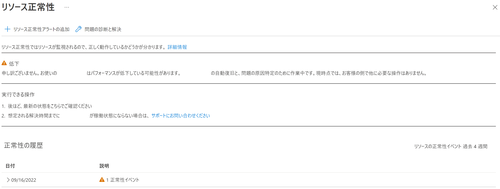

こんにちは。Azure Monitoring チームでサマー インターンをしております、徳田です ! 

本記事は [Improbing the tools for monitoring Log Analytics workspace health](https://techcommunity.microsoft.com/t5/azure-observability-blog/improving-the-tools-for-monitoring-log-analytics-workspace/ba-p/3566634)を元にしております。 
今回は Log Analytics ワークスペースのリソース正常性を示す指標に関する更新についてご紹介します。

<!-- more -->

## 目次
- インジェスト時間とは
- *Query succession percentage* (クエリ成功率) とは
- 今回の Log Analytics ワークスペースのリソース正常性に関する更新の概要
- Log Analytics ワークスペースのリソース正常性の確認方法
- Log Analytics ワークスペースのリソース正常性の状態定義
- まとめ

今回の更新の背景として、Log Analytics ワークスペースの正常性の重要な ２ つの指標として、**インジェスト時間**と ***Query succession percentage*** (クエリ成功率) を定義しました。

## インジェスト時間とは
インジェスト時間は、ログ データが生成されてからクエリ検索が可能になるまでにかかる時間を示しています。[こちらの記事](https://docs.microsoft.com/ja-jp/azure/azure-monitor/logs/data-ingestion-time)にて、インジェスト時間に影響する様々な要因をご確認いただけます。

## *Query succession percentage* とは
*Query succession percentage* (以降、クエリ成功率) は、HTTP ステータス コードが 500 番台 "以外" のエラーが返却されるクエリの数を反映しています。この数値には Azure ログ アラートや Sentinel によって実行されるクエリは含まれません。この指標は近くリソース正常性にて確認できるようになる予定です。

## 今回の Log Analytics ワークスペースの正常性に関する更新の概要
現在この 1 年でリリースされた機能と併せた、上記 2 つの指標の強化が進められています。
具体的には、[Operation](https://docs.microsoft.com/ja-jp/azure/azure-monitor/reference/tables/operation)テーブルが改善されました。このテーブルではユーザーがログ解析に関する問題やLog Analyticsの制限に関する情報、そのたデータに関する一般的な問題を確認することができます。さらに、これらのログに基づいて[アラートを作成](https://docs.microsoft.com/ja-jp/azure/azure-monitor/logs/daily-cap#alert-when-daily-cap-is-reached)し、データ損失の可能性を知ることができます。

この[Operation](https://docs.microsoft.com/ja-jp/azure/azure-monitor/reference/tables/operation) テーブル内のデータに基づいて、ワークスペースの正常性の指標が作成されています。Log Analytics ワークスペースの [概要] 内 [操作上の問題] 項目から、そのワークスペースの状態の概要を確認することができます。

Log Analytics ワークスペースの [監視] 項目の 1 つ、[分析情報](https://docs.microsoft.com/ja-jp/azure/azure-monitor/logs/log-analytics-workspace-insights-overview)からワークスペースの使用量、パフォーマンス、エージェント、クエリ、変更ログなどを確認することができます。これによりワークスペースの正常性を、パフォーマンスやインジェスト量の急増 / 急減、インジェストの待機時間、クエリ パフォーマンスの観点などから、包括的に監視することができます。

## Log Analytics ワークスペースの正常性の確認方法
Log Analytics ワークスペースのリソース正常性は Azure ポータル上の複数の場所で確認することができます。
### 確認方法 1
- Azure ポータルで "モニター" と検索し、サービス一覧の中から [モニター] を開いてください。
- [サービス正常性] > [Resource Health] 項目の [リソース正常性] を選択してください。
- [リソースの種類] ドロップダウンから "Log Analytics" を選択・設定してください。左のカラムに各ワークスペースの状態を示すアイコンが表示されます。
- より詳細な情報を確認するには、任意のワークスペースをクリックしてください。正常性の履歴が確認できます。

### 確認方法 2
- Azure ポータルで任意の Log Analytics ワークスペースを選択してください。
- [サポート + トラブルシューティング] 項目の [リソース正常性] を選択すると状態が確認できます。 1) の詳細情報と同様の内容が確認できます。

### 確認方法 3
- Azure ポータルで任意の Log Analytics ワークスペースを選択してください。
- [監視] 項目の [分析情報] をクリックし、 [正常性] タブを選択してください。可用性の状態や概要が時系列で確認できます。

## Log Analytics ワークスペースの正常性の状態定義
今回リリースされた[リソースの正常性](https://docs.microsoft.com/ja-jp/azure/service-health/resource-health-overview)の状態はインジェストの待ち時間を反映しており、以下の 3 つの状態で定義されます。

**Available** - 特定の時間範囲においてインジェストの待ち時間の問題が検知されなかった状態。

**Degraded** - 推定 1 時間以上のインジェストの待ち時間が 15 分以上続いた状態。この問題は現在緩和に向けた修正が進められています。

**Unknown** - そのワークスペースの正常性の状態を特定することができない状態。もしくは過去 24 時間以上そのワークペースからデータがインジェストされていない状態。

## まとめ
今回の更新により、インジェスト時間が反映された Log Analytics ワークスペースのリソース正常性が確認できるようになりました。
今後、リソースの正常性にはクエリ成功率の急減が反映される予定です。

また[こちらの記事](https://docs.microsoft.com/ja-jp/azure/azure-monitor/alerts/alerts-create-new-alert-rule?tabs=metric)で紹介されている手順にしたがって、ワークスペースのリソース正常性の情報に基づいたアラートを作成することが推奨されています。