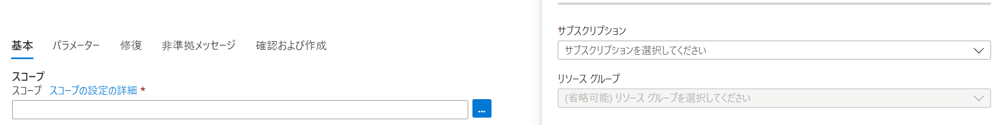
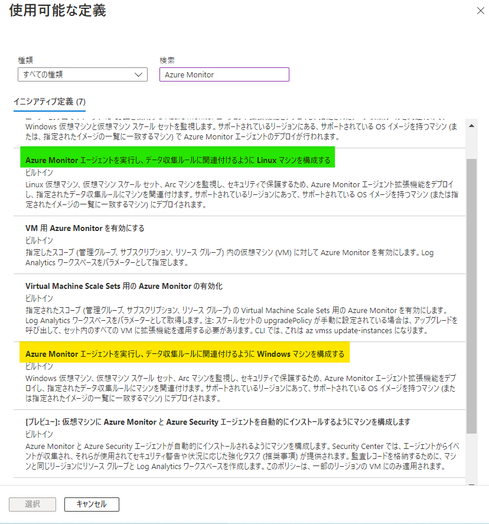
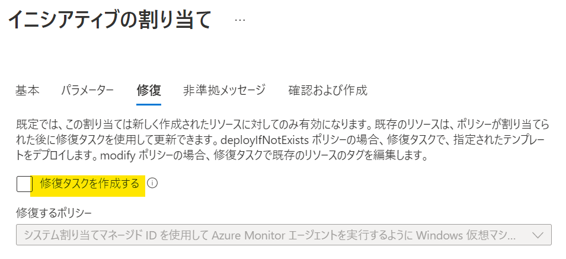
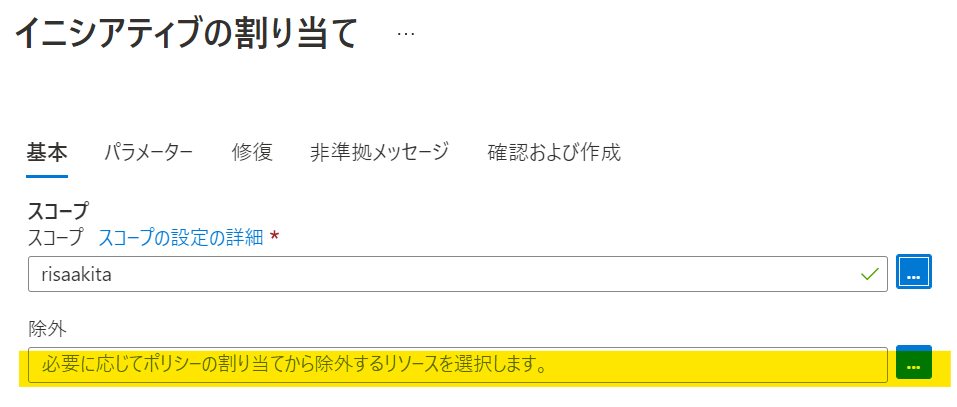

[更新履歴]  
- 2022/09/22 ブログ公開  
- 2026/01/19 GUI 変更に伴う更新   

こんにちは！ Azure Monitoring チームの秋田です！
今回は、仮想マシン (以下、VM) を作成したときに自動的に Azure Monitor エージェントのインストールとデータ収集ルールへの関連付けがされるよう設定する方法をご紹介します！

<!-- more -->

## 目次
- どうやって VM 作成時に Azure Monitor エージェントをインストールし、データ収集ルールへの関連付けを行うのか
- 詳細な手順
- 作成時の注意点
- まとめ

## どうやって VM 作成時に Azure Monitor エージェントをインストールし、データ収集ルールへの関連付けを行うのか
Azure Policy の機能のひとつであるポリシー イニシアチブを作成することで、VM 作成時に Azure Monitor エージェントのインストールとデータ収集ルールへの関連付けが自動で行われるよう設定できます。  
そもそも、ポリシー定義とは、JSON 形式で記述されたビジネス ルールのことで、 Azure Policy では、Azure 内のリソースのプロパティとポリシー定義を比較し、リソースの評価を行います。  
そして今回用いるポリシー イニシアチブとは、複数の関連するポリシー定義をグループ化したものを指します。  
  
今回は、このポリシー イニシアチブにより設定する方法をご紹介します。  

## 詳細な手順
### 事前準備
ポリシー イニシアチブを作成する際に、関連付けを行いたいデータ収集ルールのリソース ID が必要となります。  
事前準備としてリソース ID を取得しておく必要があります。  
以下、手順です。  
**事前準備 1**  
Azure ポータルで "監視" と検索し、サービス一覧の中から [監視] (モニター) を開いてください。  

**事前準備 2**  
[設定] メニューにあります [データ収集ルール] をクリックしてください。  
  
**事前準備 3**  
一覧から自動関連付けを行いたいデータ収集ルールをクリックしてください。  

**事前準備 4**  
[概要] ページ右上にあります [JSON ビュー] をクリックしてください。  
  
**事前準備 5**  
一番上に表示されます [リソース ID] をコピーしてください。  
  
以上の手順で、リソース ID の取得が完了し、事前準備は終了となります。  
  
### ポリシー イニシアチブの作成
**手順 1**  
Azure ポータルで "ポリシー" と検索し、サービス一覧の中から [ポリシー] を開いてください。  
  
**手順 2**  
[作成] メニューにあります [割り当て] をクリックしてください。  
  
**手順 3**  
遷移後の画面上部にあります [イニシアティブの割り当て] をクリックしてください。  
  
**手順 4 ([基本] タブ内で行う設定)**  
手順 4-1  
まずは、[スコープ] 欄右端にある [...] をクリックし、ポリシーを適用する対象の範囲 (スコープ) を設定します。  
スコープは、サブスクリプション単位またはリソース グループ単位で設定いただけます。  
  
  
手順 4-2  
使用するイニシアチブ定義を設定します。  
[イニシアティブ定義] 欄の右端にある [...] をクリックしてください。  
検索欄で、"Data Collection Rule" と検索ください。  
使用中の VM の OS に応じて下記の通りイニシアチブをご選択いただいたのち、画面下部にあります [選択] をクリックしてください。  
  
**Windows OS の場合** ->  
  英語表記   : Configure Windows machines to run Azure Monitor Agent and associate them to a Data Collection Rule
  日本語表記 : Azure Monitor エージェントを実行し、データ収集ルールに関連付けるように Windows マシンを構成する

**Linux OS の場合** ->
  英語表記   :Configure Linux machines to run Azure Monitor Agent and associate them to a Data Collection Rule
  日本語表記 : Azure Monitor エージェントを実行し、データ収集ルールに関連付けるように Linux マシンを構成する

  
  

上記の手順 4-1 および手順 4-2 が完了したら、画面下部にあります [次へ] をクリックしてください。  
  
**手順 5 ([パラメーター] タブ内で行う設定)**  
[データ収集ルールのリソース ID] 欄に先ほど事前準備で取得しておいた、関連付けを行いたいデータ収集ルールのリソース ID をペーストしてください。  
完了しましたら画面下部の [確認および作成] をクリックしてください。  
  
以上でポリシー イニシアチブの作成が完了となります。  
  
  
## 作成時の注意点
Azure Monitor エージェントの追加を希望されない VM が存在する場合には、以下の点に注意が必要です。  
既存の VM に対してポリシーが適用され得るタイミングとしては、以下の 2 つのいずれかが該当します。  
- ポリシー作成時
- VM に対して更新操作があった場合 (設定値やプロパティ値などを変更する要求など)
  
### ポリシー作成時
まず、ポリシー作成時に既存の VM にポリシーが適用されないようにするためには、作成画面にて [修復タスクを作成する] のチェックを外してください。  
(デフォルトでは、こちらのチェックは外れております。)  
  

これにより、既存の VM に対してポリシー作成時にポリシーが適用されることを防ぐことができます。  

### 更新適用時
ただ、ポリシー作成時にはポリシー適用対象外となっていても、VM に対して何らかの更新操作があった場合には、一定期間後にポリシーに準拠していないリソースと評価され、ポリシーが適用される可能性があります。  
この場合は、あらかじめポリシーを作成する際に、適用対象外としたい VM を [除外] 項目に入れておく必要があります。  
[除外] については、 [基本] タブ内でご設定いただけます。  
  
ポリシー適用対象外として [除外] に含められるのは、スコープのレベルよりも 1 つ下のレベルとなります。  
例えば、リソース グループをスコープとして設定している場合除外できるのはリソース単位となります。  

### カスタム イメージで VM を作成する場合
本ブログでご案内しているイニシアティブは既定で Marketplace にあるイメージで、かつ Azure Monitor エージェントがサポートしている OS のみに有効となります。
既定の設定ではカスタム イメージで作成された VM は評価対象になりません。
イニシアティブを利用してカスタム イメージで作成した VM に自動で Azure Monitor エージェントをデプロイしたい場合は、作成したイニシアティブに対して以下の設定変更が必要でございます。
1. [ポリシー] - [割り当て] 画面に作成したイニシアティブが表示されているので、作成したイニシアティブを選択します。
2. [パラメーター] タブで [入力またはレビューが必要なパラメーターのみを表示する] からチェックを外します。
3. [Azure Monitor エージェントがサポートするオペレーティング システムのスコープ ポリシー] を false にします。
  

[Azure Monitor エージェントがサポートするオペレーティング システムのスコープ ポリシー] を false に設定いただくと、"既定で Marketplace にあるイメージでかつ、Azure Monitor エージェントがサポートしている OS" と、"すべてのカスタム イメージの OS" が評価対象となります。  
一方で特定のカスタム イメージにのみイニシアティブを適用したい場合は、上記設定を true に設定いただき、[追加の仮想マシン イメージ] に対象イメージをご指定ください。  
その場合、"既定で Marketplace にあるイメージでかつ、Azure Monitor エージェントがサポートしている OS" と、"ご指定いただいたカスタム イメージの OS" が評価対象となります。 

### マネージド ID の利用
Azure Monitor エージェントを利用するには、マネージド ID が VM に割り当てられている必要がございます。
本ブログでご案内しているイニシアティブの利用は、システム割り当てマネージド ID が割り当てられていることが前提となります。
VM 作成時にシステム割り当てマネージド ID を有効化しない場合、その VM は Azure Monitor エージェントのインストール対象になりません。
もし VM 作成時にシステム割り当てマネージド ID を有効化したくない場合は、代わりに以下イニシアティブの利用をご検討ください。
・ユーザー割り当てマネージド ID ベースの認証を使用する Windows Azure Monitor エージェントをデプロイし、データ収集ルールを関連付ける

[Azure Policy を使用して Azure Monitor エージェントをインストールして管理する](https://learn.microsoft.com/ja-jp/azure/azure-monitor/agents/azure-monitor-agent-policy)にも、ユーザー割り当てマネージド ID を使用するイニシアティブについての情報が掲載されておりますので、ご覧いただけますと幸いです。

## まとめ
今回は、Azure Policy の一機能であるポリシー イニシアチブにより、VM が作成されると自動的に Azure Monitor エージェントのインストールとデータ収集ルールへの関連付けが行われるよう設定する方法をご紹介しました。  
VM 作成時に毎回手動で Azure Monitor エージェントをインストールされていた方など、ぜひこちらの方法もご検討ください。  
