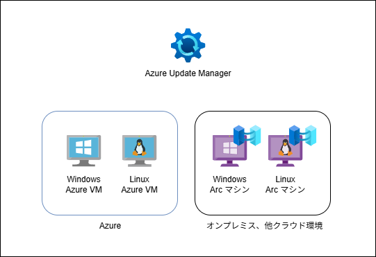
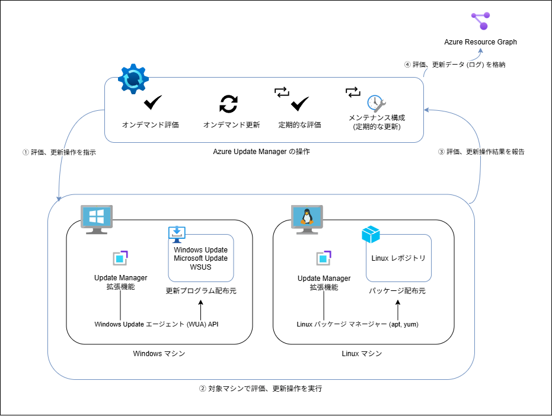

こんにちは、Azure Monitoring サポート チームの趙です。
Azure Update Manager は、Azure 上の仮想マシン (VM) や Azure Arc 対応マシンに対して、OS 更新プログラムの適用を自動化・管理できるサービスです。
本記事では、Update Manager の基本概念、アーキテクチャ、機能、設定手順等を解説します。
最後に補足としてパッチ オーケストレーション モードについてもご紹介いたします。

<!-- more -->

## 目次 

- [Azure Update Manager とは](#azure-update-manager-とは)
- [Azure Update Manager のアーキテクチャ](#azure-update-manager-のアーキテクチャ)
  - [1. 評価、更新操作を指示](#1-評価更新操作を指示)
  - [2. 対象マシンで評価、更新操作を実行](#2-対象マシンで評価更新操作を実行)
  - [3. 評価、更新操作を報告](#3-評価更新操作を報告)
  - [4. 評価、更新データ (ログ) を格納](#4-評価更新データ-ログ-を格納)
- [Azure Update Manager の主な機能](#azure-update-manager-の主な機能)
  - [オンデマンド評価 (更新プログラムの確認)](#オンデマンド評価-更新プログラムの確認)
  - [オンデマンド更新 (1 回限りの更新)](#オンデマンド更新-1-回限りの更新)
  - [定期的な評価 (定期評価)](#定期的な評価-定期評価)
  - [定期的な更新 (スケジュールの更新)](#定期的な更新-スケジュールの更新)
- [Azure Update Manager の設定手順](#azure-update-manager-の設定手順)
- [(補足) Update Manager のメンテナンス構成、Automatic VM Guest Patching、Hotpatch の違い](#補足-update-manager-のメンテナンス構成automatic-vm-guest-patchinghotpatch-の違い)
  - [パッチ オーケストレーション モード](#パッチ-オーケストレーション-モード)
    - [カスタマー マネージド スケジュール (Customer Managed Schedule)](#カスタマー-マネージド-スケジュール-customer-managed-schedule)
    - [Azure マネージド - 安全なデプロイ (Azure Managed - Safe Deployment)](#azure-マネージド--安全なデプロイ-azure-managed--safe-deployment)
    - [Windows 自動更新 (AutomaticByOS)](#windows-自動更新-automaticbyos)
    - [手動更新 (Manual)](#手動更新-manual)
    - [イメージデフォルト (ImageDefault)](#イメージデフォルト-imagedefault)
  - [Update Manager のメンテナンス構成](#update-manager-のメンテナンス構成)
  - [Automatic VM Guest Patching](#automatic-vm-guest-patching)
  - [Hotpatching](#hotpatching)

## Azure Update Manager とは 

Azure Update Manager は、Azure 上の仮想マシン (VM) や Azure Arc マシンに対して、OS 更新プログラムの評価及び適用を自動化・一元管理できるサービスです。
Windows マシンや、Linux マシン、どちらに対しても更新プログラム (パッケージ) を適用できます。

Azure Update Manager をご利用いただく主な利点は、
OS 更新プログラムをスケジュールで評価、更新 (適用) できることです。
このスケジュールのことを **メンテナンス構成** といいます。

## Azure Update Manager のアーキテクチャ 

Azure 上の仮想マシン (VM) や オンプレミス マシン、他クラウド環境のマシンに対して、OS 更新プログラムの評価及び適用を自動化・一元管理できるサービスです。
オンプレミス マシン、他クラウド環境のマシンにて Azure Update Manager をご利用いただくには、対象マシンを [Azure Arc マシンとしてオンボードする](https://learn.microsoft.com/ja-jp/azure/azure-arc/servers/learn/quick-enable-hybrid-vm)必要があります。

Azure Update Manager の構成は以下構成図をご参考いただければ幸いです。

構成図に記載されている Azure Update Manager の操作の詳細については、本ブログの "Azure Update Manager の機能" セッションをご参考いただければ幸いです。

また、Azure Update Manager をご利用いただくには、対象マシンの OS 上の Windows Update または Linux パッケージ マネージャーから更新プログラム (パッケージ) の適用が可能な状態である必要があります。

> [!NOTE]
> 例えば、Windows マシンの OS で Windows Update による更新プログラムの適用ができない状態 (例えば、Windows Update エンドポイントと通信ができない状態等) である場合は、Update Manager からの更新プログラムの適用も失敗します。
> 同様に Linux マシンの OS で yum や apt などの Linux パッケージ マネージャーから更新プログラムの適用ができない状態 (例えば、sudo yum update 実行時、エラーが返される状態等) である場合は、Update Manager からの更新プログラムの適用も失敗します。

### 1.評価、更新操作を指示 

ユーザーにて評価、更新操作を行う場合、 Update Manager から対象マシンに該当する操作を指示します。

ユーザーは、ポータル、PowerShell、CLI、REST API 等を利用して操作を行うことができます。
PowerShell、CLI、REST API を利用して操作を行う場合の詳細は以下公開情報をご参考いただければ幸いです。
[Azure VM の更新プログラムをプログラムで管理する方法](https://learn.microsoft.com/ja-jp/azure/update-manager/manage-vms-programmatically?tabs=cli%2Crest)

### 2.対象マシンで評価、更新操作を実行 

評価、更新操作を指示された対象マシンでは、Update Manager の拡張機能が対象マシンにて Windows Update エージェント API または Linux パッケージ マネージャーを経由して、更新プログラムの評価、適用を行います。 

### 3.評価、更新操作を報告 

評価、更新操作が完了したら、Update Manager の拡張機能は対象マシンの評価、更新状態を Azure Update Manager に報告します。
Azure ポータルの Azure Update Manager の履歴画面から評価された更新プログラム (パッケージ) の一覧や、更新操作の結果を確認できます。

> [!TIP]
> Update Manager では Windows マシンの場合、[Windows Update エージェント API](https://learn.microsoft.com/ja-jp/windows/win32/wua_sdk/portal-client) 経由で更新プログラムの評価、適用が行われます。
> この動作は、OS の [設定] > [更新とセキュリティ] > [Windows Update] 画面で確認できる Windows Update クライアントの動作とは相違します。
> そのため、Update Manager より更新プログラムを適用した場合、Windows Update の更新の履歴画面には反映されない場合があります。
> Update Manager より適用された更新プログラムを確認されたい際には、Azure ポータルの Azure Update Manager の履歴画面をご確認いただければ幸いです。

### 4.評価、更新データ (ログ) を格納 

Azure Update Manager は、評価、更新操作の結果を Azure Resource Graph に格納します。
このため、Azure Update Manager の評価、更新操作の結果は [Azure Resource Graph を利用して、クエリで確認する](https://learn.microsoft.com/ja-jp/azure/update-manager/sample-query-logs)ことも可能です。

## Azure Update Manager の主な機能 

Azure Update Manager では主に以下 4 つの機能がご利用可能です。

- オンデマンド評価 (更新プログラムの確認)
- オンデマンド更新 (1 回限りの更新)
- 定期的な評価 (定期評価)
- 定期的な更新 (スケジュールの更新)

**評価 (assessment)** と **更新 (update)** について少し補足させていただきます。

- 評価 (assessment): マシンに適用可能な更新プログラムの一覧を取得することです。Windows Update/Linux パッケージ マネージャーより更新プログラムのスキャンが行われます。

- 更新 (update): マシンに対して、適用可能な更新プログラムを実際に適用することです。Windows Update/Linux パッケージ マネージャーより更新プログラムの適用が行われます。

この 2 つの機能が Update Manager の基本的な機能となります。
上記内容を踏まえ、Update Manager の 4 つの主な機能について以下に説明させていただきます。

### オンデマンド評価 (更新プログラムの確認) 

オンデマンド評価は、Update Manager を使用して、マシンの更新プログラムの状態を即座に確認する機能です。
この機能をご利用いただくことで、マシンに適用可能な更新プログラムの一覧を取得できます。
ポータルでは、[推奨される更新プログラム] タブに表示されます。

> [!TIP]
> ポータル上でオンデマンド評価をトリガーするには "更新プログラムの確認" をクリックします。
> "1 回限りの評価" と呼ばれることもあります。

オンデマンド評価の詳細については以下公開情報をご参考いただければ幸いです。
[Azure Update Manager を使用して更新コンプライアンス状況を確認する](https://learn.microsoft.com/ja-jp/azure/update-manager/view-updates?tabs=singlevm-overview%2Cat-scale-overview)

### オンデマンド更新 (1 回限りの更新) 

オンデマンド更新は、マシンに対して 1 回限りの更新を適用する機能です。
この機能をご利用いただくことで、マシンに適用可能な更新プログラムを即座に適用できます。
適用/除外する更新プログラムの種類、KB ID (Windows の場合)、パッケージ名 (Linux の場合) を指定可能です。

> [!TIP]
> ポータル上では "1 回限りの更新" と表示されます。

オンデマンド更新の詳細については以下公開情報をご参考いただければ幸いです。
[Azure Update Manager を使用して今すぐ更新プログラムをデプロイし、結果を追跡する](https://learn.microsoft.com/ja-jp/azure/update-manager/deploy-updates?tabs=install-single-overview%2Cinstall-scale-overview)

### 定期的な評価 (定期評価) 

定期的な評価は、マシンの更新プログラムの状態を定期的 (24 時間ごと) に確認する機能です。
この設定はポータル上の [設定の更新](https://learn.microsoft.com/ja-jp/azure/update-manager/manage-update-settings?tabs=manage-single-overview%2Cmanage-scale-overview#configure-settings-on-a-single-vm) から ON/OFF できます。

定期評価が ON になっている場合、24 時間ごとに評価 (スキャン) され、対象マシンに必要な更新プログラムの一覧が表示されます。
定期評価が OFF になっている場合、評価は行われません。

定期評価の結果は、ポータルの "推奨される更新プログラム" タブに表示されます。

> [!NOTE]
> 定期評価は、あくまでマシンに必要な更新プログラムの状態を定期的に確認する機能です。
> そのため、定期評価が ON になっている場合でも、ユーザーにて更新操作を行わない限り、マシンに対して更新プログラムは適用されません。

定期評価の詳細については以下公開情報をご参考いただければ幸いです。
[定期評価](https://learn.microsoft.com/ja-jp/azure/update-manager/assessment-options#periodic-assessment)

### 定期的な更新 (スケジュールの更新) 

定期的な更新は、メンテナンス構成 (スケジュール) を利用し、マシンに対してユーザーが設定したスケジュールでパッチを適用する機能です。
適用/除外する更新プログラムの種類、KB ID (Windows の場合)、パッケージ名 (Linux の場合) を指定可能です。

> [!TIP]
> ポータル上では "スケジュールの更新" と表示されます。
> "メンテナンス構成" とも呼ばれます。
> "メンテナンス構成" の詳細は以下公開情報をご参考いただければ幸いです。
[Azure portal と Azure Policy を使用してマシンの定期的な更新をスケジュールする](https://learn.microsoft.com/ja-jp/azure/update-manager/scheduled-patching?tabs=schedule-updates-single-machine%2Cschedule-updates-scale-overview%2Cwindows-maintenance)

## Azure Update Manager の設定手順 

各機能ごとに説明させていただきます。

**オンデマンド評価 (更新プログラムの確認)** や **オンデマンド更新 (1 回限りの更新)** の操作は、すぐにご利用いただけます。
別途、お客様にて事前設定等を行う必要はございません。

一方、**定期的な評価 (定期評価)** や **定期的な更新 (スケジュールの更新)** の操作を行うには、別途、お客様にて事前設定を行う必要がございます。
**定期的な評価 (定期評価)** については、ポータル上の [設定の更新](https://learn.microsoft.com/ja-jp/azure/update-manager/manage-update-settings?tabs=manage-single-overview%2Cmanage-scale-overview#configure-settings-on-a-single-vm) から ON/OFF できます。
**定期的な更新 (スケジュールの更新)** については、ポータル上の [メンテナンス構成](https://learn.microsoft.com/ja-jp/azure/update-manager/scheduled-patching?tabs=schedule-updates-single-machine%2Cschedule-updates-scale-overview%2Cwindows-maintenance) から設定を行ってください。

なお、メンテナンス構成をご利用いただく際の注意点としては、対象マシンのパッチ オーケストレーション モードが、**カスタマー マネージド スケジュール (Customer Managed Schedule)** で設定されている必要があります。
パッチ オーケストレーション モードについては、本ブログの "(補足) Update Manager のメンテナンス構成、Automatic VM Guest Patching、Hotpatch の違い" セッションにて補足させていただきます。

メンテナンス構成を利用するための前提条件は以下公開情報をご参考いただければ幸いです。
[スケジュールされたパッチ適用の前提条件
](https://learn.microsoft.com/ja-jp/azure/update-manager/scheduled-patching?tabs=schedule-updates-single-machine%2Cschedule-updates-scale-overview%2Cwindows-maintenance#prerequisites-for-scheduled-patching)

## (補足) Update Manager のメンテナンス構成、Automatic VM Guest Patching、Hotpatch の違い 

以下からは  Update Manager のメンテナンス構成、Automatic VM Guest Patching、Hotpatch の違いについて説明させていただきます。
違いを説明させていただくため、まずは、パッチ オーケストレーション モードについて説明させていただきます。

### パッチ オーケストレーション モード 

パッチ オーケストレーション モードとは、対象マシンに対して、どのようにパッチを適用するかを定義する設定です。
パッチ オーケストレーション モードには 5つの種類があります。

- カスタマー マネージド スケジュール (Customer Managed Schedule)
- Azure マネージド - 安全なデプロイ (Azure Managed - Safe Deployment)
- Windows 自動更新 (AutomaticByOS)
- 手動更新 (Manual)
- イメージデフォルト (ImageDefault)

パッチ オーケストレーション モードの詳細については、以下公開情報もご参考いただければ幸いです。
[1 つの VM で設定を構成する](https://learn.microsoft.com/ja-jp/azure/update-manager/manage-update-settings?tabs=manage-single-overview%2Cmanage-scale-overview#configure-settings-on-a-single-vm) 
[パッチ オーケストレーションのモード](https://learn.microsoft.com/ja-jp/azure/virtual-machines/automatic-vm-guest-patching#patch-orchestration-modes)

以下それぞれのパッチ オーケストレーション モードについて説明させていただきます。

#### カスタマー マネージド スケジュール (Customer Managed Schedule) 
Update Manager でメンテナンス構成 (スケジュールによる更新プログラムの適用) をご利用いただくためには、
パッチ オーケストレーションを "カスタマー マネージド スケジュール (Customer Managed Schedule)" に設定いただく必要があります。

公開情報 [パッチ オーケストレーションのモード](https://learn.microsoft.com/ja-jp/azure/virtual-machines/automatic-vm-guest-patching#patch-orchestration-modes) 上では、AutomaticByPlatform (Azure-orchestrated) に該当します。
[ByPassPlatformSafetyChecksOnUserSchedule プロパティが "True" ](https://learn.microsoft.com/ja-jp/azure/update-manager/prerequsite-for-schedule-patching?tabs=new-prereq-portal%2Cauto-portal#enable-scheduled-patching-on-azure-vms)である場合、 "カスタマー マネージド スケジュール (Customer Managed Schedule)" に該当します。

#### Azure マネージド - 安全なデプロイ (Azure Managed - Safe Deployment) 

Automatic VM Guest Patching で利用されるパッチ オーケストレーション モードです。
Azure の任意のタイミングで Critical および Security の更新プログラムが適用されます。

公開情報 [パッチ オーケストレーションのモード](https://learn.microsoft.com/ja-jp/azure/virtual-machines/automatic-vm-guest-patching#patch-orchestration-modes) 上では、AutomaticByPlatform (Azure-orchestrated) に該当します。
[ByPassPlatformSafetyChecksOnUserSchedule プロパティが "False" ](https://learn.microsoft.com/ja-jp/azure/update-manager/prerequsite-for-schedule-patching?tabs=new-prereq-portal%2Cauto-portal#enable-automatic-guest-vm-patching-on-azure-vms)である場合、 "Azure マネージド - 安全なデプロイ (Azure Managed - Safe Deployment)" に該当します。

> [!TIP]
> カスタマー マネージド スケジュール (Customer Managed Schedule) と Azure マネージド - 安全なデプロイ (Azure Managed - Safe Deployment) の違いは、**Update Manager のメンテナンス構成を利用するか利用しないか**の違いです。カスタマー マネージド スケジュール (Customer Managed Schedule) では Update Manager のメンテナンス構成を利用して、ユーザーが更新プログラムの適用スケジュール (ユーザーのタイミング) を設定します。一方、Azure マネージド - 安全なデプロイ (Azure Managed - Safe Deployment) では、Azure が自動的に (Azure のタイミング) 更新プログラムを適用します。

#### Windows 自動更新 (AutomaticByOS) 

Windows のみ該当するパッチ オーケストレーション モードです。
Windows 自動更新 (AutomaticByOS) の場合、マシンの OS 上の Windows Update 自動更新が有効になります。

#### 手動更新 (Manual) 

Windows のみ該当するパッチ オーケストレーション モードです。
手動更新 (Manual) の場合、マシンの OS 上の Windows Update 自動更新が無効になります。

#### イメージデフォルト (ImageDefault) 

Linux のみ該当するパッチ オーケストレーション モードです。
イメージデフォルト (ImageDefault) の場合、マシンの OS 上で設定されている既定のパッケージ配布設定に従って構成されます。

### Update Manager のメンテナンス構成 

Update Manager のメンテナンス構成は、**カスタマー マネージド スケジュール (Customer Managed Schedule)** のパッチ オーケストレーション モードでご利用いただけます。

> [!TIP]
> Update Manager でスケジュール機能 (メンテナンス構成) を特にご利用されない場合、
パッチ オーケストレーションをカスタマー マネージド スケジュールに変更しなくても、**オンデマンド評価 (更新プログラムの確認)**、**オンデマンド更新 (1 回限りの更新)**、**定期的な評価 (定期評価)** をご利用できます。

### Automatic VM Guest Patching 

Automatic VM Guest Patching は、Azure のタイミングによって、[重大] および [セキュリティ] 更新プログラムが自動的にダウンロードされて VM に適用される機能です。

> [!TIP]
> Azure のタイミングとは、**VM のピーク外時間帯**となります。
> VM のピーク外時間帯は、VM がデプロイされているリージョンの時間帯に依存します。
> 具体的には、Automatic VM Guest Patching が有効になっており、対象 VM が東日本リージョンにデプロイされている場合、東日本リージョンの時間帯 (日本時間) の 10 PM - 4 AM が VM のピーク外時間帯となります。

お客様にて更新プログラムを適用するタイミングをスケジュールでコントロールされたい場合は、Update Manager のメンテナンス構成をご利用いただく必要がございます。

Automatic VM Guest Patching の詳細については以下公開情報をご参考いただければ幸いです。
[Azure Virtual Machines とスケール セットのゲストの自動パッチ適用](https://learn.microsoft.com/ja-jp/azure/virtual-machines/automatic-vm-guest-patching)

### Hotpatchig 

Hotpatching は、Azure 上の Windows 仮想マシン (VM) に対して、再起動なしで自動的に更新プログラムを適用できる機能です。

> [!TIP]
> Hotpatching で適用される更新プログラム (KB) は [Release notes for Hotpatch in Azure Automanage for Windows Server 2022](https://support.microsoft.com/en-us/topic/release-notes-for-hotpatch-in-azure-automanage-for-windows-server-2022-4e234525-5bd5-4171-9886-b475dabe0ce8)、あるいは、[Release notes for Hotpatch on Windows Server 2025 Datacenter Azure Edition](https://support.microsoft.com/en-us/topic/release-notes-for-hotpatch-on-windows-server-2025-datacenter-azure-edition-c548437e-8c7a-4e27-99f4-e8746f97f8fa) をご参考いただければ幸いです。

Hotpatching は、[一部の Windows Server エディションでのみご利用](https://learn.microsoft.com/ja-jp/windows-server/get-started/hotpatch?toc=%2Fazure%2Fvirtual-machines%2Ftoc.json#azure-and-azure-local-virtual-machines)いただけます。

Hotpatching は Hotpatch Calendar のスケジュールに従い、適用されます。
そのため、お客様にて更新プログラムを適用するタイミングをスケジュールでコントロールされたい場合は、Update Manager のメンテナンス構成をご利用いただく必要がございます。

Hotpatch のスケジュールの詳細については以下公開情報をご参考いただければ幸いです。
[How Hotpatch works](https://learn.microsoft.com/ja-jp/windows-server/get-started/hotpatch?toc=%2Fazure%2Fvirtual-machines%2Ftoc.json#how-hotpatch-works)
[Release notes for Hotpatch in Azure Automanage for Windows Server 2022](https://support.microsoft.com/en-us/topic/release-notes-for-hotpatch-in-azure-automanage-for-windows-server-2022-4e234525-5bd5-4171-9886-b475dabe0ce8)

本日のご紹介は以上となります。上記の内容以外でご不明な点や疑問点などございましたら、弊社サポート サービスまでお問い合わせください。
最後までお読みいただきありがとうございました。
