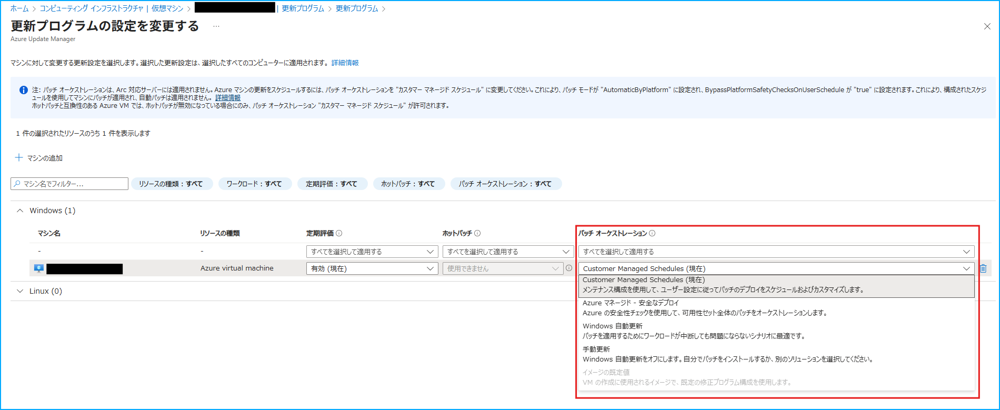
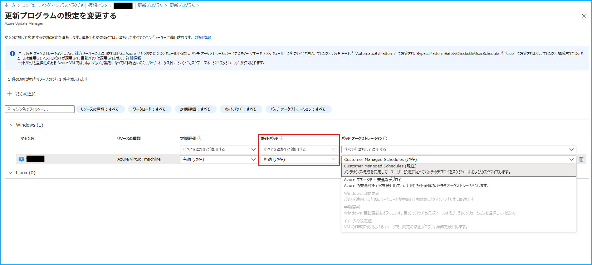
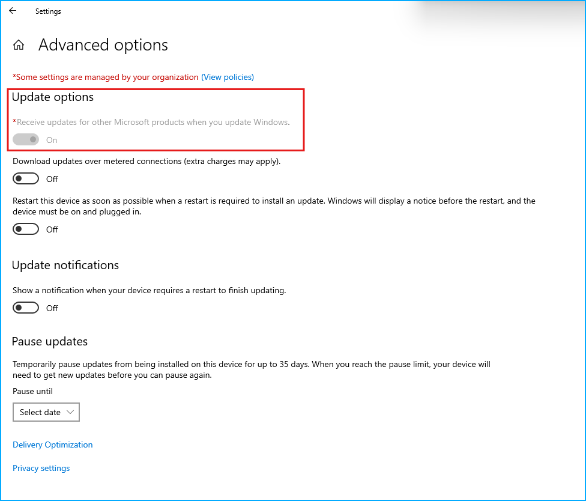

こんにちは、Azure Monitoring サポート チームの中条です。
今回は Azure Update Manager に関するよくあるご質問をご紹介します。

[Azure Update Manager の基本概念、アーキテクチャ、機能、設定手順等](https://jpazmon-integ.github.io/blog/UpdateManager/AboutUpdateManager/)については、別途ブログを投稿しておりますので併せてご覧いただけますと幸いです！

 

<!-- more -->
## 目次

- [Q. パッチ オーケストレーションの変更方法を教えてください。](#Q.-パッチ-オーケストレーションの変更方法を教えてください。)
- [Q. Azure Update Manager でスケジュールで更新プログラムの適用を実施したいのに、Windows Update にて自動で更新プログラムが適用されました。](#Q.-Azure-Update-Manager-でスケジュールで更新プログラムの適用を実施したいのに、Windows-Update-にて自動で更新プログラムが適用されました。)
- [Q. パッチ オーケストレーション設定がグレー アウトしていて変更できません。](#Q.-パッチ-オーケストレーション設定がグレー-アウトしていて変更できません。)
- [Q. WSUS サポート終了に伴い、Azure Update Manager で更新プログラムを適用したいです。](#Q.-WSUS-サポート終了に伴い、Azure-Update-Manager-で更新プログラムを適用したいです。)
- [Q. SQL サーバーの更新プログラムが適用対象になりません。](#Q.-SQL-サーバーの更新プログラムが適用対象になりません。)
- [Q. Azure Update Manager で適用する更新プログラムを事前にダウンロードしておいて、後からインストールできますか。](#Q.-Azure-Update-Manager-で適用する更新プログラムを事前にダウンロードしておいて、後からインストールできますか。)
- [Q. Azure Update Manager のネットワーク要件を教えてください。](#Q.-Azure-Update-Manager-のネットワーク要件を教えてください。)

 
 
 

### Q. パッチ オーケストレーションの変更方法を教えてください。
[Azure Portal 上でパッチ オーケストレーションの設定を変更する方法](https://learn.microsoft.com/ja-jp/azure/update-manager/manage-update-settings?tabs=manage-single-overview%2Cmanage-scale-overview)は、下図のように Azure VM のパッチ オーケストレーションの設定を変更し、保存します。
 

 

[PowerShell 等のコマンドでパッチ オーケストレーションの設定を変更する方法](https://learn.microsoft.com/ja-jp/azure/update-manager/prerequsite-for-schedule-patching?tabs=new-prereq-powershell%2Cauto-portal#enable-scheduled-patching-on-azure-vms)もございます。
 
 
 

### Q. Azure Update Manager でスケジュールで更新プログラムの適用を実施したいのに、Windows Update にて自動で更新プログラムが適用されました。

以下の 2 点を確認します。

<b>1. パッチ オーケストレーション設定が [カスタマー マネージド スケジュール (Customer Managed Schedule)] になっていること</b>

パッチ オーケストレーション設定が [Windows 自動更新 (AutomaticByOS)] が設定されている場合、OS の設定に準拠して更新プログラムの適用が実施されます。

なお、パッチ オーケストレーションの設定を [Windows 自動更新 (AutomaticByOS)] から [カスタマー マネージド スケジュール (Customer Managed Schedule)] へ変更いただいた後、更新プログラムの適用もしくは評価が実行されるまでは、後述のレジストリ値 NoAutoUpdate の 0 から 1 への変更が即時反映されません。

Azure Update Manger による更新プログラムの適用もしくは評価が実行されたタイミングで、対象マシンに Microsoft.CPlat.Core.WindowsPatchExtension 拡張機能がインストールされ、この拡張機能により、レジストリ値 NoAutoUpdate が 0 から 1 に変更されます。

 

<b>2. レジストリ値 NoAutoUpdate が 1 になっていること</b>

以下のレジストリ キー内のレジストリ値 NoAutoUpdate が 0 の場合、OS の設定に準拠して更新プログラムの適用が実施されます。
HKEY_LOCAL_MACHINE\SOFTWARE\Policies\Microsoft\Windows\WindowsUpdate\AU

レジストリ キーの詳細は[こちら](https://learn.microsoft.com/ja-jp/windows/deployment/update/waas-wu-settings#configuring-automatic-updates-by-editing-the-registry)をご参照ください。

レジストリ値 NoAutoUpdate を即時 0 から 1 に変更する方法としては、1 回限りの更新プログラム適用を実施します。

なお、Windows OS 側で設定いただく[自動更新のグループ ポリシー設定](https://learn.microsoft.com/ja-jp/windows-server/administration/windows-server-update-services/deploy/4-configure-group-policy-settings-for-automatic-updates##configure-automatic-updates)の有効化により、レジストリ値 NoAutoUpdate が 0 から 1 に書き換わる場合があります。

 
 
 

 

### Q. パッチ オーケストレーション設定がグレー アウトしていて変更できません。
例えば、Windows OS の Azure VM のパッチ オーケストレーション設定は [Windows 自動更新 (AutomaticByOS) から手動更新 (Manual) に変更できません。](https://learn.microsoft.com/ja-jp/azure/update-manager/troubleshoot?tabs=azure-machines#unable-to-change-the-patch-orchestration-option-to-manual-updates-from-automatic-updates)

Windows OS では VM 作成時に指定する[プロパティ osProfile.windowsConfiguration.enableAutomaticUpdates の値により、指定可能なパッチ オーケストレーション設定が決まります。](https://learn.microsoft.com/ja-jp/azure/virtual-machines/automatic-vm-guest-patching#patch-orchestration-modes)

 

|     osProfile.windowsConfiguration.enableAutomaticUpdates        |                            指定可能なパッチ オーケストレーション設定                                                         |
| ---------- | ----------------------------------------------------------------------------------- |
| true | カスタマー マネージド スケジュール (Customer Managed Schedule)、Azure マネージド - 安全なデプロイ (Azure Managed - Safe Deployment)、手動更新 (Manual)  |
| false | カスタマー マネージド スケジュール (Customer Managed Schedule)、Azure マネージド - 安全なデプロイ (Azure Managed - Safe Deployment)、Windows 自動更新 (AutomaticByOS) |

また、ホットパッチを無効化した場合、選択可能なパッチ オーケストレーション設定は以下の 2 つのみです。

・カスタマー マネージド スケジュール (Customer Managed Schedule)

・Azure マネージド - 安全なデプロイ (Azure Managed - Safe Deployment)

 

 
 
 
 

### Q. WSUS サポート終了に伴い、Azure Update Manager で更新プログラムを適用したいです。
Azure Update Manager で更新プログラムの適用がサポートされているオペレーティング システムにつきましては[こちら](https://learn.microsoft.com/ja-jp/azure/update-manager/support-matrix-updates?tabs=ci-win&pivots=azure-vm)をご確認ください。

なお、Windows 10 や Windows 11 などのクライアント OS はサポートされていません。
Microsoft Intune での更新プログラムの管理をおすすめしております。

その他 Azure Update Manager でサポートされていない環境については[こちら](https://learn.microsoft.com/ja-jp/azure/update-manager/unsupported-workloads)をご確認ください。

 
 
 

### Q. SQL サーバーの更新プログラムが適用対象になりません。
Azure Update Manager を利用して SQL サーバーの更新プログラムを適用するためには、Windows OS の設定にて、[Windows の更新時に他の Microsoft 製品の更新プログラムも入手します] 設定を有効にする必要があります。詳細は[こちら](https://learn.microsoft.com/ja-jp/azure/update-manager/configure-wu-agent#enable-updates-for-other-microsoft-products)をご確認ください。
 

 

 
 
 

### Q. Azure Update Manager で適用する更新プログラムを事前にダウンロードしておいて、後からインストールできますか。
[Azure Update Manager では更新プログラムの事前ダウンロードはサポートされていません。](https://learn.microsoft.com/ja-jp/azure/update-manager/configure-wu-agent#pre-download-updates)

 
 
 

### Q. Azure Update Manager のネットワーク要件を教えてください。

Azure Update Manager をご利用いただく際の[ネットワーク要件](https://learn.microsoft.com/ja-jp/azure/update-manager/prerequisites#network-planning)について、OS の種類ごとに説明します。

<b>1. Windows OS の場合</b>

Windows OS のマシンの場合は、Windows Update エージェントで必要とされるすべてのエンドポイントへのトラフィックを許可する必要があります。

Windows Update エージェントで必要なエンドポイントの一覧は[こちら](
https://learn.microsoft.com/ja-jp/troubleshoot/windows-client/installing-updates-features-roles/windows-update-issues-troubleshooting?toc=%2Fwindows%2Fdeployment%2Ftoc.json&bc=%2Fwindows%2Fdeployment%2Fbreadcrumb%2Ftoc.json#issues-related-to-httpproxy)で確認できます。 

 

<b>2. Linux OS の場合</b>

Linux OS のマシンの場合は、Linux パッケージの配布先のエンドポイントへの通信を許可する必要があります。

例えば、Red Hat Linux マシンの場合の Linux パッケージの配布先のエンドポイントは[こちら](https://learn.microsoft.com/ja-jp/azure/virtual-machines/workloads/redhat/redhat-rhui#the-ips-for-the-rhui-content-delivery-servers)で確認できます。

他の Linux ディストリビューションについては、各プロバイダーのドキュメントをご覧ください。

 
 
 

上記の内容以外でご不明な点や疑問点などございましたら、弊社サポート サービスまでお問い合わせください。
最後までお読みいただきありがとうございました！

