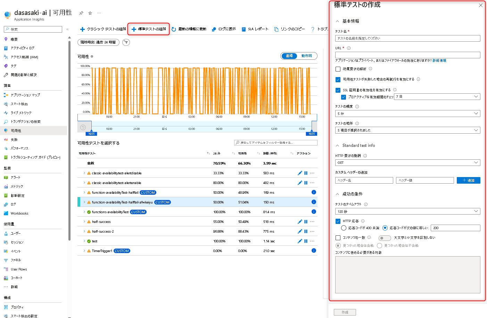

こんにちは、Azure Monitoring サポート チームの佐々木です。

今回は、Application Insights に用意されている以下の可用性テスト２種類について特徴と使い分けをご案内させていただきます。

- 1. クラシック テスト
- 2. 標準テスト

<!-- more -->

## 目次
- [目次](#目次)
- [クラシック テスト](#クラシックテスト)
- [標準テスト](#標準テスト)
- [クラシック テストの今後について](#クラシックテストの今後について)
- [閉じられたネットワークへの可用性テストについて](#閉じられたネットワークへの可用性テストについて)
- [可用性テストのテスト方法について](#可用性テストのテスト方法について)
- [まとめ](#まとめ)

## はじめに

## クラシックテスト
クラシック テストとは、以下ドキュメントにて案内されている機能を示します。

[URL ping テストを使用して可用性を監視する - Azure Monitor | Microsoft Learn](https://learn.microsoft.com/ja-jp/azure/azure-monitor/app/monitor-web-app-availability)

パブリック DNS レコードが存在し、ファイアウォールなどを使用してパブリックからのアクセスを制限した環境に対しては、サービス タグまたはテストの送信元のサーバーの IP アドレスを許可してテストを行うことができます。

可用性テストの送信元のサーバーの IP アドレスはサービス タグ "ApplicationInsightsAvailability" にて定義しております。このサービス タグをネットワーク セキュリティ グループなどで受信の許可を設定して、可用性テストを実施できます。

または、リクエストを送信するテストの場所ごとの IP アドレスに対して受信の許可を設定し、テストを行うことも可能でございます。
テストの場所ごとの IP アドレスは以下の弊社公開情報にて提供しております。
[場所ごとにグループ化されたアドレス (Azure パブリック クラウド)](https://docs.microsoft.com/ja-jp/azure/azure-monitor/app/ip-addresses#addresses-grouped-by-location-azure-public-cloud)

### クラシック テスト の機能

- ICMP ではなく、HTTP リクエストを利用し、エンドポイントが応答するかどうかを検証します。
- CSSの取得先など、Web ページが依存する Web ページの可用性解析(従属要求の解析)
- 最大3回までのリクエストが失敗した際の再試行
- リクエスト元ロケーションの指定
- 成功時の条件指定
  - 応答ステータス
  - タイムアウト秒数
  - レスポンスボディの一致(コンテンツの一致) ※日本語非対応

[参考情報]
[URL ping テストを使用して可用性を監視する - Azure Monitor | Microsoft Learn](https://learn.microsoft.com/ja-jp/azure/azure-monitor/app/monitor-web-app-availability)

## 標準テスト
標準テスト とは、以下ドキュメントにて案内されている機能を示します。

これは 2021年7月頃に追加された機能であり、同時に以前から存在していた可用性テストは、クラシック テスト と呼ばれる様になりました。

### 標準テスト の機能

クラシック テストの機能と比較し、***追加されている機能***がございます。
そのため、クラシック テストよりも多くのシチュエーションに対応する事が可能です。

- ICMP ではなく、HTTP リクエストを利用し、エンドポイントが応答するかどうかを検証します。
- CSSの取得先など、Web ページが依存する Web ページの可用性解析(従属要求の解析)
- 最大3回までのリクエストが失敗した際の再試行
- ***SSL 証明書の有効性解析***
  - ***発行者が異なる証明書ではないか等***
  - ***証明書の有効期間が切れていないか、残り日数〇日未満ではないか***
- ***HTTP リクエストのメソッド指定***
- ***HTTP リクエストのヘッダー指定***
- リクエスト元ロケーションの指定
- 成功時の条件指定
  - 応答ステータス
    - 400未満を全て成功にするオプション
  - タイムアウト秒数
  - レスポンスボディの一致(コンテンツの一致) 
    - ***日本語対応***
    - ***大文字、小文字の区別オプション***
    - ***部分一致オプション***

## クラシックテストの今後について
現時点(2022/11/6)では、クラシック テストの廃止予定はなく、引き続きご利用いただく事が可能ですが、
追加された機能と、それにより対応可能なシチュエーションが多数増えておりますため、新しく作成いただく場合には標準テストをご利用いただく事を推奨します。

## 閉じられたネットワークへの可用性テストについて
インターネットに公開されている必要のある、クラシック テスト や 標準テストでは対応する事ができません。
Azure Function を用いたカスタム可用性テストを利用した方法が公開ドキュメント、サポートブログにて案内されておりますため、こちらをご確認いただけますと幸いです。

[参考]
[Azure Functions を使用してカスタム可用性テストを作成して実行する - Azure Monitor | Microsoft Learn](https://learn.microsoft.com/ja-jp/azure/azure-monitor/app/availability-azure-functions)
[プライベート環境への可用性テスト | Japan Azure Monitoring Support Blog (jpazmon-integ.github.io)](https://jpazmon-integ.github.io/blog/applicationInsights/aboutPrivateAvailabilityTest/)

## 可用性テストのテスト方法について

可用性テストで網羅可能なシチュエーションが多数あるものの、お客様がご希望される監視要件時の動作を検証される場合、
弊社外にて用意されているサンプル ページを利用する事で検証可能と思われます。
例えば、SSL 有効性のテスト環境や、ステータスコードご構築が難しい場合は、下記のようなサイトをご利用いただく事が可能かと存じます。

- ステータス コード別
[Test pages of HTTP Status code (sakura.ne.jp)](https://ozuma.sakura.ne.jp/httpstatus/)
- SSL ステータス別
[badssl.com](https://badssl.com/)

## まとめ
本記事では、クラシックと標準の可用性テストついてご案内いたしましたが、ご理解いただけましたでしょうか。

本記事が少しでもお役に立ちましたら幸いです。
最後までお読みいただきありがとうございました！

