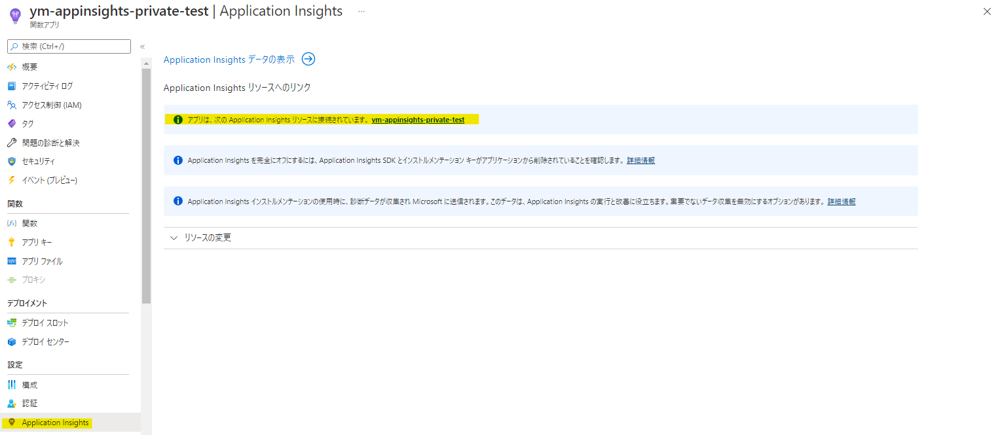
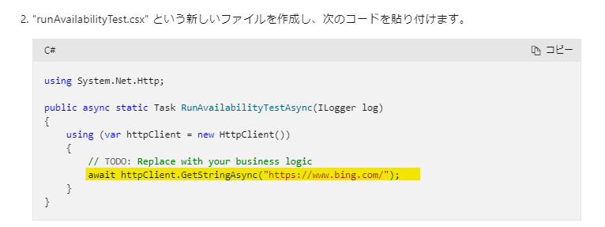
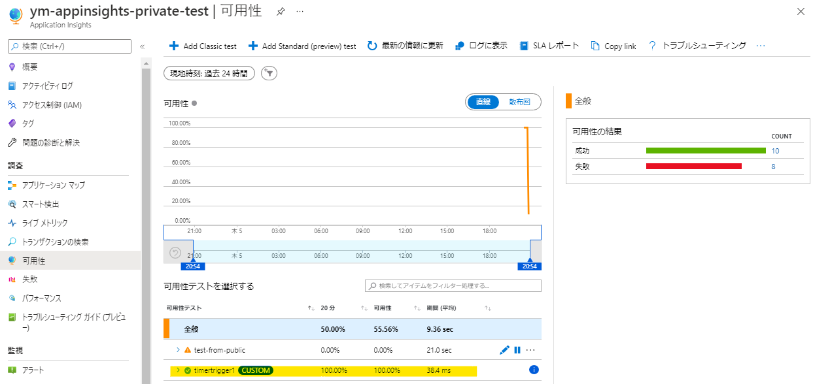

[更新履歴]
- 2022/5/18 ブログ公開
- 2026/1/7 最新情報に更新

こんにちは、Azure Monitoring サポート チームの六浦です。

今回は、以下のようなパブリックからのアクセスを許可していない環境に対して Application Insights の可用性テストを行う方法をご案内いたします。
- ファイアウォールを設定している
- パブリック IP アドレスが設定されていない etc.

<!-- more -->

## 目次
- [目次](#目次)
- [パブリックからのアクセスを許可していない環境への可用性テスト①](#パブリックからのアクセスを許可していない環境への可用性テスト①)
- [パブリックからのアクセスを許可していない環境への可用性テスト②](#パブリックからのアクセスを許可していない環境への可用性テスト②)
- [まとめ](#まとめ)

## パブリックからのアクセスを許可していない環境への可用性テスト①
パブリック DNS レコードが存在し、ファイアウォールなどを使用してパブリックからのアクセスを制限した環境に対しては、サービス タグを許可してテストを行うことができます。

可用性テストの送信元のサーバーの IP アドレスはサービス タグ "ApplicationInsightsAvailability" にて定義しております。このサービス タグをネットワーク セキュリティ グループなどで受信の許可を設定して、可用性テストを実施できます。

なお、可用性テスト サービスは共有 IP アドレスを使用しております。
可用性テストの接続元 IP アドレスは以下公開情報よりダウンロード可能な JSON ファイルの[ApplicationInsightsAvailability] の項目に記載しております。

[Azure IP Ranges and Service Tags – Public Cloud](https://www.microsoft.com/en-us/download/details.aspx?id=56519)

但し、IP アドレスの一覧は不定期に変更される見込みですので、基本的にはサービス タグをご利用いただければと存じます。

[参考情報]
[Application Insights 可用性テスト - Azure Monitor | Microsoft Learn # ファイアウォールの内側でのテスト](https://learn.microsoft.com/ja-jp/azure/azure-monitor/app/availability?tabs=track#testing-behind-a-firewall)

## パブリックからのアクセスを許可していない環境への可用性テスト②
パブリック DNS レコードが存在せず仮想ネットワーク内からのみアクセスできる環境やサービス タグを許可できない環境に対しては、Azure Functions を使用して可用性テストを行います。

1. Application Insights を有効化した Azure Functions を用意します。
   Application Insights が有効になっているかは、Azure Functions の以下の画面からご確認いただけます。

    > [!NOTE]
    > 仮想ネットワーク内で可用性テストを行う場合は、Azure Functions をテスト対象のサーバーと同じ仮想ネットワークに対して VNET 統合を設定する必要がございます。
    > Azure Functions で VNET 統合を利用するには、従量課金の代わりに Premium プランを使用します。
    > また、仮想ネットワークを使用して Azure Functions からストレージ アカウントへアクセスする場合は、以下の弊社公開情報を参考に、Azure Functions とストレージ アカウントを構成ください。
    > [仮想ネットワークで Azure Functions を構成する方法](https://learn.microsoft.com/ja-jp/azure/azure-functions/configure-networking-how-to#restrict-your-storage-account-to-a-virtual-network)

2. タイマー トリガー関数を作成します。
   以下の弊サポート チーム ブログにて、可用性テストを行うためのソース コードの実装例を提供しております。  
    [Azure Functions を利用したプライベート可用性テストについて](https://jpazmon-integ.github.io/blog/applicationInsights/privateAvailabilityTestSampleCode/)

    runAvailabilityTest.csx で、テスト先の URL を指定します。

3. Application Insights の [可用性] を開き、可用性テストが動いていることを確認します。
   Azure Functions で作成した可用性テストは、[CUSTOM] と表示されます。

※ 2026/1/7 現在、可用性テストは Application Insights の [調査] - [有効] より表示いただけます。

[参考情報]  
[pplication Insights 可用性テスト - Azure Monitor | Microsoft Learn # 可用性テストを作成する](https://learn.microsoft.com/ja-jp/azure/azure-monitor/app/availability?tabs=track#create-an-availability-test)  
[Azure Functions を利用したプライベート可用性テストについて](https://jpazmon-integ.github.io/blog/applicationInsights/privateAvailabilityTestSampleCode/)

## まとめ
本記事では、パブリックからのアクセスを許可していない環境への可用性テストの方法ついてご案内いたしましたが、ご理解いただけましたでしょうか。

本記事が少しでもお役に立ちましたら幸いです。
最後までお読みいただきありがとうございました！

