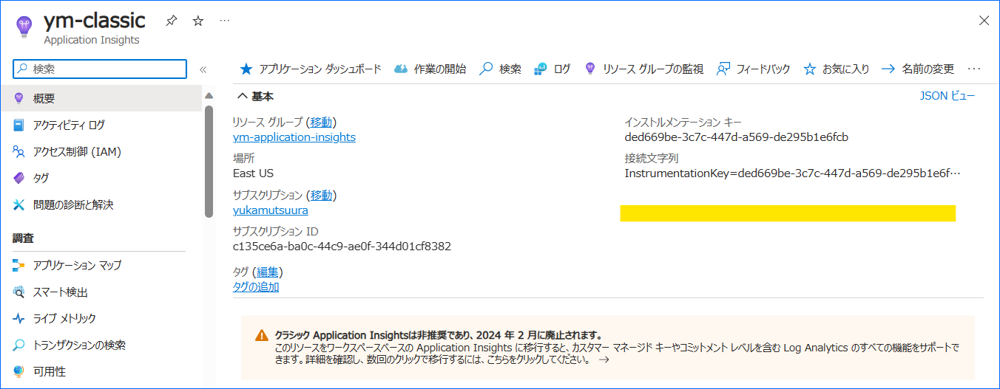
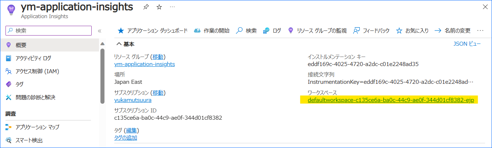
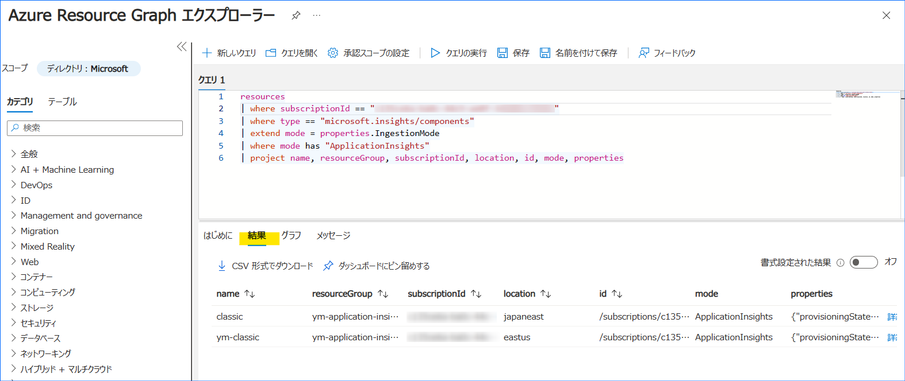
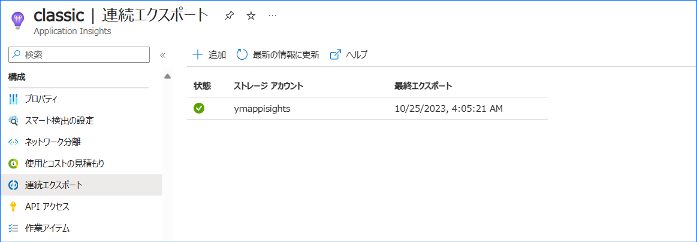
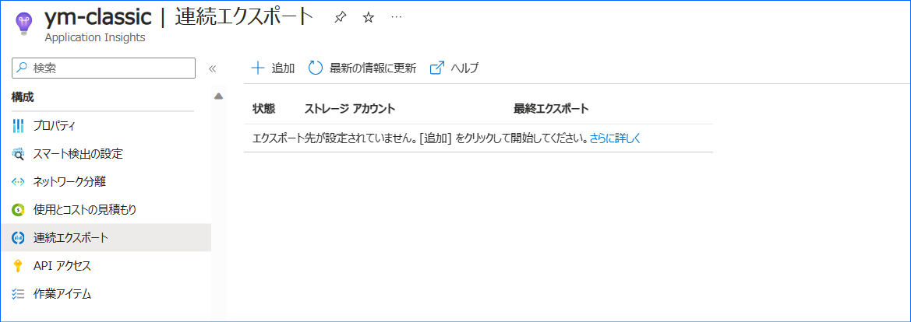
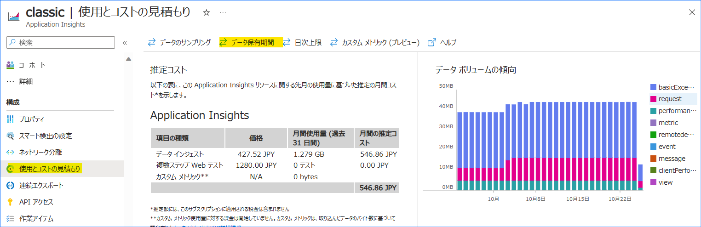

こんにちは、Azure Monitoring サポート チームの六浦です。

サービス正常性 BTNG-JT8 にて通知されている Application Insights のクラシックからワークスペースベースへの移行に関するよくあるご質問をご紹介します。
移行を行う際に疑問点があれば、是非ご確認ください。


<!-- more -->

## Q & A タイトル
  - [Q1. クラシック Application Insights を使用しているかどのように判断できますか](#Q1-クラシック-Application-Insights-を使用しているかどのように判断できますか)
  - [Q2. 複数の Application Insights に対して一括でクラシックか判断する方法はありますか](#Q2-複数の-Application-Insights-に対して一括でクラシックか判断する方法はありますか)
  - [Q3. 連続エクスポートを使用しているかはどのように判断できますか](#Q3-連続エクスポートを使用しているかはどのように判断できますか)
  - [Q4. 移行前後で Application Insights のログに対するコストに差はありますか](#Q4-移行前後で-Application-Insights-のログに対するコストに差はありますか)
  - [Q5. どのように移行したらいいですか](#Q5-どのように移行したらいいですか)
  - [Q6. クラシック Application Insights で設定したアラート ルールは変更が必要ですか](#Q6-クラシック-Application-Insights-で設定したアラート-ルールは変更が必要ですか)
  - [Q7. 移行中のログは欠損しますか](#Q7-移行中のログは欠損しますか)
  - [Q8. 移行中のログはクラシックとワークスペースベースのどちらに記録されますか](#Q8-移行中のログはクラシックとワークスペースベースのどちらに記録されますか)
  - [Q9. 移行前のクラシック Application Insights のログを、Log Analytics ワークスペースやストレージ アカウントにコピーすることはできますか](#Q9-移行前のクラシック-Application-Insights-のログを、Log-Analytics-ワークスペースやストレージ-アカウントにコピーすることはできますか)
  - [Q10. 移行の切り戻しはできますか](#Q10-移行の切り戻しはできますか)
  - [Q11. 移行に失敗したらどうしたらいいですか](#Q11-移行に失敗したらどうしたらいいですか)
  - [Q12. サポート終了後、クラシック Application Insights を利用し続けているとテレメトリは収集されなくなりますか](#Q12-サポート終了後、クラシック-Application-Insights-を利用し続けているとテレメトリは収集されなくなりますか)
  - [Q13. 移行が成功したことはどのように確認できますか](#Q13-移行が成功したことはどのように確認できますか)
  - [Q14. 移行前のログはいつまで参照できますか](#Q14-移行前のログはいつまで参照できますか)
  - [Q15. 移行に伴い、Application Insights にログを出力しているアプリケーションの設定を変更する必要はありますか](#Q15-移行に伴い、Application-Insights-にログを出力しているアプリケーションの設定を変更する必要はありますか)
  - [Q16. Application Insights にログを出力しているアプリケーションは移行時にパフォーマンスへの影響はありますか？また、アプリケーションの再起動が必要になりますか？](#Q16-Application-Insights-にログを出力しているアプリケーションは移行時にパフォーマンスへの影響はありますか？また、アプリケーションの再起動が必要になりますか？)


<br>

### Q1. クラシック Application Insights を使用しているかどのように判断できますか
Application Insights の [概要] に「ワークスペース」が表示されない場合は、クラシック Application Insights と判断できます。
また、クラシック Application Insights には、廃止に関する警告が表示されます。



「ワークスペース」が設定されている場合、ワークスペースベースの Application Insights をご利用のため、移行作業は不要です。


### Q2. 複数の Application Insights に対して一括でクラシックか判断する方法はありますか
Resource Graph エクスプローラーで以下のクエリを実行することでクラシック Application Insights の有無を確認できます。
```
resources
| where subscriptionId == "<サブスクリプション ID>"
| where type == "microsoft.insights/components"
| extend mode = properties.IngestionMode
| where mode has "ApplicationInsights"
| project name, resourceGroup, subscriptionId, location, id, mode, properties
```

結果に表示されたリソースがクラシック Application Insights です。



Resource Graph エクスプローラーについては、[こちらの弊社公開情報](https://learn.microsoft.com/ja-jp/azure/governance/resource-graph/first-query-portal)をご参照ください。


### Q3. 連続エクスポートを使用しているかはどのように判断できますか
クラシック Application Insights の [連続エクスポート] をご確認ください。
以下のように設定が表示されれば、連続エクスポートを使用していると判断できます。


一方で、以下のように「エクスポート先が設定されていません。[追加] をクリックして開始してください。」と表示される場合、連続エクスポートの設定はないと判断できます。



### Q4. 移行前後で Application Insights のログに対するコストに差はありますか
移行前後で Application Insights のログに対するコストに差はありません。
Application Insights のコストについてはこちらの[ブログ](https://jpazmon-integ.github.io/blog/applicationInsights/aboutCostOfAi/)もご参照ください

### Q5. どのように移行したらいいですか
[弊社公開情報の手順](https://learn.microsoft.com/ja-jp/azure/azure-monitor/app/convert-classic-resource#migrate-your-resource) をご参考ください。
なお、移行の前に [前提条件](https://learn.microsoft.com/ja-jp/azure/azure-monitor/app/convert-classic-resource#prerequisites)を満たしているか十分に確認ください。


### Q6. クラシック Application Insights で設定したアラート ルールは変更が必要ですか
いいえ。クラシック Application Insights で設定したアラート ルールは、移行後も引き続き動作します。
そのため、移行に伴いアラート ルールの設定を変更する必要はありません。


### Q7. 移行中のログは欠損しますか
いいえ。移行中のログは欠損しません。


### Q8. 移行中のログはクラシックとワークスペースベースのどちらに記録されますか
移行中の状況によって、クラシックに保存されるログと移行後のワークスペースに保存されるログがあります。
具体的に移行中のどのタイミングで移行後のワークスペースに保存され始めるかについては、公開可能な情報はございません。
そのため、移行作業中のログをご確認いただく際は、移行後の Log Analytics ワークスペースからではなく、Application Insights リソースの [ログ] からご確認ください。


### Q9. 移行前のクラシック Application Insights のログを、Log Analytics ワークスペースやストレージ アカウントにコピーすることはできますか
クラシック Application Insights に保存されたログをLog Analytics ワークスペースに出力する機能はありません。
また、連続エクスポートを除いてストレージ アカウントにログを出力することはできず、連続エクスポートが設定される以前に取り込まれたログをストレージ アカウントに出力する機能もありません。
すでにクラシック Application Insights に取り込まれたログをストレージ アカウントへログを保存する際は、利用者様にて以下のいずれかの手順でログを出力したファイルをストレージ アカウントに保存ください。
- Application Insights の [ログ] ブレードから検索した結果を CSV で出力


- Application Insights のログを取得する [REST API](https://learn.microsoft.com/ja-jp/rest/api/Application-Insights/query/get?tabs=HTTP) で取得したログをファイルへ出力


### Q10. 移行の切り戻しはできますか
いいえ、切り戻しはできません。
移行作業に懸念点がある場合は、新たにワークスペースベースの Application Insights リソースをご用意いただき、アプリケーションのログの出力先をクラシック Application Insights からワークスペースベースの Application Insights に変更ください。


### Q11. 移行に失敗したらどうしたらいいですか
現時点では、移行に失敗した事例は確認しておりません。
もし移行後に不具合が発生した際は、弊社サポート サービスまでお問い合わせください。


### Q12. サポート終了後、クラシック Application Insights を利用し続けているとテレメトリは収集されなくなりますか
いいえ、サポート終了後も引き続きテレメトリを収集できます。
ただし、2024 年 2 月 29 日以降はサポートを受けることはできません。
そのため、クラシック Application Insights にて問題が発生した場合、お問い合わせいただいても対応できない可能性があります。
また、今後クラシック Application Insights 自体のご利用ができなくなる可能性もございます。
サポート終了後もクラシック Application Insights を使用する際は、これらの点を予めご留意ください。

### Q13. 移行が成功したことはどのように確認できますか
Application Insights の [概要] に「ワークスペース」の設定を確認できれば移行は成功しております。
または、Log Analytics ワークスペースの [ログ] から Application Insights のログを参照できれば、移行が成功したと判断できます。


### Q14. 移行前のログはいつまで参照できますか
クラシック Application Insights で設定されていたログの保持期間までログを参照できます。
クラシック Application Insights の保持期間は [使用とコストの見積もり] > [データ保持期間] から確認できます。


### Q15. 移行に伴い、Application Insights にログを出力しているアプリケーションの設定を変更する必要はありますか
いいえ、移行後もアプリケーション側の設定を変更することなく、Application Insights に引き続きログを収集できます。

### Q16. Application Insights にログを出力しているアプリケーションは移行時にパフォーマンスへの影響はありますか？また、アプリケーションの再起動が必要になりますか？
いいえ。Application Insights にログを出力しているアプリケーションの動作に影響はありませんので、ご安心ください。


------------
上記の内容以外でご不明な点や疑問点などございましたら、弊社サポート サービスまでお問い合わせください。
また、弊社公開情報の [よく寄せられる質問](https://learn.microsoft.com/ja-jp/azure/azure-monitor/app/convert-classic-resource#frequently-asked-questions) やクラシックとワークスペースベースの違いに関する[ブログ](https://jpazmon-integ.github.io/blog/applicationInsights/aboutDifferentTypesOfAi/) もあわせてご確認いただけますと幸いです。

最後までお読みいただきありがとうございました！

