[更新履歴]
- 2023/6/8 ブログ公開
- 2026/1/7 最新情報に更新

こんにちは、Azure Monitoring サポート チームの北山です。

Application Insights には可用性テストの機能があります。
可用性テストの機能をご利用いただく事で、監視対象の Web サイトに対して自動的にリクエストを送信することが可能です。  
監視対象の Web サイトからのレスポンスをチェックし、期待したレスポンスが返却されない場合にアラートを通知する事が可能です。

[Application Insights 可用性テスト](https://learn.microsoft.com/ja-jp/azure/azure-monitor/app/availability-overview)

Application Insights のサービスから監視対象の Web サイトに対して定期的にリクエストを送信するため、監視対象の Web サイトはパブリックからの通信を許可いただく必要がございます。  
しかし、お客様の環境によってはパブリックからの通信を許可していない可能性がございます。  
この場合は、標準の可用性テストがご利用いただけません。

この記事では、TimerTrigger 関数で指定された構成に従って定期的に実行される、独自のテスト ロジックが実装された Azure Functions から、Application Insights API の一つである TrackAvailability() を使って可用性テストの結果を送信する方法について説明します。

<!-- more -->

## 目次
- [目次](#目次)
- [Azure Functions を用いたプライベート可用性テスト構築の手順](#azure-functions-を用いたプライベート可用性テスト構築の手順)
  - [1. VNET 統合を実施した Azure Functions を用意します。](#1-vnet-統合を実施した-azure-functions-を用意します)
  - [2. Azure Functions にテスト ロジックを実装します。](#2-azure-functions-にテスト-ロジックを実装します)
    - [Visual Studio Code を使って作成](#visual-studio-code-を使って作成)
    - [Azure Portal から作成](#azure-portal-から作成)
- [注意事項](#注意事項)
- [まとめ](#まとめ)
- [関連する記事](#関連する記事)


## Azure Functions を用いたプライベート可用性テスト構築の手順
### 1. VNET 統合を実施した Azure Functions を用意します。
パブリックからの通信を許可していない Web サイトにアクセスするために、VNET 統合した Azure Functions リソースを準備します。
VNET 統合を実施すると、Azure Functions からの通信が VNET を経由します。  
監視対象の Web サイトにアクセス可能な VNET 上に Azure Functions リソースをデプロイすることで、定期的に監視対象の Web サイトへテストのためのリクエストが可能です。

Azure Functions の VNET 統合の方法につきましては、下記の公開情報をご参考くださいませ。

- [Azure Functions のネットワーク オプション # 仮想ネットワークの統合](https://learn.microsoft.com/ja-jp/azure/azure-functions/functions-networking-options?tabs=azure-portal#virtual-network-integration)

上記公開情報をご参考に、ランタイムが .NET の Azure Functions リソースをご準備くださいませ。  
> 弊社検証環境では、Windows OS の .NET 6 ～ .NET 10 にて確認いたしました。

### 2. Azure Functions にテスト ロジックを実装します。
#### Visual Studio Code を使って作成
下記の公開情報をもとに、Azure Functions にデプロイする関数を作成します。  
Visual Studio Code を使って関数を作成するための前提条件などは、下記の公開情報をご一読ください。
- [Visual Studio Code を使用して Azure Functions を開発する](https://learn.microsoft.com/ja-jp/azure/azure-functions/functions-develop-vs-code?tabs=node-v4%2Cpython-v2%2Cisolated-process&pivots=programming-language-csharp)

上記公開情報に従って、Timer Triger の関数を作成します。  
※ ここでは、C# (.NET 8 Isolated) のランタイムを選択しております。


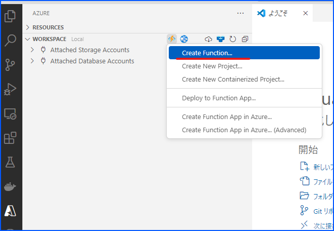
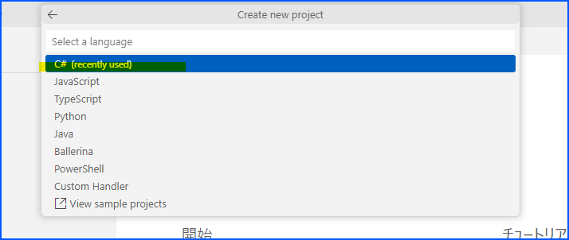


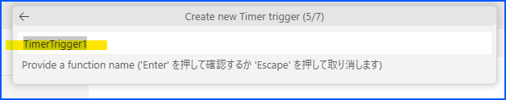
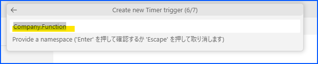
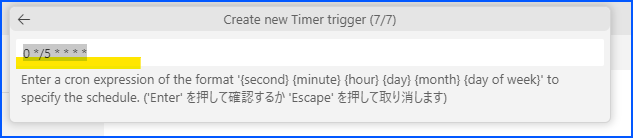


プロジェクト ファイルに、下記のコードを追加して Application Insights SDK の[最新バージョン](https://www.nuget.org/packages/Microsoft.Azure.WebJobs.Logging.ApplicationInsights#versions-body-tab)を導入します。
```xml
    <PackageReference Include="Microsoft.Azure.WebJobs.Logging.ApplicationInsights" Version="3.0.44" /> <!-- Ensure you’re using the latest version --> 
```


> 注意 : C# の Functions に Application Insights SDK を導入する場合は、標準の Application Insights SDK ではなく必ず "Microsoft.Azure.WebJobs.Logging.ApplicationInsights" をインストールしてください。
- [Azure Functions を使用する C# クラス ライブラリ関数を開発する - カスタム テレメトリをログに記録する](https://learn.microsoft.com/ja-jp/azure/azure-functions/functions-dotnet-class-library?tabs=v4%2Ccmd#log-custom-telemetry-in-c-functions)

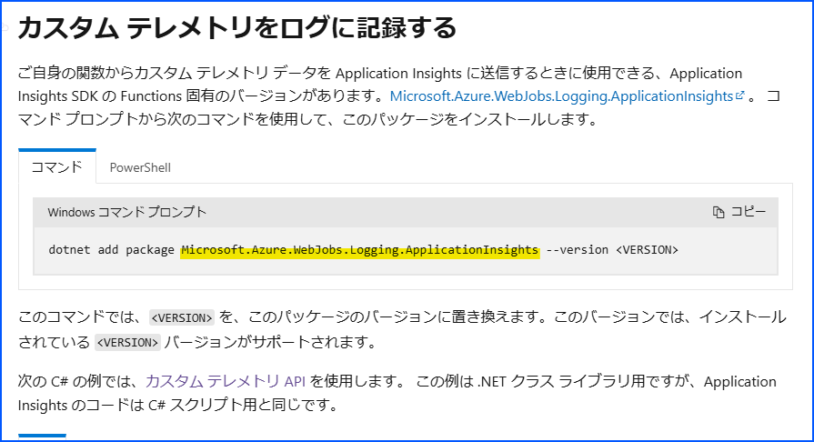

最新のバージョンは[こちら](https://www.nuget.org/packages/Microsoft.Azure.WebJobs.Logging.ApplicationInsights)をご確認ください。

その後、Timer Triger のクラスに下記のようにコードを修正します。  
※ 検証環境では TimerTrigger1 というクラス名で動かしています。

using 宣言は下記のとおりです。
```cs
using Microsoft.Azure.Functions.Worker;
using Microsoft.Extensions.Logging;
using Microsoft.ApplicationInsights;
using Microsoft.ApplicationInsights.DataContracts;
using Microsoft.ApplicationInsights.Extensibility;
using System.Diagnostics;
```

プライベート変数として TelemetryClient クラスの変数を定義し、コンストラクタは下記のとおり改修します。
```cs
        private readonly TelemetryClient telemetryClient;

        public TimerTrigger1(ILoggerFactory loggerFactory, TelemetryConfiguration telemetryConfiguration)
        {
            _logger = loggerFactory.CreateLogger<TimerTrigger1>();
            this.telemetryClient = new TelemetryClient(telemetryConfiguration);
        }
```

Run 関数は下記のとおりです。  
Application Insights へ送信するテスト結果インスタンス (AvailabilityTelemetry) を生成し、テストを実施、結果を指定し TrackAvailability() を呼び出して Application Insights へ結果を出力します。
```cs
        [Function("TimerTrigger1")]
        public async Task Run([TimerTrigger("0 */5 * * * *")] TimerInfo myTimer)
        {
            string testName = "Function Name";
            string location = Environment.GetEnvironmentVariable("REGION_NAME");
            var availability = new AvailabilityTelemetry
            {
                Name = testName,
                RunLocation = location,
                Success = false,
            };

            availability.Context.Operation.ParentId = Activity.Current.SpanId.ToString();
            availability.Context.Operation.Id = Activity.Current.RootId;
            var stopwatch = new Stopwatch();
            stopwatch.Start();

            try
            {
                using (var activity = new Activity("AvailabilityContext"))
                {
                    activity.Start();
                    availability.Id = Activity.Current.SpanId.ToString();
                    // Run business logic 
                    await RunAvailabilityTestAsync();
                }
                availability.Success = true;
            }

            catch (Exception ex)
            {
                availability.Message = ex.Message;
                throw;
            }

            finally
            {
                stopwatch.Stop();
                availability.Duration = stopwatch.Elapsed;
                availability.Timestamp = DateTimeOffset.UtcNow;
                telemetryClient.TrackAvailability(availability);
                telemetryClient.Flush();
            }
        }
```

別途下記のようなビジネス ロジックを実装し、この中で監視対象の Web サイトへアクセスします。  
アクセスした結果は、適宜呼び出し元に返却します。  
テスト結果が NG の場合は、例外をスローしても良いかもしれません。  
例外をスローする場合は、必ず呼び出し元で Catch して Application Insights へ結果を出力しましょう。
```cs
        private async Task RunAvailabilityTestAsync()
        {
            using (var httpClient = new HttpClient())
            {
                // TODO: Replace with your business logic 
                await httpClient.GetStringAsync("https://www.bing.com/");
            }
        }
```

TimerTrigger1 クラスの全体はこのような感じで実装しております。
```cs
using Microsoft.Azure.Functions.Worker;
using Microsoft.Extensions.Logging;
using Microsoft.ApplicationInsights;
using Microsoft.ApplicationInsights.DataContracts;
using Microsoft.ApplicationInsights.Extensibility;
using System.Diagnostics;

namespace Company.Function
{
    public class TimerTrigger1
    {
        private readonly ILogger _logger;
        private readonly TelemetryClient telemetryClient;

        public TimerTrigger1(ILoggerFactory loggerFactory, TelemetryConfiguration telemetryConfiguration)
        {
            _logger = loggerFactory.CreateLogger<TimerTrigger1>();
            this.telemetryClient = new TelemetryClient(telemetryConfiguration);
        }

        [Function("TimerTrigger1")]
        public async Task Run([TimerTrigger("0 */5 * * * *")] TimerInfo myTimer)
        {
            string testName = "Function Name";
            string location = Environment.GetEnvironmentVariable("REGION_NAME");
            var availability = new AvailabilityTelemetry
            {
                Name = testName,
                RunLocation = location,
                Success = false,
            };

            availability.Context.Operation.ParentId = Activity.Current.SpanId.ToString();
            availability.Context.Operation.Id = Activity.Current.RootId;
            var stopwatch = new Stopwatch();
            stopwatch.Start();

            try
            {
                using (var activity = new Activity("AvailabilityContext"))
                {
                    activity.Start();
                    availability.Id = Activity.Current.SpanId.ToString();
                    // Run business logic 
                    await RunAvailabilityTestAsync();
                }
                availability.Success = true;
            }

            catch (Exception ex)
            {
                availability.Message = ex.Message;
                throw;
            }

            finally
            {
                stopwatch.Stop();
                availability.Duration = stopwatch.Elapsed;
                availability.Timestamp = DateTimeOffset.UtcNow;
                telemetryClient.TrackAvailability(availability);
                telemetryClient.Flush();
            }
        }

        private async Task RunAvailabilityTestAsync()
        {
            using (var httpClient = new HttpClient())
            {
                // TODO: Replace with your business logic 
                await httpClient.GetStringAsync("https://www.bing.com/");
            }
        }

    }
}

```

その後、当該関数が実行されると、テスト コードの結果として Application Insights に可用性テストの結果が記録されます。

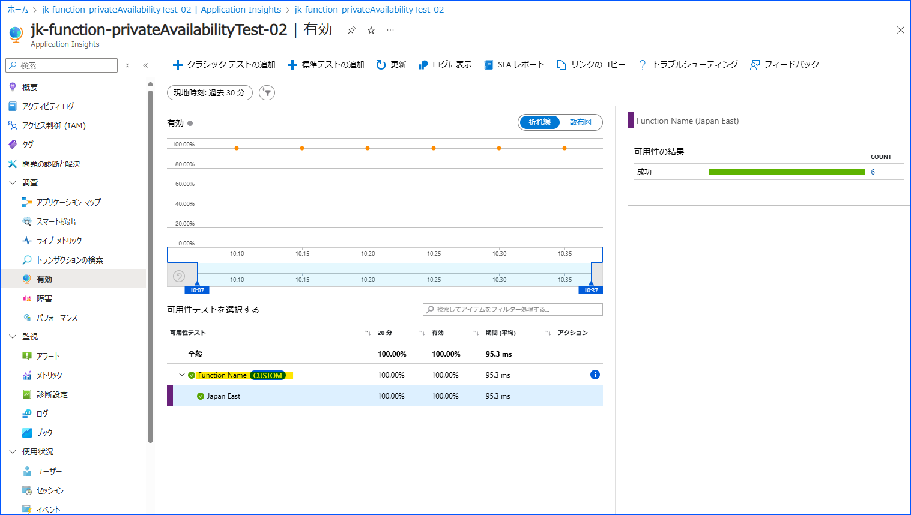


#### Azure Portal から作成 
> Azure Portal からの作成は、.NET インプロセス モデルのみサポートしております。  
> また、インプロセス モデルはサポート終了予定で、今後は Visual Studio Code などを使って作成する必要がある点ご留意ください。


その 1 でご準備いただいた Functions リソースに対して、タイマー トリガーの関数を作成します。
関数名やスケジュールは、貴社のご要件に合うよう適宜ご指定くださいませ。

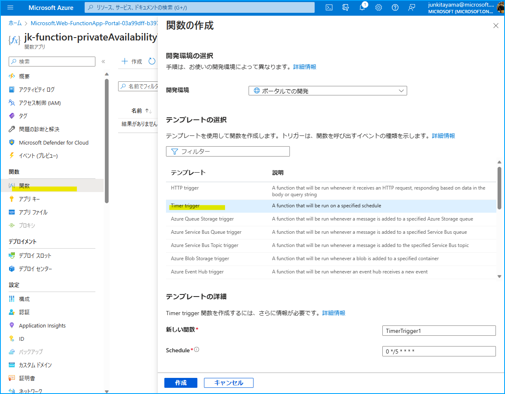


その後、当該 Functions リソースの左側ペインより「App Service Editor (プレビュー)」を開きます。


下図のように、当該関数に対して右クリックし新しいファイルを作成します。  
作成するファイル名は、「function.proj」です。

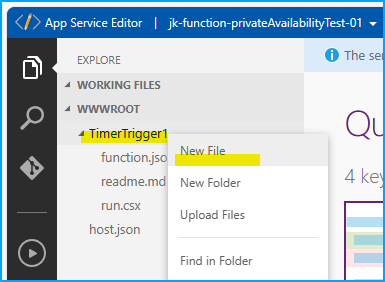

function.proj に対して、下記のコードを貼り付けます。

```xml
<Project Sdk="Microsoft.NET.Sdk"> 
 <PropertyGroup> 
 <TargetFramework>netstandard2.0</TargetFramework> 
 </PropertyGroup> 
 <ItemGroup> 
 <PackageReference Include="Microsoft.ApplicationInsights" Version="2.15.0" /> <!-- Ensure you’re using the latest version --> 
 </ItemGroup> 
</Project>
```


次に runAvailabilityTest.csx というファイルを作成し、下記のコードを貼り付けます。  
> 下記のコードは、監視対象の Web サイトに対して GET リクエストを送信するコードです。  
> こちらはサンプル コードのため、Bing のサイトにアクセスするよう実装しております。  

```cs
using System.Net.Http;

public async static Task RunAvailabilityTestAsync( ILogger log )
{
    using (var httpClient = new HttpClient())
    {
        // TODO: Replace with your business logic 
        await httpClient.GetStringAsync( "https://www.bing.com/" );
    }
}
```
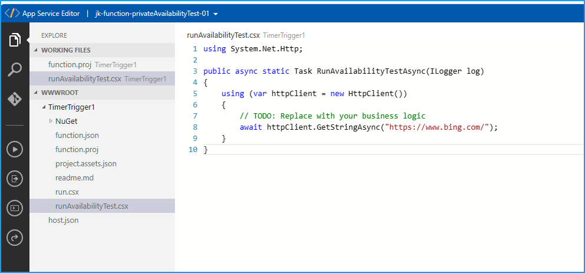


次のコードを run.csx にコピーします。  
これによって既存のコードが全て置き換えられます。
> 下記のサンプル コードは、当該 Functions のアプリケーション設定に指定された接続文字列 (APPLICATIONINSIGHTS_CONNECTION_STRING) を使って、テスト結果の送信先である Application Insights を指定しています。
```cs
#load "runAvailabilityTest.csx" 
using System;
using System.Diagnostics;
using System.Threading.Tasks;
using System.Threading;
using Microsoft.ApplicationInsights;
using Microsoft.ApplicationInsights.Channel;
using Microsoft.ApplicationInsights.DataContracts;
using Microsoft.ApplicationInsights.Extensibility;
using Microsoft.Extensions.Logging;

private static TelemetryClient telemetryClient;

// ============================================================= 
// ****************** DO NOT MODIFY THIS FILE ****************** 
// Business logic must be implemented in RunAvailabilityTestAsync function in runAvailabilityTest.csx 
// If this file does not exist, please add it first 
// ============================================================= 
public async static Task Run( TimerInfo myTimer, ILogger log, Microsoft.Azure.WebJobs.ExecutionContext executionContext )
{
    if (telemetryClient == null)
    {
        // Initializing a telemetry configuration for Application Insights based on connection string 
        var telemetryConfiguration = new TelemetryConfiguration();
        telemetryConfiguration.ConnectionString = Environment.GetEnvironmentVariable( "APPLICATIONINSIGHTS_CONNECTION_STRING" );
        telemetryConfiguration.TelemetryChannel = new InMemoryChannel();
        telemetryClient = new TelemetryClient( telemetryConfiguration );
    }

    string testName = executionContext.FunctionName;
    string location = Environment.GetEnvironmentVariable( "REGION_NAME" );
    var availability = new AvailabilityTelemetry
    {
        Name = testName,
        RunLocation = location,
        Success = false,
    };

    availability.Context.Operation.ParentId = Activity.Current.SpanId.ToString();
    availability.Context.Operation.Id = Activity.Current.RootId;
    var stopwatch = new Stopwatch();
    stopwatch.Start();

    try
    {
        using (var activity = new Activity( "AvailabilityContext" ))
        {
            activity.Start();
            availability.Id = Activity.Current.SpanId.ToString();
            // Run business logic 
            await RunAvailabilityTestAsync( log );
        }
        availability.Success = true;
    }

    catch (Exception ex)
    {
        availability.Message = ex.Message;
        throw;
    }

    finally
    {
        stopwatch.Stop();
        availability.Duration = stopwatch.Elapsed;
        availability.Timestamp = DateTimeOffset.UtcNow;
        telemetryClient.TrackAvailability( availability );
        telemetryClient.Flush();
    }
}
```

その後、当該関数が実行されると、テスト コードの結果として Application Insights に可用性テストの結果が記録されます。

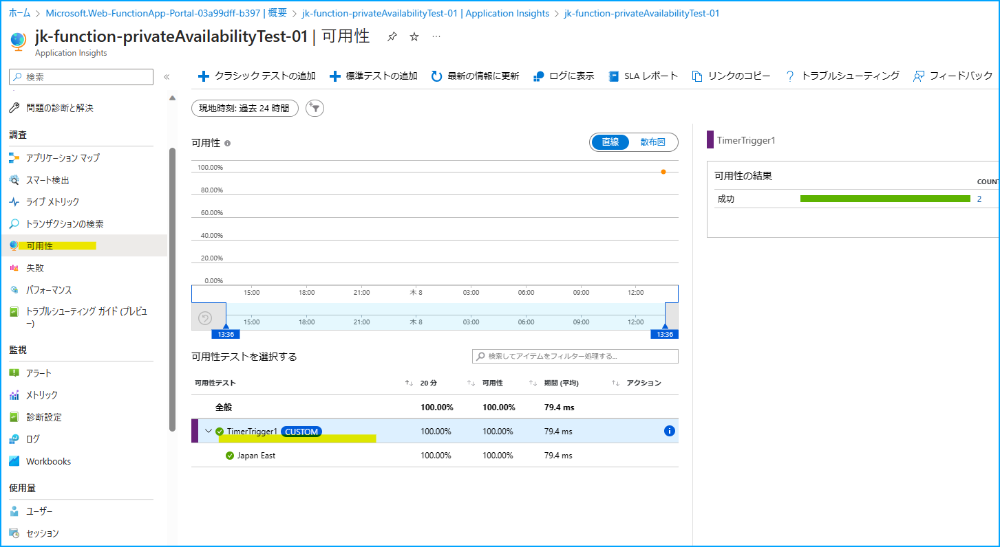


## 注意事項
上記サンプル コードは、あくまでサンプルです。  
お客様の環境によっては GET リクエストではなく POST リクエストの実行結果を確認する事も想定されます。  
そのため、お客様の監視要件に合わせてテスト コードを実装いただけますと幸いです。


## まとめ
本記事では、パブリックからのアクセスを許可していない環境への可用性テストの方法ついてご案内いたしましたが、ご理解いただけましたでしょうか。

本記事が少しでもお役に立ちましたら幸いです。
最後までお読みいただきありがとうございました！

## 関連する記事
- [プライベート環境への可用性テスト](https://jpazmon-integ.github.io/blog/applicationInsights/aboutPrivateAvailabilityTest/)
