こんにちは、Azure Monitoring サポート チームの北山です。

App Service や Azure VM などにデプロイいただいている Web アプリケーションのパフォーマンスを監視するために、Application Insights をご利用いただいているケースがございます。  
監視対象の Web アプリケーションから Application Insights リソースに対してテレメトリ (ログやメトリックなどの情報) を送信することで、Web アプリケーションのパフォーマンス監視が可能です。  
しかし、場合によっては監視対象の Web アプリケーションから Application Insights リソースに対してテレメトリが送信されないケースがございます。
> 例 : Application Insights リソースの requests テーブルや traces テーブルに、突然ログが保存されなくなった。requests テーブルにはログが記録されているのに、突然 traces テーブルのログが記録されなくなったなど。

このような問題が発生した場合に、問題解消のためにチェックすべきポイントについて記載いたします。
問題発生時によろしければご参考ください。

# 目次
- [目次](#目次)
- [ケース 1. すべての種類のテレメトリが Application Insights にまったく収集されなくなった](#ケース-1-すべての種類のテレメトリが-application-insights-にまったく収集されなくなった)
  - [問題の概要](#問題の概要)
  - [疑われるポイント](#疑われるポイント)
- [ケース 2. 一部の種類のテレメトリが Application Insights にまったく収集されなくなった](#ケース-2-一部の種類のテレメトリが-application-insights-にまったく収集されなくなった)
  - [問題の概要](#問題の概要-1)
  - [実際にあったケース](#実際にあったケース)
- [ケース 3. 問題なく Application Insights にテレメトリが収集出来ているが、時々期待したログが欠落する](#ケース-3-問題なく-application-insights-にテレメトリが収集出来ているが時々期待したログが欠落する)
  - [問題の概要](#問題の概要-2)
  - [疑われるポイント](#疑われるポイント-1)
- [色々調べたけど問題が解決しない場合……](#色々調べたけど問題が解決しない場合)
- [まとめ](#まとめ)
- [関連する記事](#関連する記事)


# ケース 1. すべての種類のテレメトリが Application Insights にまったく収集されなくなった
## 問題の概要
- 今までは問題なく Application Insights に各種テレメトリ (requests ログや traces ログ、dependencies ログなど) が収集されていた。
- しかし突然、すべての種類のテレメトリが Application Insights に収集されなくなった。

## 疑われるポイント
### その 1. 通信のトラブル
突然すべてのテレメトリが Application Insights に収集されなくなった場合、Application Insights のエンドポイントに対して通信が失敗している可能性がございます。  
例えば下記のような契機によって、すべてのテレメトリが突然収集できなくなる可能性がございます。

- 監視対象の Web アプリケーションを App Service にデプロイしており、App Service リソースに対して VNET 統合を実施した。
- 監視対象の Web アプリケーションを Azure VM にデプロイしており、関連する VNET に紐づいた NSG や Azure Firewall の設定を変更した。など

上記のような作業を実施したことで、Application Insights のエンドポイントと通信が出来ずテレメトリの収集に失敗している可能性がございます。

ちなみに Application Insights に対してテレメトリを送信するためには、Application Insights のエンドポイントに関連する URL に通信が可能な状態である必要がございます。
> 「目的」がテレメトリの箇所の URL をご確認ください。

- [Azure Monitor で使用される IP アドレス # 送信ポート](https://learn.microsoft.com/ja-jp/azure/azure-monitor/app/ip-addresses#outgoing-ports)
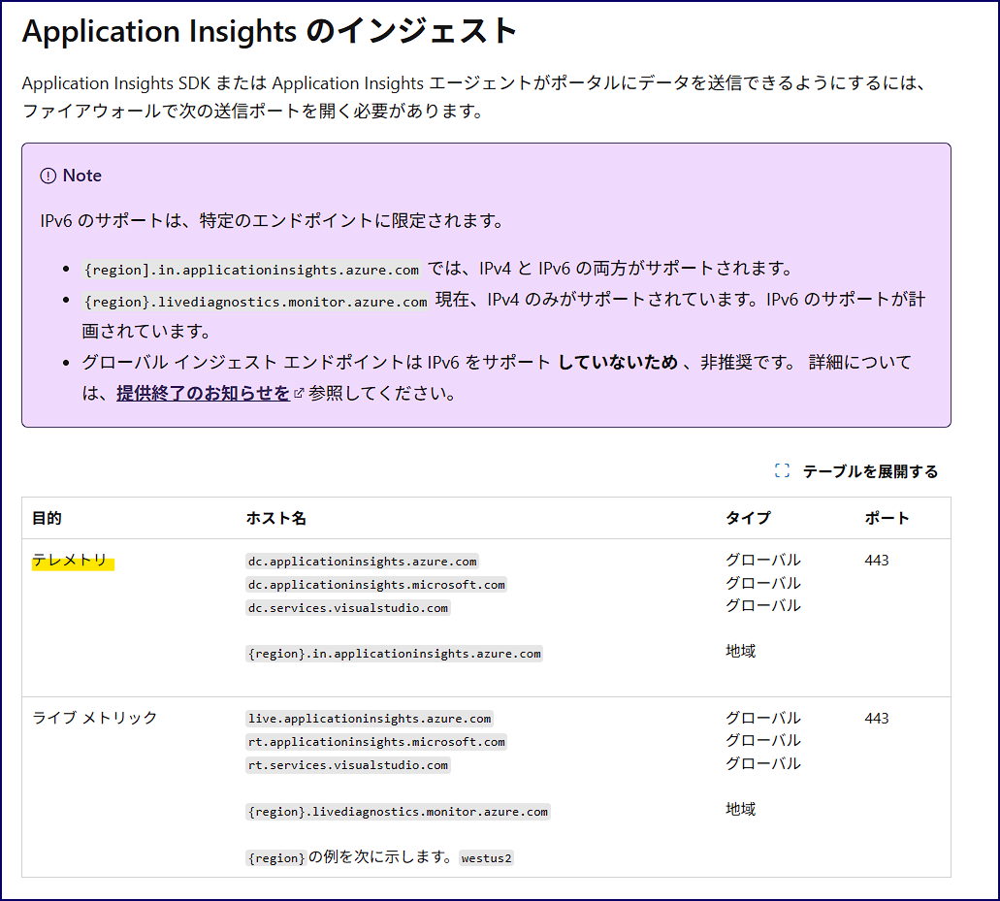

もしくは、もしサービス タグを用いて通信制御を構築している場合、監視対象の Web アプリケーションから外向きの通信に対して AzureMonitor サービス タグに対する通信許可が必要です。  
ポート番号は 443 番に対して通信許可をご構築ください。

そのため、例えば VNET 統合した App Service リソースから「dc.applicationinsights.azure.com」に対する名前解決が失敗する、通信でタイムアウトが発生している場合、突然すべての種類のテレメトリが宛先の Application Insights に対して送信できなくなる可能性がございます。

### Application Insights への通信を確認する方法
#### App Service や Azure Functions に Web アプリケーションをデプロイしている場合
下記の手順で当該コンピューターから Application Insights へ通信が可能であるかどうかをご確認ください。

##### 手順
1. 当該 Application Insights リソース ページへ移動します。
2. 概要ページに記載がある接続文字列をコピーいただき、[IngestionEndpoint] に指定がある URL のホスト名をコピーします。  
例 : 「```IngestionEndpoint=https://japaneast-0.in.applicationinsights.azure.com/```」の場合は、「japaneast-0.in.applicationinsights.azure.com」をコピーします。  
もしくは、グローバル インジェスト エンドポイントのホストである「dc.applicationinsights.azure.com」を使います。  
接続文字列を用いて Application Insights と統合する場合は、接続文字列に記載があるホストに対して通信します。  
接続文字列ではなくインストルメンテーション キーを用いて Application Insights と統合する場合は、dc.applicationinsights.azure.com に対して通信します。
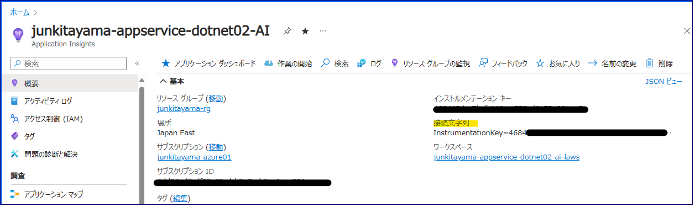

3. 当該 App Service リソース ページへ移動します。
4. 左側ペインの [高度なツール] をクリックし、[移動] をクリックします。
5. 画面上部の [Debug console - PowerShell] をクリックします。  
Linux の場合おは[SSH] をクリックします。
6. 下記コマンドを実行し、名前解決が可能であるかどうかご確認ください。

**Linux の場合**
```
nslookup <2 でコピーした値>
```
例 : 
```
nslookup japaneast-0.in.applicationinsights.azure.com
```

もし名前解決が出来ない場合、一例ではございますが下図のようにエラーが発生します。


正常に名前解決出来る場合は、下図のように IP アドレスが表示されます。  
※ 下図の環境は AMPLS を構築しているため、プライベート エンドポイントの IP アドレスが表示されております。

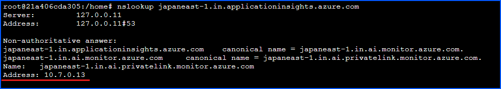

**Windows の場合**
```
nameresolver <2 でコピーした値>
```
例 : 
```
nameresolver japaneast-1.in.applicationinsights.azure.com
```

もし名前解決が出来ない場合、一例ではございますが下図のようにエラーが発生します。

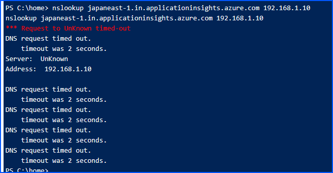

正常に名前解決出来る場合は、下図のように IP アドレスが表示されます。  
※ 下図の環境は AMPLS を構築しているため、プライベート エンドポイントの IP アドレスが表示されております。

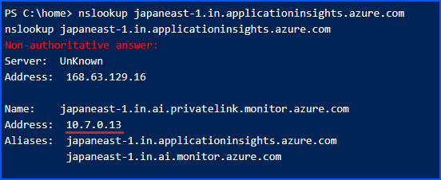

7. 下記コマンドを実行し、Application Insights のエンドポイントと通信が可能かご確認ください。  

**Linux の場合**  
```
curl -v --tlsv1.1 --tls-max 1.2 https://<2 でコピーした値>:443
```

例 : 
```
curl -v --tlsv1.1 --tls-max 1.2 https://japaneast-0.in.applicationinsights.azure.com:443
```

もし宛先と通信が出来ない場合、一例ではございますが下図のようにエラーが発生します。


もし 404 が返ってきた場合は正常に通信が出来ております。


**Windows の場合**  
```
tcpping <2 でコピーした値>:443
```

例 : 
```
tcpping japaneast-1.in.applicationinsights.azure.com:443
```

もし宛先と通信が出来ない場合、一例ではございますが下図のようにエラーが発生します。

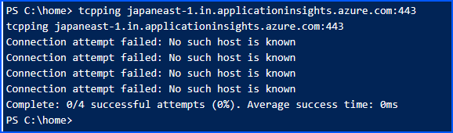

もし、「Complete: 4/4 successful attempts (100%)」が出力された場合は、正常に通信出来ております。

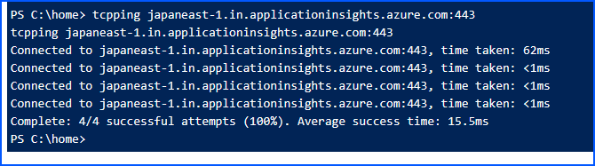

App Service や Azure Functions の場合、nslookup や ping は機能しません。  
そのため、nameresolver や tcpping を利用しております。  
詳細は下記の公開情報をご参考ください。

- [仮想ネットワークとAzure App Serviceの統合のトラブルシューティング # Windows Apps での送信接続のトラブルシューティング](https://learn.microsoft.com/ja-jp/troubleshoot/azure/app-service/troubleshoot-vnet-integration-apps#troubleshoot-outbound-connectivity-on-windows-apps)  

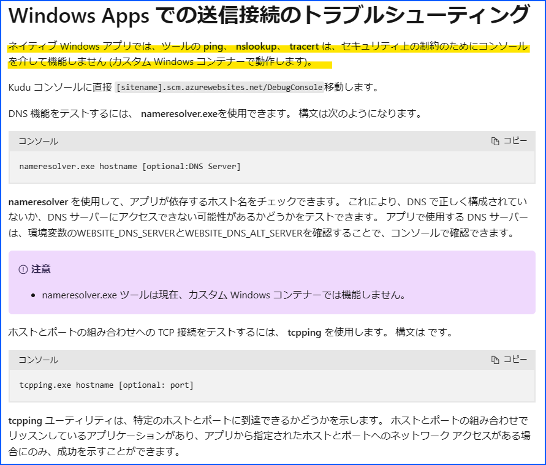


#### Azure VM やオンプレミス環境のコンピューターに Web アプリケーションをデプロイしている場合
下記の手順で当該コンピューターから Application Insights へ通信が可能であるかどうかをご確認ください。

##### 手順
1. 当該 Application Insights リソース ページへ移動します。
2. 概要ページに記載がある接続文字列をコピーいただき、[IngestionEndpoint] に指定がある URL のホスト名をコピーします。  
例 : 「```IngestionEndpoint=https://japaneast-0.in.applicationinsights.azure.com/```」の場合は、「japaneast-0.in.applicationinsights.azure.com」をコピーします。


3. 当該コンピューターにリモートで接続いただき、下記コマンドを実行し、名前解決が可能であるかどうかご確認ください。もし名前解決に失敗する場合は、DNS 周りに何か問題があるかもしれません。

**Linux の場合**  
```
nslookup <2 でコピーした値>
```
例 : 
```
nslookup japaneast-0.in.applicationinsights.azure.com
```

**Windows の場合 (PowerShell で実行)**  
```
nslookup <2 でコピーした値>
```

例 : 
```
nslookup japaneast-0.in.applicationinsights.azure.com
```

4. 下記コマンドを実行し、Application Insights のエンドポイントと通信が可能かご確認ください。もし通信に失敗する場合、ファイアウォールや NSG の設定などに問題があるかもしれません。


**Linux の場合**
```
curl -v --tlsv1.1 --tls-max 1.2 https://<2 でコピーした値>:443
```
例 : 
```
curl -v --tlsv1.1 --tls-max 1.2 https://japaneast-0.in.applicationinsights.azure.com:443
```

**Windows の場合 (PowerShell で実行)**
```
Test-NetConnection -ComputerName <2 でコピーした値> -Port 443
```

例 :
```
Test-NetConnection -ComputerName japaneast-0.in.applicationinsights.azure.com -Port 443
```


もし監視対象のコンピューターや App Service から Application Insights への通信が失敗しているようなら、一度通信環境の見直しをお願いします。

### その 2. 日時上限の制限抵触
クラシック・ワークスペース ベースの両方に、日時上限の設定が可能です。  
もし日時上限の制限に抵触していた場合、Application Insights リソースへのテレメトリ取り込みがストップします。

クラシック Application Insights リソースにて日時上限が発生した場合、当該 Application Insights リソースのアクティビティ ログが出力されます。  
出力されるアクティビティ ログは、下記公開情報に記載があるログです。
- [Log Analytics ワークスペースの日次上限を設定する # 従来の Application Insights リソース](https://learn.microsoft.com/ja-jp/azure/azure-monitor/logs/daily-cap#classic-application-insights-resource)


ワークスペース ベースの Application Insights の場合、Application Insights リソース側もしくは Application Insights リソースに紐づいた Log Analytics ワークスペース側に日時上限の設定が可能です。  

もし Application Insights リソース側に日時上限の設定 10 GB を設定し、Log Analytics ワークスペース側に 100 GB を設定した場合、データ サイズが少ない Application Insights リソース側の日時上限に抵触した段階でテレメトリの取り込みがストップします。  

もし Application Insights リソース側の日時上限に抵触した場合は、前述のアクティビティ ログが出力されます。  

一方で、**「Application Insights リソース側の日時上限データ サイズ > Log Analytics ワークスペース側の日時上限データ サイズ」** の場合は、Log Analytics ワークスペース側の制限に抵触し、テレメトリの取り込みがストップします。  
この場合は、Log Analytics ワークスペース側にて ``` _LogOperation | where Category =~ "Ingestion" | where Detail contains "OverQuota" ``` のクエリを実行することで、日時上限に抵触したかどうかの判断が可能です。

- [Log Analytics ワークスペースの日次上限を設定する # 1 日の上限に達したら警告する](https://learn.microsoft.com/ja-jp/azure/azure-monitor/logs/daily-cap#alert-when-daily-cap-is-reached)


日時上限に抵触してテレメトリの取り込みがストップしたかどうかは、上記の内容でご判断ください。  
その他参考資料はこちらです。

- [Application Insights の日次上限の予期しない動作](https://learn.microsoft.com/ja-jp/troubleshoot/azure/azure-monitor/app-insights/daily-cap-unexpected-behaviors)


### その 3. AMPLS による意図的なテレメトリ取り込みの拒否
もしお客様の環境にて AMPLS をご利用いただいており、Application Insights への通信を AMPLS のプライベート エンドポイント経由で行っている場合に発生する可能性がございます。

例えば下図の VNET 上に Web アプリケーションがデプロイされた Azure VM が存在する場合。  
下図の VNET と統合した App Service・Azure Functions が存在する場合などです。


上記のような環境の場合、Application Insights のエンドポイントのホスト名に対して名前解決を実施すると、AMPLS に紐づいたプライベート エンドポイントの IP アドレスに変換されます。  
> Global IP アドレスではなく、Private IP アドレスに変換されます。

例えば通常の場合、dc.services.visualstudio.com (Application Insights エンドポイントの一部のホスト名) に対して名前解決を実施すると、下記のように Global IP アドレスに変換されます。

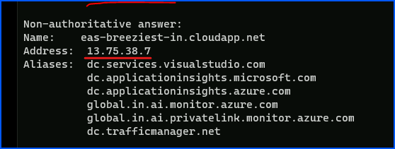


一方で AMPLS の環境を構築している場合、名前解決した結果下記のように Private IP アドレスに変換されます。

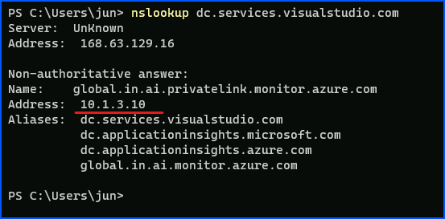

このように AMPLS に紐づいたプライベート エンドポイントに対する通信が発生する場合に、AMPLS 側の設定によってテレメトリが意図的に Application Insights に取り込まれない可能性があります。

例えば下記のような設定の場合を想定します。


**AMPLS の「インジェスト アクセス モード」が「プライベートのみ」**


**AMPLS に対して、宛先の Application Insights リソースが追加されていない**

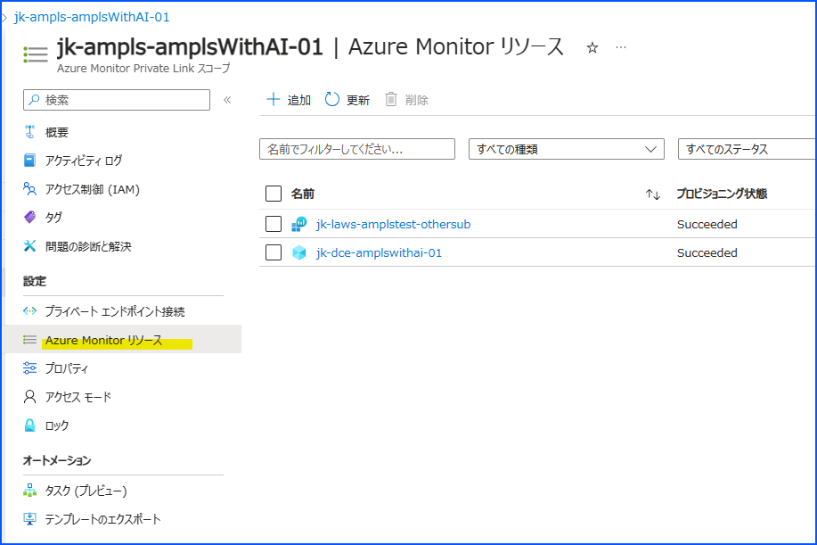

このような状況で、監視対象 Web アプリケーションからプライベート エンドポイント経由で Application Insights にテレメトリを送信しようとした場合、AMPLS 側でテレメトリの取り込みが拒否されます。
> 下図は、PowerShell スクリプトを使って Application Insights にテレメトリの送信を試みている状況を表しております。Application Insights のエンドポイントから 403 が返ってきている事がわかります。

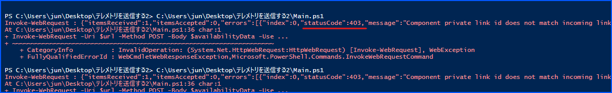

もしお客様の環境で Application Insights へのテレメトリ送信を試されたい場合は、下記の PowerShell コマンドを Kudu や Azure VM のゲスト OS などから実行ください。

※ 下記 PowerShell スクリプトは、当該 Application Insights リソースに対して availabilityResults テーブルにテスト用のログを送信するためのスクリプトです。詳細は[可用性テスト結果を送信する PowerShell スクリプト
](https://learn.microsoft.com/ja-jp/troubleshoot/azure/azure-monitor/app-insights/investigate-missing-telemetry#powershell-script-send-availability-test-result) の公開情報をご確認ください。  
※ $ConnectionString の変数に対して、適宜当該 Application Insights リソースの接続文字列の値をご指定ください。
```powershell
# Info: Provide either the Connection String or Ikey for your Application Insights Resource

$ConnectionString = "InstrumentationKey=XXXXXXXX;IngestionEndpoint=https://japaneast-1.in.applicationinsights.azure.com/;LiveEndpoint=https://japaneast.livediagnostics.monitor.azure.com/" 
$InstrumentationKey = ""
 
function ParseConnectionString {
param ([string]$ConnectionString)
  $Map = @{}
 
  foreach ($Part in $ConnectionString.Split(";")) {
     $KeyValue = $Part.Split("=")
     $Map.Add($KeyValue[0], $KeyValue[1])
  }
  return $Map
}
 
# If Ikey is the only parameter supplied, we'll send telemetry to the 
# global ingestion endpoint instead of regional endpoint found in connection strings
If (($InstrumentationKey) -and ("" -eq $ConnectionString)) {
$ConnectionString = "InstrumentationKey=$InstrumentationKey;IngestionEndpoint=https://dc.services.visualstudio.com/"
}
 
$map = ParseConnectionString($ConnectionString)
$url = $map["IngestionEndpoint"] + "v2/track"
$ikey = $map["InstrumentationKey"]
$lmUrl = $map["LiveEndpoint"]
 
$time = (Get-Date).ToUniversalTime().ToString("o")
 
$availabilityData = @"
{
  "data": {
        "baseData": {
            "ver": 2,
            "id": "SampleRunId",
            "name": "Microsoft Support Sample Webtest Result",
            "duration": "00.00:00:10",
            "success": true,
            "runLocation": "Region Name",
            "message": "Sample Webtest Result",
            "properties": {
                "Sample Property": "Sample Value"
                }
        },
        "baseType": "AvailabilityData"
  },
  "ver": 1,
  "name": "Microsoft.ApplicationInsights.Metric",
  "time": "$time",
  "sampleRate": 100,
  "iKey": "$iKey",
  "flags": 0
}
"@ 
 
# Uncomment one or more of the following lines to test client TLS/SSL protocols other than the machine default option
# [System.Net.ServicePointManager]::SecurityProtocol = [System.Net.SecurityProtocolType]::SSL3
# [System.Net.ServicePointManager]::SecurityProtocol = [System.Net.SecurityProtocolType]::TLS
# [System.Net.ServicePointManager]::SecurityProtocol = [System.Net.SecurityProtocolType]::TLS11
[System.Net.ServicePointManager]::SecurityProtocol = [System.Net.SecurityProtocolType]::TLS12
# [System.Net.ServicePointManager]::SecurityProtocol = [System.Net.SecurityProtocolType]::TLS13
 
$ProgressPreference = "SilentlyContinue"
Invoke-WebRequest -Uri $url -Method POST -Body $availabilityData -UseBasicParsing
```

宛先から 403 が返って来た場合は、AMPLS によって拒否されている可能性が高いです。


正常時は、宛先から 200 番が返却されます。

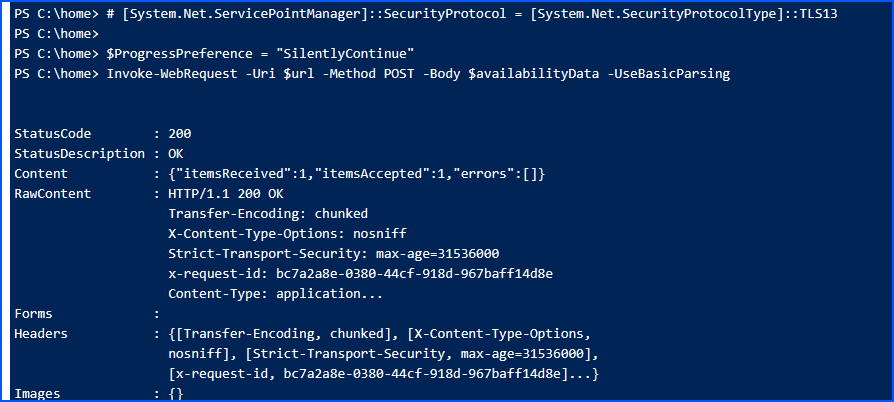

そして宛先の Application Insights リソースの availabilityResults テーブルに、下記のようなログが記録されます。

```
availabilityResults
| where message =~ 'Sample Webtest Result'
```

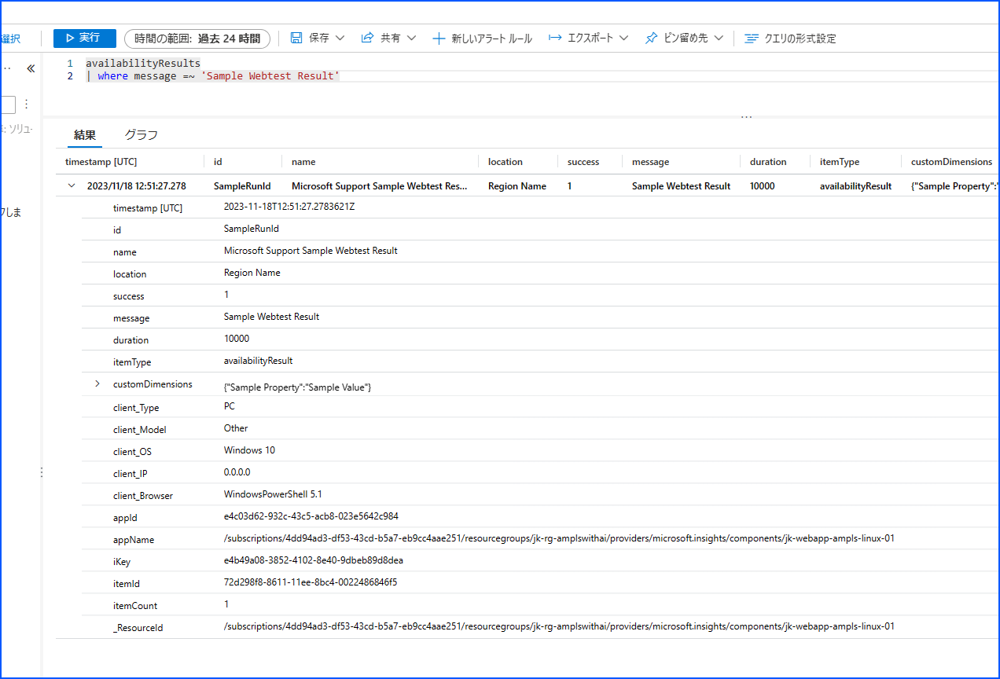

上記は PowerShell スクリプトですが、Linux の場合は下記の CURL コマンドを実行することで確認可能です。

※ 下記 CURL コマンドの詳細は[Curl コマンドを使用して可用性テスト結果を送信する
](https://learn.microsoft.com/ja-jp/troubleshoot/azure/azure-monitor/app-insights/investigate-missing-telemetry#curl-command-send-availability-test-result) の公開情報をご確認ください。  
※ iKey の XXX の箇所には、適宜当該 Application Insights リソースのインストルメンテーション キーの値をご指定ください。


```
curl -H "Content-Type: application/json" -X POST -d '{"data":{"baseData":{"ver":2,"id":"SampleRunId","name":"MicrosoftSupportSampleWebtestResultUsingCurl","duration":"00.00:00:10","success":true,"runLocation":"RegionName","message":"SampleWebtestResult","properties":{"SampleProperty":"SampleValue"}},"baseType":"AvailabilityData"},"ver":1,"name":"Microsoft.ApplicationInsights.Metric","time":"2022-09-01T12:00:00.0000000Z","sampleRate":100,"iKey":"XXXXXXXXXXXX","flags":0}' https://japaneast-1.in.applicationinsights.azure.com/v2.1/track
```

もし AMPLS によってテレメトリの取り込みが拒否された場合、同じように 403 エラーが宛先から返却されます。


このように AMPLS 側でインジェストが拒否される振る舞いは仕様どおりです。  
下記の公開情報に記載がございますが、AMPLS のインジェスト アクセス モードが「プライベートのみ」の場合は、宛先となる Application Insights リソースを当該 AMPLS に追加する必要がございます。  
そうしないと、テレメトリの取り込みが拒否されます。  
この点について十分ご留意くださいませ。

- [プライベート リンクをネットワークに適用する方法を制御する](https://learn.microsoft.com/ja-jp/azure/azure-monitor/logs/private-link-design#control-how-private-links-apply-to-your-networks)  

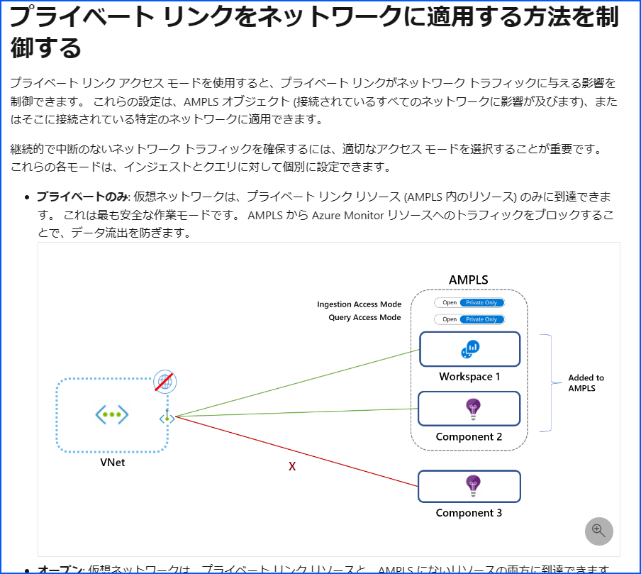


もし当該 AMPLS のインジェスト アクセス モードが「プライベートのみ」の場合は、このような原因でテレメトリが取り込まれなくなる可能性があります。  
一度当該 AMPLS リソースをご確認いただき、当該 Application Insights リソースが追加されているか、追加されている Application Insights リソースのプロビジョニング状態が「Succeeded」であるかどうかを、ご確認ください。  

ちなみに Application Insights リソースのプロビジョニング状態が「Failed」の場合、プライベート エンドポイントに紐づく VNET のサブネットの IP アドレスが枯渇している可能性がございます。

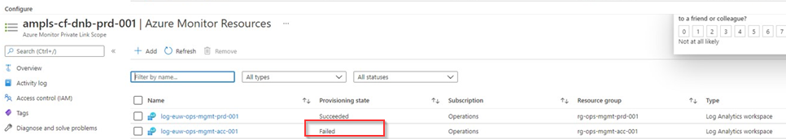


当該 VNET のページから「使用可能な IP」をご確認いただく事で枯渇しているかどうか確認可能です。  
もし IP アドレスが足りないようでしたら、拡張いただくようご検討ください。


> サポートされる最小の IPv4 のサブネットは /27 です。 割り当て可能な IP アドレスの数に要注意です。

[Azure Private Link のセットアップを設計する # ネットワーク サブネットのサイズ](https://learn.microsoft.com/ja-jp/azure/azure-monitor/logs/private-link-design#requirements)

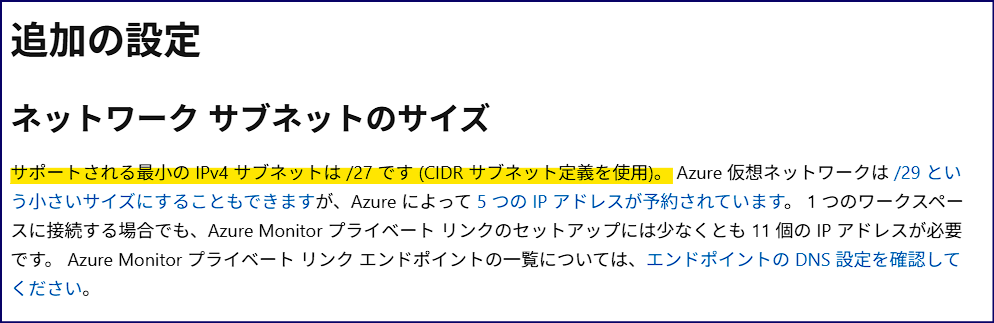


もし IP アドレスの数に問題が無いのにもかかわらずプロビジョニング状態が「Failed」の場合、一度適当なリソースを AMPLS から削除いただき、改めて追加してください。  
それでも問題が改善しない場合は、お手数ではございますがサポート リクエストをご起票ください。

### その 4. コレクション レベルが "無効" になっている
.NET (.NET Framework ではない) の Web アプリケーションを App Service にデプロイし、自動インストルメンテーションを用いて Application Insights と統合している場合。  
App Service リソースの Application Insights を確認し、コレクション レベルが "無効" になっていると Application Insights にテレメトリが出力されません。
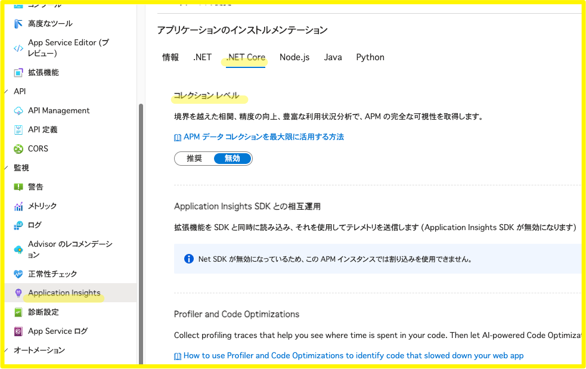

もしコレクション レベルが "無効" の場合は "推奨" にご変更ください。  
なおコレクション レベルを変更すると、App Service の環境変数が変更されるため App Service の再起動が実施されます。  
再起動される点について、予めご留意ください。

# ケース 2. 一部の種類のテレメトリが Application Insights にまったく収集されなくなった
## 問題の概要
- requests ログや dependencies ログは収集されているのに、traces ログが収集されなくなった。

## 実際にあったケース
### ケース 1. .NET Framework から .NET へ移行したことで、収集されるログ レベルの既定値が変わった
監視対象 Web アプリケーションのランタイムが .NET Framework の場合には、問題なくログを traces テーブルに保存が出来ていた。  
しかし Web アプリケーションのランタイムを .NET 6 などに移行すると、Warn や Error ログは出力されるのに Information のログが出力されなくなった。  

このような事例の場合、収集されるログ レベルの既定値の影響の可能性が非常に高いです。

.NET 用の Application Insights SDK は、規定では Ilogger Warning 以上のログが収集されます。  
つまり、例えば LogInformation で収集されたログは規定では Application Insights に収集されません。
 
- [Application Insights for ASP.NET Core アプリケーション](https://docs.microsoft.com/ja-jp/azure/azure-monitor/app/asp-net-core#ilogger-logs)

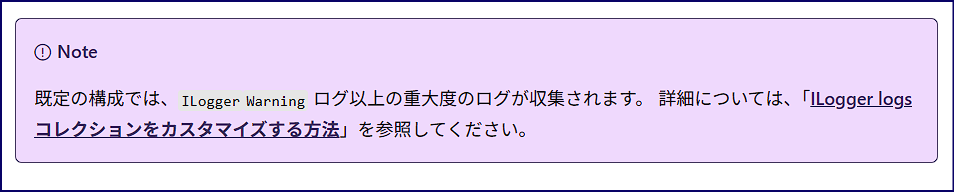


もし Application Insights SDK ですべてのレベルのログを収集されたい場合は、appsettings.json ファイルに下記の設定を追加ください。

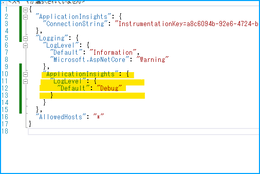

```
    "ApplicationInsights": {
      "LogLevel": {
        "Default": "Debug"
      }
```

監視対象 Web アプリケーションのランタイムが Java の場合でも発生しうる問題です。  
Java に関しましては下記の公開情報をご確認ください。

- [構成オプション: Azure Monitor Application Insights for Java # 自動収集されるログ](https://learn.microsoft.com/ja-jp/azure/azure-monitor/app/java-standalone-config#autocollected-logging)

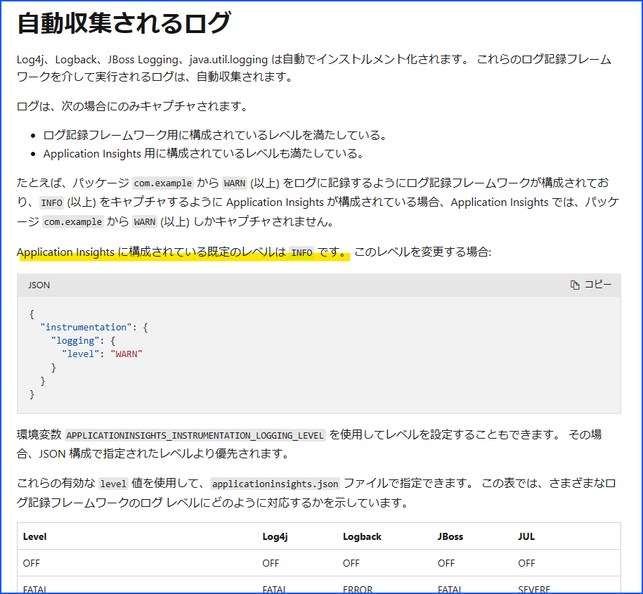


### ケース 2. 自動インストルメンテーション機能を有効にしているのに、中途半端な状態で Application Insights SDK が組み込まれてしまった
App Service と Application Insights を統合する方法として、下記の 2 種類ございます。

1. 自動インストルメンテーション機能を用いて有効化 (ソースコードの変更は不要)
2. Web アプリケーションに Application Insights SDK 組み込む (ソースコードの変更が必要)

> これらの違いは [こちらの公開情報](https://learn.microsoft.com/ja-jp/azure/azure-monitor/app/opentelemetry-overview?tabs=aspnetcore) をご参考ください。

ランタイムが .NET Framework / .NET の場合、自動インストルメンテーション機能を有効化していてかつ、当該 App Service リソースに対して Application Insights SDK が組み込まれた Web アプリケーションをデプロイした場合、Application Insights SDK 側が優先されます。

- [Azure App Service のアプリケーションの監視の概要](https://learn.microsoft.com/ja-jp/azure/azure-monitor/app/opentelemetry-overview?tabs=aspnetcore)

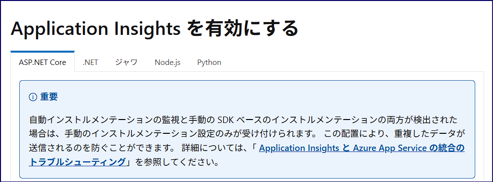

Application Insights SDK 側が優先されるため、Application Insights SDK 側の設定に影響して収集されるテレメトリの種類が決定します。  
もし担当者の方が自動インストルメンテーション機能の有効化を期待していた場合、何らかの原因によって組み込まれた Application Insights SDK が意図せず機能する可能性があります。
その場合に適切に Application Insights SDK の設定が構築出来ていないと、期待どおりテレメトリが収集出来ない場合がございます。

もし Application Insights SDK は不要であれば、下記の手順で当該 Web アプリケーションから Application Insights SDK の削除をご検討ください。

#### Application Insights SDK を完全に削除する
Azure の基盤側ログに、ApplicationInsights.dll ファイルが wwwroot フォルダに検出されたことが記録されております。  
もし当該 Web アプリケーションに対して ApplicationInsights.dll が含まれている場合は、お手数ではございますが当該 DLL を削除し改めて App Service に再デプロイを実施ください。  
もしくは、当該 Web アプリケーションのプロジェクトに Microsoft.ApplicationInsights.AspNetCore が存在する場合、こちらを削除いただき App Service に再デプロイください。  

- [Application Insights for ASP.NET Core アプリケーション](https://learn.microsoft.com/ja-jp/azure/azure-monitor/app/asp-net-core?tabs=netcorenew%2Cnetcore6#enable-application-insights-server-side-telemetry-no-visual-studio)
 
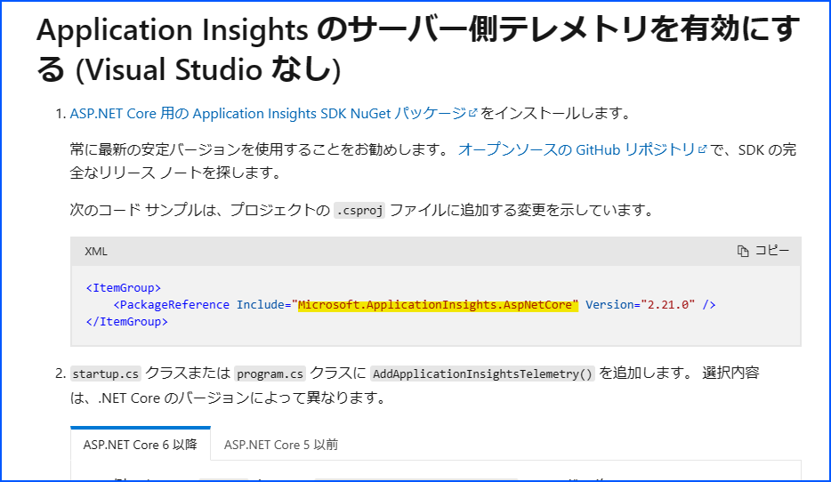


.NET Framework の場合は、こちらを削除ください。

- [ASP.NET Web サイトに Application Insights を構成する](https://learn.microsoft.com/ja-jp/azure/azure-monitor/app/asp-net#add-application-insights-manually)

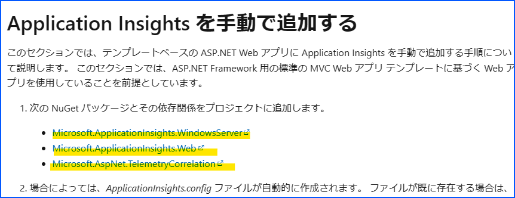


# ケース 3. 問題なく Application Insights にテレメトリが収集出来ているが、時々期待したログが欠落する
## 問題の概要
- 基本的には requests ログや dependencies ログ、traces ログは収集されている。
- しかし時々、一部のデータが欠落しているように見受けられる。

## 疑われるポイント
サンプリングが機能している可能性が非常に高いです。  
下記の公開情報をご参考に、サンプリングによってログが意図的に間引かれているかどうかをご確認ください。

- [サンプリングが動作しているかどうかを把握する](https://learn.microsoft.com/ja-jp/azure/azure-monitor/app/sampling-classic-api#knowing-whether-sampling-is-in-operation)

```kql
union requests,dependencies,pageViews,browserTimings,exceptions,traces
| where timestamp > ago(1d)
| summarize RetainedPercentage = 100/avg(itemCount) by bin(timestamp, 1h), itemType
```


# 色々調べたけど問題が解決しない場合……
問題解消のために、ぜひ弊社サポートにお問い合わせください。  
その際は、**必ず問題が発生したサブスクリプションからサポート リクエストをご起票ください**ませ。  
セキュリティ上の理由から、権限の確認を厳密化させていただいているためです。  
詳細は、[お問い合わせ発行時と「異なる」サブスクリプションならびに AAD テナントの調査依頼に対してのセキュリティ チェックが強化されます](https://jpaztech.github.io/blog/information/Different-subscriptions-research/) をご確認ください。

なお、お問い合わせいただく際には下記の情報をご共有いただく事でスムーズに調査が可能となります。  
Application Insights に対してテレメトリが収集されなくなり、弊社サポートにお問い合わせいただく場合にご参考いただけますと幸いです。

- 問題が発生した Application Insights リソース名
- 監視対象の Web アプリケーションのデプロイ先の情報
  - App Service にデプロイいただいている場合は、App Service のリソース名
  - Azure VM にデプロイいただいている場合は、Azure VM のリソース名
- 監視対象 Web アプリケーションのランタイム情報 (.NET 6, Java 17 など)
- Application Insights をご利用いただくための方法
  - 下記のどちらかの方法で Application Insights と統合が可能ですが、どちらをご選択いただいているかを共有ください。(不明な場合はその旨お伝えください)
    - ソースコードの変更が不要な、App Service リソース ページから有効化が可能な自動インストルメンテーション機能を使って、Application Insights を利用している。
    - ソースコードの必要な、Application Insights SDK を Web アプリケーションに組み込んで Application Insights を利用している。
- 問題が発生し始めた時間帯
  - 時間帯は、日本時間か UTC なのかを必ずご共有くださいませ。
- テレメトリが欠落している事に気づいた際に、ログをご確認いただく時に実際に実行いただいた Kusto クエリ


# まとめ
本記事では、Application Insights へテレメトリが収集されなくなった場合の事象についてご案内いたしました。

本記事が少しでもお役に立ちましたら幸いです。
最後までお読みいただきありがとうございました！


# 関連する記事
Application Insights に関するトラブルシューティング系の公開情報は別で用意されています。  
今回の記事で案内させて頂いた内容も多々含まれておりますので、問題が発生した際はぜひ下記の公開情報をご確認くださいませ。

- [Azure Monitor Application Insights でアプリケーション テレメトリが見つからない場合のトラブルシューティング](https://learn.microsoft.com/ja-jp/troubleshoot/azure/azure-monitor/app-insights/investigate-missing-telemetry)

またあまり知られておりませんが、当該 Application Insights リソースのページからトラブルシューティングが可能です。  
Azure portal より問題が発生した Application Insights のページへ移動し、「問題の診断と解決」から「Application Insights の有効かごのデータがない…」という箇所をクリックしてみてください。


このページから、問題を解決するためのトラブルシューティングが可能です。  
例えば、下図のように Problem subtype に対して「すべてのテレメトリがない」を選択します。


すると、様々な観点から問題解消のために役立つ情報がご確認いただけます。  
こちらも一度参考いただけますと幸いです。

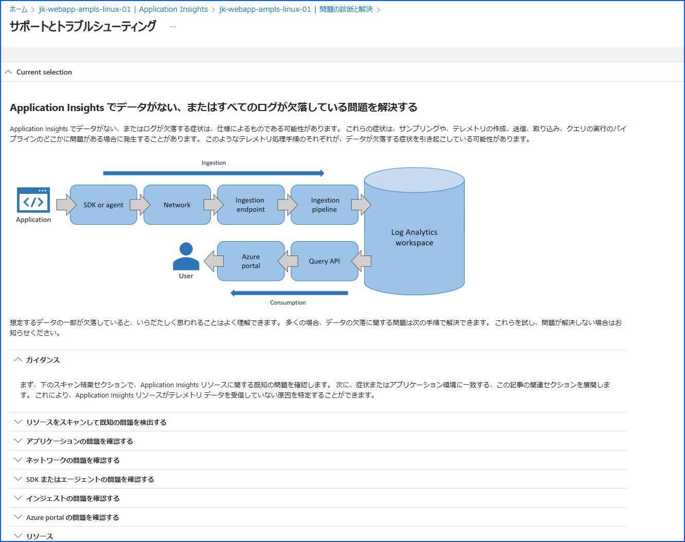