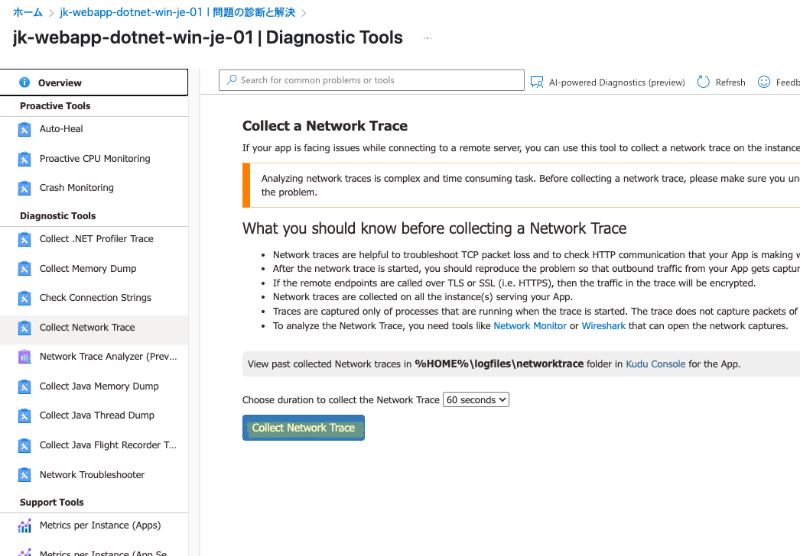
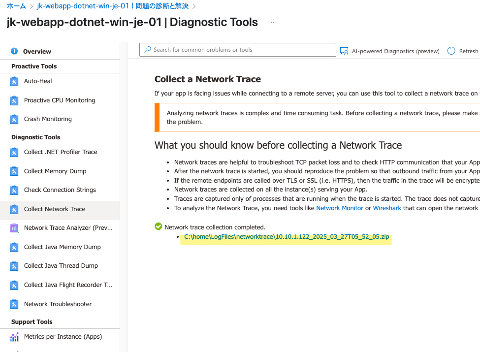

こんにちは、Azure Monitoring サポート チームの北山です。  
今回の記事では、Application Insights の TLS 変更に関するご案内 (Tracking ID : TT8T-TR0) について記載します。

<!-- more -->
- [概要](#概要)
- [どのような影響を受けるか](#どのような影響を受けるか)
- [いつから影響を受けるか](#いつから影響を受けるか)
- [影響を受けるお客様](#影響を受けるお客様)
- [影響を受けているか確認する方法](#影響を受けているか確認する方法)
  - [1. 接続文字列を用いて Application Insights と連携している場合](#1-接続文字列を用いて-application-insights-と連携している場合)
  - [2. インストルメンテーション キーを用いて Application Insights と連携している場合](#2-インストルメンテーション-キーを用いて-application-insights-と連携している場合)
- [よくあるご質問](#よくあるご質問)
  - [私は接続文字列とインストルメンテーション キーのどちらを利用していますか?](#私は接続文字列とインストルメンテーション-キーのどちらを利用していますか)
  - [なんとかして使っている TLS のバージョンをチェックすることは出来ますか?](#なんとかして使っている-tls-のバージョンをチェックすることは出来ますか)
  - [正常性イベントに記載があった "You can determine if you're using TLS 1.0 or 1.1 by enabling logging." とはどういう意味ですか?](#正常性イベントに記載があった-you-can-determine-if-youre-using-tls-10-or-11-by-enabling-logging-とはどういう意味ですか)
- [最後に](#最後に)


# 概要
下記のサービス正常性に関する記事となります。

<table>
  <tr>
    <th style="width: 150px;">項目名</th>
    <th>項目値</th>
  </tr>
  <tr>
    <td>題名</td>
    <td>Action required: Upcoming TLS changes for Azure Monitor Application Insights</td>
  </tr>
  <tr>
    <td>追跡 ID</td>
    <td>TT8T-TR0</td>
  </tr>
  <tr>
    <td>影響を受けるリージョン</td>
    <td>Southeast Asia; East US; West US 2; Sweden Central; South Africa West; West US 3; Canada Central; UK South; Global; South India; North Central US; New Zealand North; West India; Australia Central 2; France South; Switzerland North; Jio India West; Italy North; Central US; Japan West; Australia Southeast; Mexico Central; Qatar Central; Switzerland West; Central India; East US 2 EUAP; Taiwan North; East Asia; UAE Central; Canada East; West US; France Central; Norway West; Germany West Central; South Africa North; West Europe; East US 2; Israel Central; Australia Central; Central US EUAP; Brazil Southeast; Japan East; Korea South; Germany North; Brazil South; UK West; Indonesia Central; Sweden South; West Central US; South Central US; Jio India Central; North Europe; Australia East; UAE North; Spain Central; Norway East; Korea Central; Poland Central</td>
  </tr>
  <tr>
    <td>正常性イベントの種類</td>
    <td>正常性の勧告</td>
  </tr>
</table>

<br>

内容は下記のとおりです。

**原文**
```
You’re receiving this notification because you're associated with one or more Azure subscriptions that use Azure Monitor Application Insights.

To enhance security and provide best-in-class encryption for your data, we'll require all connections to Azure Monitor Application Insights to be secured using Transport Layer Security (TLS) 1.2 or later beginning 1 May 2025, when support for TLS 1.0 and 1.1 will end.

If you're already using TLS 1.2 or later, no further action is required.

# Required action
If you're using TLS 1.0 or 1.1 for Azure Monitor Application Insights, you'll need to switch to TLS 1.2 or later by 1 May 2025. You can determine if you're using TLS 1.0 or 1.1 by enabling logging.
```

**日本語**
```
あなたは、Azure Monitor Application Insights をご利用いただいている Azure サブスクリプションに関連付けられているため、この通知を受け取っています。

データのセキュリティ強化と最先端の暗号化を提供するため、2025年5月1日より、Azure Monitor Application Insights へのすべての接続で TLS 1.2 以降の使用を必須とし、TLS 1.0 および 1.1 のサポートを終了します。

すでに TLS 1.2 以降を使用している場合は、追加の対応は不要です。

# 必要なアクション
クライアント側で TLS 1.0 または 1.1 を使って Azure Monitor Application Insights と通信している場合は、2025年5月1日までにクライアント側を TLS 1.2 以降へ移行する必要があります。
使用中の TLS バージョンを確認するには、ログを有効化してください。
```

# どのような影響を受けるか
クライアント側 (OS の設定もしくは、ランタイム・Web アプリケーション側の設定) にて、TLS 1.1 もしくは 1.0 のプロトコルでサーバーと通信する設定の場合、期待どおり Application Insights に各種テレメトリが送信されません。  
結果として、Application Insights に各種ログやメトリックが保存されず、期待どおり Web アプリケーションの監視が出来なくなります。


# いつから影響を受けるか
2025 年 5 月 1 日からです。

# 影響を受けるお客様
監視対象の Web アプリケーションをホストしているクライアント側で、TLS 1.1 もしくは 1.0 のプロトコルを使ってサーバーと通信をしているお客様です。


# 影響を受けているか確認する方法
## 1. 接続文字列を用いて Application Insights と連携している場合
この場合、お客様に実施いただく対処は不要です。  
接続文字列を用いて Application Insights と連携している場合、監視対象の Web アプリケーションは接続文字列に含まれるリージョナル インストルメンテーション エンドポイントに対して各種テレメトリを送信しております。

例えば下記の接続文字列の場合、Japan East に展開されたリージョナル エンドポイント (**japaneast-1.in.applicationinsights.azure.com**) 宛に各種テレメトリを送信します。
> InstrumentationKey=XXXX;IngestionEndpoint=https://japaneast-1.in.applicationinsights.azure.com/;LiveEndpoint=https://japaneast.livediagnostics.monitor.azure.com/;ApplicationId=XXX

[IP addresses used by Azure Monitor](https://learn.microsoft.com/ja-jp/azure/azure-monitor/fundamentals/ip-addresses)


このリージョナル インジェスト エンドポイントに関しましては、もともとサーバー側で TLS 1.1 / 1.0 を利用しておりません。  
そのため、接続文字列を用いて Application Insights と連携していてかつ、Application Insights リソースに各種テレメトリが送信できている状況であれば、クライアント側はすでに TLS 1.2 以上で通信しております。  
そのため、対処は不要です。


## 2. インストルメンテーション キーを用いて Application Insights と連携している場合
インストルメンテーション キーを用いて Application Insights と連携している場合、グローバル インジェスト エンドポイントに対して各種テレメトリを送信しております。  
このエンドポイントは、現在も TLS 1.0 / 1.1 をサポートしております。  
[IP addresses used by Azure Monitor](https://learn.microsoft.com/ja-jp/azure/azure-monitor/fundamentals/ip-addresses)


インストルメンテーション キーを用いて Application Insights と連携している場合は、場合によってはクライアント側の対処が必要です。  
対処の要否確認方法は、Web アプリケーションをホストしている OS の種類やランタイムによって異なります。  
TLS 1.0 に関して、弊社からお客様向けにガイダンスを提供しております。  
確認方法は環境によって異なるため一概にはお答えできませんが、下記公開情報をご参考くださいませ。

- [TLS 1.0の問題の解決、第2版](https://learn.microsoft.com/ja-jp/security/engineering/solving-tls1-problem)
- [Azure Network 製品について TLS 1.2 以降に移行するアナウンスの補足 (Tracking ID:7_8G-D8Z)](https://jpaztech.github.io/blog/network/tls1.2_migration/)


# よくあるご質問
## 私は接続文字列とインストルメンテーション キーのどちらを利用していますか?
お客様の実装方法によって確認方法が異なります。  
インストルメンテーション キーや接続文字列の指定方法は、いくつか方法がございます。  
ランタイムによって実装方法が異なる可能性がございますが、基本的には下記のとおりです。

1. 環境変数で指定する
2. ご利用いただいている Azure Monitor OpenTelemetry Distro や Classic Application Insights SDK の設定ファイルで指定する
3. ソース コード上にハードコーディングする

上記の方法が存在するため、確認自体はお客様にて実施いただく必要がございます。  
これは、弊社ではお客様が管理しているデータにアクセス出来ないためです。  

お問い合わせを頂いている中で、一番多い連携方法は環境変数で指定する方法です。  
インストルメンテーション キーと接続文字列で使用される環境変数は下記のとおりです。

- ```APPINSIGHTS_INSTRUMENTATIONKEY``` : インストルメンテーション キーを指定するために使われます。
- ```APPLICATIONINSIGHTS_CONNECTION_STRING``` : 接続文字列を指定するために使われます。

もし環境変数に  ```APPINSIGHTS_INSTRUMENTATIONKEY``` が指定されている場合は、環境変数から ```APPINSIGHTS_INSTRUMENTATIONKEY``` を削除して ```APPLICATIONINSIGHTS_CONNECTION_STRING``` のみをご指定ください。

> App Service や Azure Functions の場合、環境変数を変更すると再起動が実施されます。
> その結果一時的にアクセス出来ない状況が考えられるため、環境変数の設定は十分ご留意くださいませ。

その他、接続文字列に関する参考情報は下記となります。  
- [Application Insights の接続文字列 # 接続文字列を設定する](https://learn.microsoft.com/ja-jp/azure/azure-monitor/app/connection-strings#set-a-connection-string)


もしお客様自身でご確認いただいていも分からない場合は、お気兼ねなく Azure portal よりサポート リクエストをご起票ください。  
その際は下記の情報をご連携いただけると、よりスムーズにサポートを提供出来ると存じます。

- 監視対象 Web アプリケーションのランタイム (.NET, Java, Node.js など)
- Application Insights との統合方法 (手動インストルメンテーション or 自動インストルメンテーション)
- 手動インストルメンテーションの場合、組み込んでいただいているパッケージ情報 (パッケージ名とパッケージのバージョン)
- 自動インストルメンテーションの場合、デプロイ先の Azure リソース ID (App Service のリソース ID)
- 宛先の Application Insights リソースのリソース ID

## なんとかして使っている TLS のバージョンをチェックすることは出来ますか?
パケットキャプチャーを取得することで、ご確認可能です。  
App Service にデプロイいただいている状況を例に、方法について記載します。

> 下記に記載する方法は、TLS のバージョン問わず Application Insights のエンドポイントと通信が出来ている前提です。  
> 何らかの理由で通信が出来ない場合は、TLS ハンドシェイクの箇所をご確認いただく必要がある点についてご留意ください。

**手順 1**  
Azure portal にアクセスして、Web アプリケーションをデプロイしている App Service リソースのページへ移動します。  
"問題の診断と解決" ページにて、"Collect Network Trace" を選びます。


> こちらは Windows 版 App Service のみです。  
> Linux 版の場合は手動にて採取いただく必要がございます。  
> 詳細は下記の公開情報をご参照ください。  
> [仮想ネットワークを Azure App Service に統合する際のトラブルシューティング](https://learn.microsoft.com/ja-jp/troubleshoot/azure/app-service/troubleshoot-vnet-integration-apps)

**手順 2**  
監視対象の Web アプリケーションが稼働していることを確認して、"Collect Network Trace" をクリックします。  
すると、60 秒間ネットワーク トレースが採取され続けます。



**手順 3**  
60 秒後、収集が完了します。  
ハイパーリンクから、収集したトレース ファイルをダウンロードします。



**手順 4**  
弊社のツールである [Microsoft Network Monitor](https://www.microsoft.com/en-us/download/details.aspx?id=4865) を使って、ダウンロードしたキャプチャ ファイルを開きます。
> Wireshark など、他のパケット解析ツールでも問題ございません。  


**手順 5**  
30 秒ごとに実施される Application Insights へのテレメトリ送信処理のパケットを確認し、TLS フレームの詳細で利用しているバージョンを確認します。  
下図のように 1.2 を使っていれば対処は不要です。  


宛先となる Application Insights の IP アドレスですが、接続文字列に指定されたインジェスト エンドポイントを名前解決することで確認可能です。  
App Service の場合 Kudu にてご確認可能です。  
Global IP アドレスは一つでは無いため、下図のように複数回実行いただくことを推奨します。


> 名前解決は、Windows 版の App Service の場合は nameresolver を使います。
> Linux 版の場合は nslookup を使います。
> 詳細は下記の公開情報をご参考ください。  
> [仮想ネットワークを Azure App Service に統合する際のトラブルシューティング](https://learn.microsoft.com/ja-jp/troubleshoot/azure/app-service/troubleshoot-vnet-integration-apps)


## 正常性イベントに記載があった "You can determine if you're using TLS 1.0 or 1.1 by enabling logging." とはどういう意味ですか?
結論から申し上げますと、こちらの方法では TLS 1.0 / 1.1 を使っているかどうかの特定は出来ません。  
お客様に誤った情報を発信して混乱を招いてしまい、大変申し訳ございませんでした。  

ログを収集するために Application Insights を有効化いただいても、TLS バージョンを特定することは出来ません。  
大変恐れ入りますが、本ブログ記事に記載させていただいた方法でご確認いただけますと幸いです。


# 最後に
もし移行方法についてご質問がある場合やトラブル解決のためにサポートが必要な場合は、Azure portal より Application Insights 観点でお問い合わせください。  
以上となります。