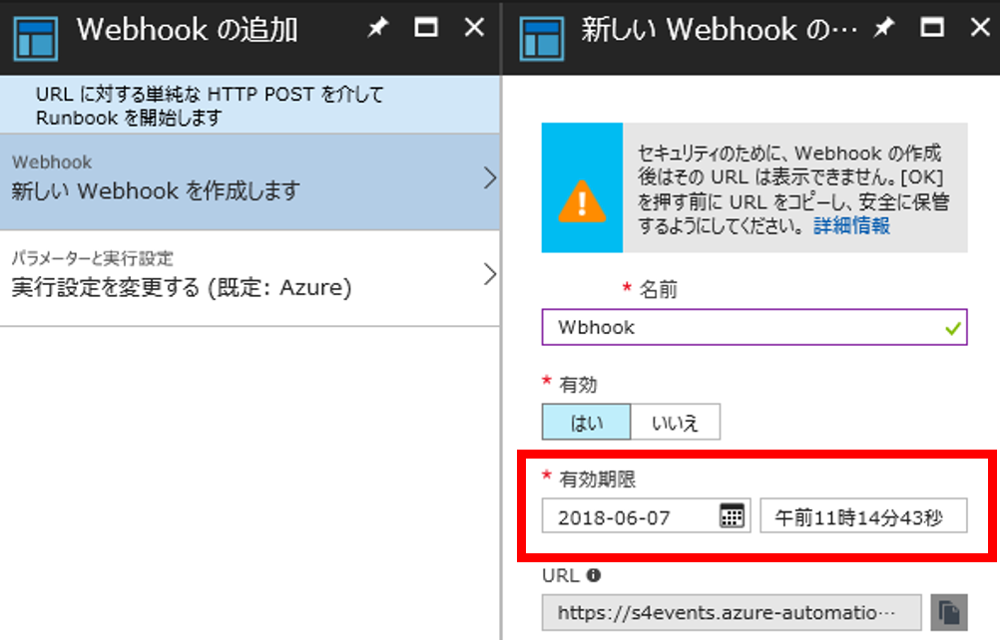
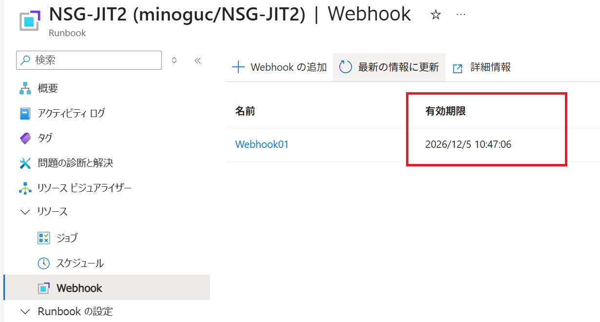

こんにちは、Azure サポート チームの世古です。  
今回は Azure Automation で Webhook を実行する際に記録されるエラー ”(404) 見つかりません” の原因および対処方法についてご案内させていただきます。

# エラー内容および発生している問題について
記録されるエラーについては以下の通りです。

```
ERROR [TID:*] [] System.Net.WebException: リモート サーバーがエラーを返しました: (404) 見つかりません
```
上記内容にあります通り、Runbook を実行しようとしたが実行する URL が見つからない為、404 のエラーを記録して、Runbook の実行に失敗します。

# 対処方法について
URL が見つからない要因としては、一般的に Webhook 作成時に指定した URL の有効期限が影響している可能性がございます。  
その為、まずは同様のエラーで失敗する場合には Webhook の有効期限をご確認ください。  
有効期限が既に切れている場合には、Runbook で実行する事は出来ませんので、再度 Webhook を再作成くださいますようお願いします。  
以下確認方法についてご紹介します。







# 参考 有効期限の指定について
Webhook で URL を指定して実行するのは簡単で便利ですが、URL の有効期限についてはセキュリティ面の観点でも非常に大事な項目となります。  
例えば、外部トークンの URL が外部に漏れた場合には、誰でも Runbook が実行出来るようになるためです。  
詳細は[公開情報](https://docs.microsoft.com/ja-jp/azure/automation/automation-webhooks)を確認いただければと存じますが、ただ長期の期間を指定するのではなく、適切な有効期限を指定する事を推奨しております。