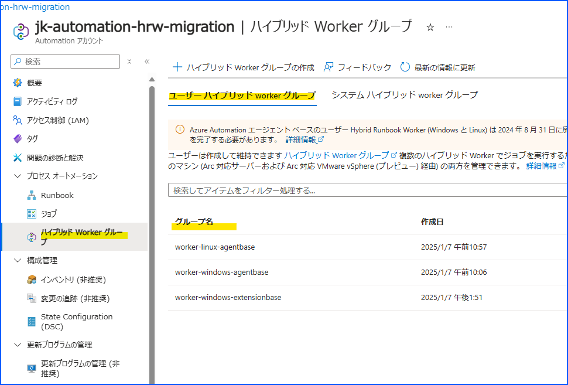
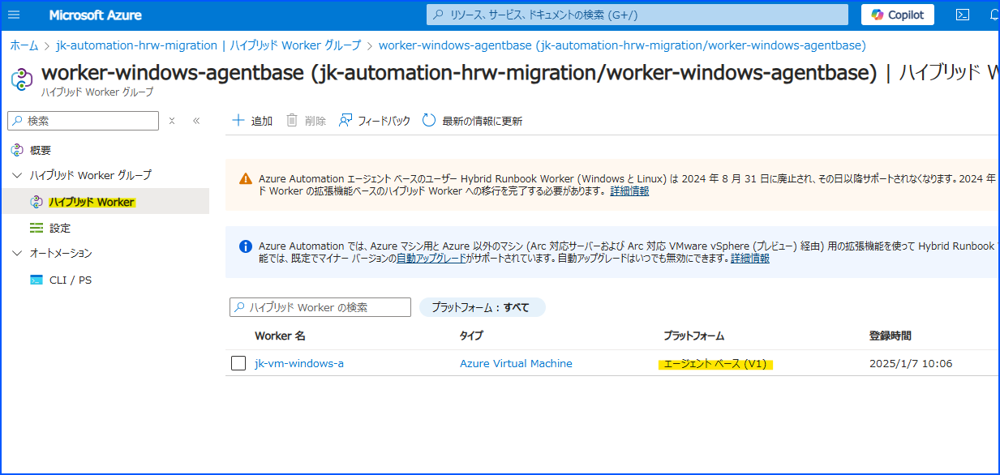
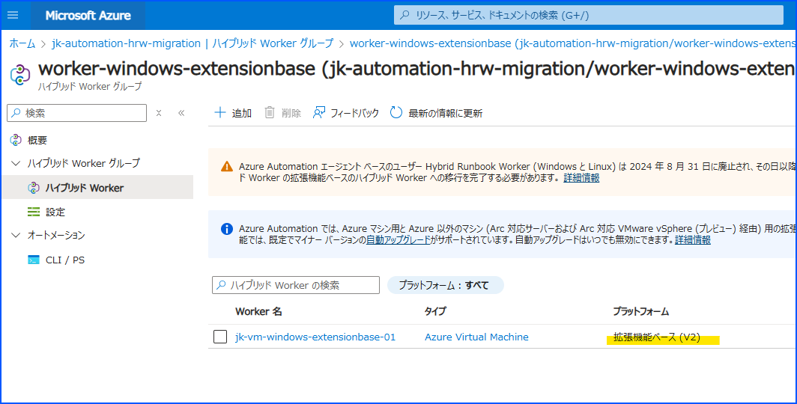
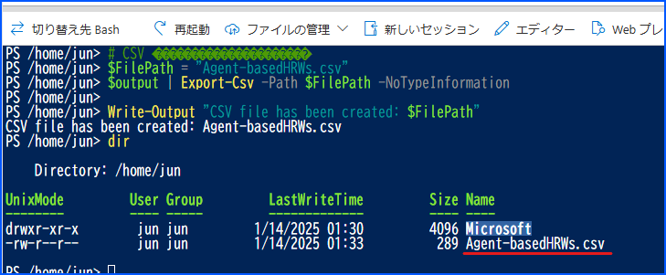
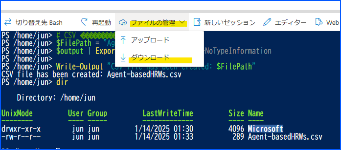
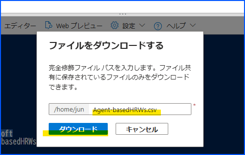
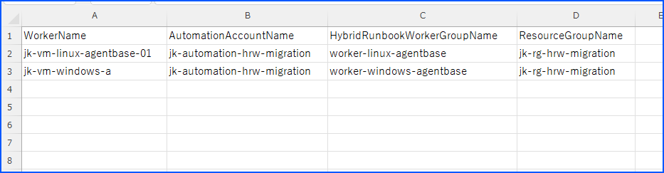

こんにちは、Azure Monitoring サポート チームの北山です。  
今回の記事では、Azure Automation のエージェント ベースの Hybrid Runbook Worker 廃止について記載します。
[Retirement: All Azure Automation jobs running on Agent-based Hybrid Worker will be stopped from 1 April 2025](https://azure.microsoft.com/ja-jp/updates/?id=477734)

<!-- more -->
# 目次
- [目次](#目次)
- [用語](#用語)
  - [Hybrid Runbook Worker](#hybrid-runbook-worker)
  - [エージェント ベースの Hybrid Runbook Worker](#エージェント-ベースの-hybrid-runbook-worker)
  - [拡張機能ベースの Hybrid Runbook Worker](#拡張機能ベースの-hybrid-runbook-worker)
- [概要](#概要)
- [どのような影響を受けるか](#どのような影響を受けるか)
- [いつから影響を受けるか](#いつから影響を受けるか)
- [影響を受けるお客様](#影響を受けるお客様)
  - [エージェント ベースの Hybrid Runbook Worker を利用しているか確認する方法](#エージェント-ベースの-hybrid-runbook-worker-を利用しているか確認する方法)
- [移行方法](#移行方法)
- [最後に](#最後に)

# 用語
## Hybrid Runbook Worker
Azure Automation の機能の一つです。  
予め作成した Runbook (PowerShell・Python スクリプト) は、Azure Automation のクラウド環境で比較的容易に実行可能です。  
一方で Hybrid Runbook Worker を利用すると、お客様管理のコンピューター上で Runbook の実行が可能です。  

メリットは、クラウド環境で実行するよりも制限が緩いこと、サード パーティー製のアプリケーションと連携が可能なこと、お客様管理のネットワーク環境上で実行が可能なことなどです。

## エージェント ベースの Hybrid Runbook Worker
Log Analytics エージェントのテクノロジーを利用した、Hybrid Runbook Worker です。  
エージェント ベースの Hybrid Runbook Worker をご利用いただくには、当該コンピューターに Log Analytics エージェントのインストールが必須です。

Log Analytics エージェントは 2024 年の 8 月にサポート終了しているため、それに伴いエージェント ベースの Hybrid Runbook Worker もサポートが終了しています。


## 拡張機能ベースの Hybrid Runbook Worker
現在主流の、Azure VM・Azure Arc enabled servers の拡張機能として動作する Hybrid Runbook Worker です。  
Log Analytics エージェントに依存していないため、Log Analytics エージェントのインストールは不要です。  
Log Analytics エージェントの後継版である Azure Monitor エージェントのインストールも不要です。

# 概要
エージェント ベースの Hybrid Runbook Worker に関しましては、2024 年の 8 月にすでにサポートが終了しております。  
サポートは終了していましたが、引き続きエージェント ベースの Hybrid Runbook Worker がご利用いただけておりました。  

しかし、下記の更新情報に記載がございますとおり **2025 年 4 月 1 日からはエージェント ベースの Hybrid Runbook Worker がご利用できなくなります。**

[Retirement: All Azure Automation jobs running on Agent-based Hybrid Worker will be stopped from 1 April 2025](https://azure.microsoft.com/ja-jp/updates/?id=477734)

# どのような影響を受けるか
エージェント ベースの Hybrid Runbook Worker 上でジョブを実行した場合、ジョブ実行が正常に動作しません。  
これは、スケジュール実行・ポータルからの実行・Webhook (*1) による実行すべてに該当します。  
※ 1 : Logic Apps や PowerAutomate で使われる Azure Automation コネクタも該当します。


# いつから影響を受けるか
2025 年 4 月 1 日からです。

# 影響を受けるお客様
ジョブ実行環境として、エージェント ベースの Hybrid Runbook Worker をご利用いただいているお客様です。

## エージェント ベースの Hybrid Runbook Worker を利用しているか確認する方法
### 1. Azure ポータルから確認する方法
一つ一つ Automation アカウントを確認する必要がありますが、Azure ポータルから確認が可能です。
確認の手順は下記のとおりです。

1. Azure ポータルを開き、Automation アカウントのページへ移動します。
2. 画面左側の [プロセス オートメーション - ハイブリッド Worker グループ] をクリックし、[ユーザー ハイブリッド worker グループ] タブから確認したい Hybrid Runbook Worker グループをクリックします。

3. [ハイブリッド Worker グループ - ハイブリッド Worker] をクリックして表示される Hybrid Runbook Worker の [プラットフォーム] 列を確認し、値が「エージェント ベース (V1)」の場合はエージェント ベースの Hybrid Runbook Worker を利用しています。


もしプラットフォームの箇所が「拡張機能ベース (V2)」の場合は、対処不要です。



### 2. PowerShell スクリプトを実行して確認する方法
#### 実行方法
後述する PowerShell スクリプトを Azure Portal の Cloud Shell にて実行することで、エージェント ベースの Hybrid Runbook Worker 一覧を CSV 形式で出力が可能です。
- [Azure Cloud Shell の概要](https://learn.microsoft.com/ja-jp/azure/cloud-shell/overview)

PowerShell スクリプトを Cloud Shell の PowerShell にて実行し、「CSV file has been created: Agent-basedHRWs.csv」が出力されれば処理は完了です。
その後、下記の手順にて CSV ファイルのダウンロードが可能です。

1. Dir コマンドで対象の CSV ファイルが存在する事を確認します。


2. ダウンロードをクリックします。  


3. ファイル名 (Agent-basedHRWs.csv) を入力して [ダウンロード] をクリックします。  


出力された CSV には、下記の列が存在します。
- WorkerName : エージェント ベースの Hybrid Runbook Worker の名称です。
- AutomationAccountName : Hybrid Runbook Worker を管理している Azure Automation アカウントの名称です。
- HybridRunbookWorkerGroupName : Hybrid Runbook Worker を管理している Hybrid Runbook Worker グループの名称です。
- ResourceGroupName : Azure Automation アカウントを管理しているリソース グループの名称です。




#### 注意点
- Cloud Shell は、Bash ではなく PowerShell としてご利用ください。
- テナントに複数のサブスクリプションが存在する場合、期待しないサブスクリプションに対して処理が実行される可能性がございます。期待しないサブスクリプションに処理が実行される場合は、予め「Set-AzContext -SubscriptionID "<対象サブスクリプション ID>"」のコマンドレットを実行ください。
- Azure portal にアクセスしているユーザーには、最低でもサブスクリプション スコープに閲覧者ロールを付与してください。サブスクリプション内のすべての Azure Automation リソースを参照するためです。

#### 補足
- Cloud Shell のターミナルに PowerShell スクリプトをペーストする場合は、「Ctrl + V」ではなく「Shift + Insert」をご利用ください。
- 出力される CSV には、エージェント ベースの Hybrid Runbook Worker しか出力されません。
- この PowerShell スクリプトを実行することで、Azure リソースが更新されることはございません。
- この PowerShell スクリプトを実行することで、Hybrid Runbook Worker として稼働している Azure VM が停止することはございません。


#### サンプル スクリプト
```powershell
# 出力用のデータを格納する配列を初期化
$output = @()

# Automation アカウントの一覧を取得
$automationAccounts = Get-AzAutomationAccount | Select-Object -Property ResourceGroupName, AutomationAccountName

# Automation アカウントの総数を取得
$totalAccounts = $automationAccounts.Count
$currentIndex = 0

foreach ($account in $automationAccounts) {
    $currentIndex++
    
    # 進捗状況を出力
    Write-Progress `
        -Activity "In progress..." `
        -Status "Current account: $($account.AutomationAccountName)" `
        -PercentComplete (($currentIndex / $totalAccounts) * 100)

    # リソースグループ名とAutomationアカウント名を変数にセット
    $resourceGroup = $account.ResourceGroupName
    $automationAccountName = $account.AutomationAccountName

    # Hybrid Worker Groups を取得
    $hybridRunbookWorkerGroups = Get-AzAutomationHybridWorkerGroup `
        -ResourceGroupName $resourceGroup `
        -AutomationAccountName $automationAccountName `
    | Where-Object { $_.GroupType -eq "User" } `
    | Select-Object -Property Id, Name

    # $hybridRunbookWorkerGroups が NULL または空白の場合は次のループへ
    if (-not $hybridRunbookWorkerGroups) {
        Continue
    }

    # Hybrid Worker Groups に含まれる、エージェント ベース (HybridV1) Hybrid Runbook Worker を取得
    foreach ($worker in $hybridRunbookWorkerGroups) {
        $workerItem = Get-AzAutomationHybridRunbookWorker `
            -ResourceGroupName $resourceGroup `
            -AutomationAccountName $automationAccountName `
            -HybridRunbookWorkerGroupName $worker.Name `
        | Where-Object { $_.WorkerType -eq "HybridV1" }

        if (-not $workerItem) {
            Continue
        }
        
        # 出力用のデータを配列に追加
        $outputItem = @{
            ResourceGroupName            = $resourceGroup
            AutomationAccountName        = $automationAccountName
            HybridRunbookWorkerGroupName = $worker.Name
            WorkerName                   = $workerItem.WorkerName
        }
        $output += $outputItem
    }
}

# CSV ファイルに出力
$FilePath = "Agent-basedHRWs.csv"
$output | Export-Csv -Path $FilePath -NoTypeInformation

Write-Output "CSV file has been created: $FilePath"

```

# 移行方法
基本的には、下記の流れで移行作業を実施します。

1. 対象のコンピューターに、Hybrid Runbook Worker の拡張機能をインストールします。
2. 拡張機能をインストール後、動作実績がある Runbook を Hybrid Runbook Worker にて実行し、動作確認を行います。
3. 動作確認完了後、Azure portal にて当該 Hybrid Runbook Worker グループからエージェント ベースの Hybrid Runbook Worker を削除します。

その他、拡張機能ベースの Hybrid Runbook Worker ご利用の前提条件や、Azure VM 以外のコンピューターでご利用いただく方法などが下記の公開情報に記載されております。  
こちらの公開情報をご参考に、エージェント ベースの Hybrid Runbook Worker から拡張機能の Hybrid Runbook Worker へ移行作業をご検討ください。

- [既存のエージェント ベースのハイブリッド worker を拡張機能ベースのハイブリッド worker に移行する](https://learn.microsoft.com/ja-jp/azure/automation/migrate-existing-agent-based-hybrid-worker-to-extension-based-workers?tabs=bicep-template%2Cwin-hrw)


# 最後に
もし移行方法についてご質問がある場合やトラブル解決のためにサポートが必要な場合は、Azure portal より Azure Automation 観点でお問い合わせください。  
以上となります。