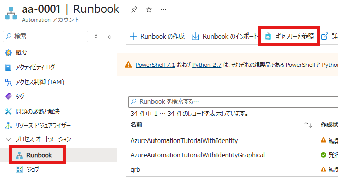

こんにちは、Azure Monitoring サポート チームの花房です！  
今回は Azure Automation の PowerShell Runbook でよくいただくお問い合わせをもとに、いくつか起票前にご確認いただきたいポイントをご紹介いたします。  
今回ご紹介するポイントをふまえてお問い合わせを発行いただきますと、よりスムーズな調査が可能ですので、少しでもご参考になれば幸いです！  
  
本ブログでは、以下の 2 つのシナリオのお問い合わせにフォーカスいたします。  
シナリオ A. Azure Automation の PowerShell Runbook がうまく動作していない、エラーとなる  
シナリオ B. Runbook の書き方が分からない  

 
<!-- more -->

## 目次
- [目次](#目次)
- [シナリオ A. Azure Automation の PowerShell Runbook がうまく動作していない、エラーとなる](#シナリオ-a--azure-automation-の-powershell-runbook-がうまく動作していないエラーとなる)
  - [シナリオ A のお問い合わせ発行前の確認ポイント](#シナリオ-a-のお問い合わせ発行前の確認ポイント)
- [シナリオ B. PowerShell Runbook の書き方が分からない](#シナリオ-b-powershell-runbook-の書き方が分からない)
  - [シナリオ B のお問い合わせ発行前の確認ポイント](#シナリオ-b-のお問い合わせ発行前の確認ポイント)
- [Automation のお問い合わせとして起票する場合](#automation-のお問い合わせとして起票する場合)
- [共通の注意点 (ギャラリーの Runbook について)](#共通の注意点-ギャラリーの-runbook-について)
- [さいごに](#さいごに)

 

## シナリオ A . Azure Automation の PowerShell Runbook がうまく動作していない、エラーとなる
「Azure Automation の Runbook がうまく動作していないようだけれど要因が分からない」 という場合に、お問い合わせいただくことがございます。  
この要因には、”Azure Automation 側 (Azure 基盤側)” と “お客様のスクリプト側” のどちらかに問題があることが考えられます。  
   
このどちらかを切り分けるため、「お客様のスクリプトには問題がなさそう」 ということをまずお客様にてご確認いただくことで、弊社での調査がスムーズになり、より短い調査時間で見解をご案内できます！  
   
前提として、本サポート サービスでは、お客様のスクリプトの解析は行っておりません。  
(これは Azure Automation に限りません。)  
お客様のスクリプトを弊社で解析することは、大変な時間を要しますし、間違っている場合には調査結果も異なることになります。  
結果、大変な調査時間をいただいたにも関わらず、見当違いの回答を差し上げることにもなってしまいます。  
これは、せっかくお待ちいただいたお客様にとっても、一生懸命に調査した私どもサポート エンジニアにとっても、とても残念な結果です。  
このような点からも、お客様のスクリプトは、お客様にて解析いただく必要がございます。  
  
一方で、お客様にてスクリプトの問題なのかをご判断いただくのは難しい場合があるかと存じます。  
そのような場合、以下のポイントをご参照くださいませ！  

 

### シナリオ A のお問い合わせ発行前の確認ポイント

**★ A-1. ローカルで動作するのか**  
対象の Runbook (PowerShell スクリプト) がローカルで実行した際もエラーとなる場合には、Automation 固有の問題ではないと考えられます。  
スクリプトをデバックしていただき、エラーの対象となるリソースのお問い合わせとして起票いただけますと、よりスムーズな調査が可能です。  
一方で、ローカルでは問題なく動作する場合、Automation 側の問題である可能性がございます。  
この場合には、Automation のお問い合わせとして起票ください！  
その際に添えていただきたい情報は、後述の 「Automation のお問い合わせとして起票する場合」 をご参照くださいませ。  
  
 
**★ A-2. 出力されるエラーはスクリプト内で自前で記録したものか**  
Automation で 「xxxx」 というエラーがジョブに記録されている、という状態の場合、そのエラー内容を記録しているスクリプトの該当箇所を特定します。  
もしもスクリプト側で write-log などで記録しているエラーなのであれば、スクリプト内のデバックを続けることが出来るかと存じます。  
エラーとなっている個所を特定ができたら、そのエラーに関連しているリソースのお問い合わせとして起票します。  
  
 
**★ A-3. これまで Automation 上で動作していたか**  
これまでは Automation 上で問題なく動作していたが、Runbook の内容を変更していないにも関わらずエラーが発生しているような場合には、Automation 側の問題である可能性が考えられます。  
Automation のお問い合わせとして起票ください！  
その際に添えていただきたい情報は、後述の 「Automation のお問い合わせとして起票する場合」 をご参照くださいませ。  
  
  
 

## シナリオ B. PowerShell Runbook の書き方が分からない
「“xxxx” という処理を自動化したいけれど、PowerShell Runbook での実現方法が分からない」 という場合に、お問い合わせいただくことがございます。 
「“xxxx” という処理を実現するためのスクリプトの書き方を知りたい」 というお問い合わせを頂戴することもございます。  
こちらも前提として、本サポート サービスでは基本的にお客様の要件に合わせたスクリプトのご提供は行っておりません。  
(こちらも Azure Automation に限りません。)  
スクリプトは、まずはお客様にて作成ください。  
  
その上で、例えば 「Automation 上で xxxx のコマンドは問題なく動作するのか」 という Automation 観点での具体的な内容であれば、ご支援することは可能です！

 

### シナリオ B のお問い合わせ発行前の確認ポイント
  
**★ B-1.Automation の PowerShell Runbook で実装するうえで固有の内容か**  

PowerShell Runbook で実装するうえでの固有の内容であれば、ご支援できます！
例えば、「xxx コマンドは Azure Runbook 上で利用できるか」 というご質問です。
なお、ローカルで実行可能な PowerShell であれば、基本的に Automation の PowerShell Runbook でもご利用いただけます。
このため、ローカルで動作するスクリプトまではお客様で作成ください。
 
また、Automation のお問い合わせとして起票いただく際には、ご状況に応じて後述の 「Automation のお問い合わせとして起票する場合」 の情報を添えていただければと存じます。
 
  

## 共通の注意点 (ギャラリーの Runbook について)
Azure Automationでは、ギャラリーご提供している PowerShell Runbook があります。

 
 
これらは弊社コミュニティメンバーの有志により作成・提供されております。  
ただ、分かりにくくて大変恐縮なのですが、これらは弊社の正式な製品ではなく、あくまでサンプルであり、Runbook 内に不具合が見つかったとしても修正される保証はございません。  
このため、ギャラリーで提供されている Runbook は、お客様の環境でも動作確認の上でご利用をいただけましたら幸いです。  

 

## Automation のお問い合わせとして起票する場合
上記のポイントをご確認いただき、Automation で調査が必要と考えられる場合には、どうぞいつでもお問い合わせくださいませ！
 
その際に、以下の情報を添えていただけますと、より迅速に調査に着手することが可能です。  
-サブスクリプション ID  
-Automation アカウント名  
-Runbook 名  
-ジョブ ID  
 
 

## さいごに
今回は Automation の PowerShell Runbook のお問い合わせを起票いただく際に、ご確認いただきたいポイントをご案内いたしました！  
私どもサポート チームも、精一杯お問い合わせのご状況や背景や内容を把握したうえで、できる限り迅速なご支援できるよう、毎日調査をしております。  
ただ、回答までにお時間を要することもございます。  
少しでもスムーズな回答のために、お客様にて実装された点はお客様にてご確認いただけたらと存じます。  
   
ただ、お客さまでは判断が難しい点もあるかと存じます！  
そのような場合に、上記ポイントが少しでもお客様のお役に立てば大変幸いです。  
   
最後までお読みいただきありがとうございました！  
