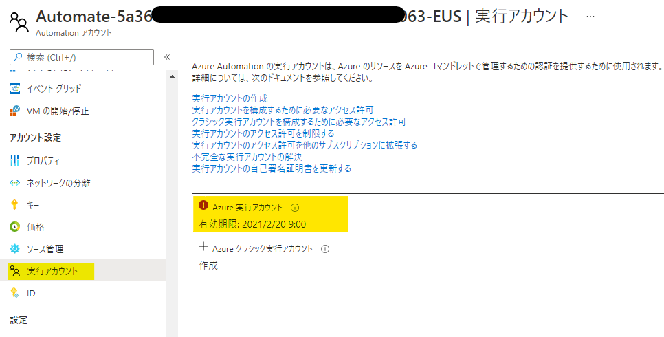

[更新履歴]  
- 2021/06/25 : ブログ公開
- 2026/01/09 : 廃止について追記済み
  Azure Automation 実行アカウント (クラシック実行アカウントを含む) は 2023 年 9 月 30 日に廃止されました。
  詳細は [既存の実行アカウントからマネージド ID に移行する](https://learn.microsoft.com/ja-jp/azure/automation/migrate-run-as-accounts-managed-identity?tabs=run-as-account)  をご参考いただければ幸いです。


こんにちは、Azure Monitoring & Integration サポート チームの伊東です。
本日は、Azure Automation の実行アカウントについて、サポート チームによくお問い合わせいただく質問を例に挙げ、実行アカウントをどのように管理していくのか tips をご紹介していきます。

<!-- more -->

## 目次
- Azure Automation の実行アカウントとは (2023 年 9 月 30 日に廃止)
- FAQ
    - Q1: 実行アカウントを作成するためにどのような権限が必要ですか？
    - Q2: 実行アカウントの有効期限が切れました。どのような影響がありますか？どう対処すれば良いですか？
    - Q3: 実行アカウントの更新に失敗します。実行アカウントの有効期限の更新に必要な権限が知りたいです。
    - Q4: 実行アカウントの有効期限が 1 年なのですが、より長い期間に設定したいです。
    - Q5: 実行アカウントの有効期限が切れる前に通知を行いたいです。
- References

## Azure Automation の実行アカウントとは (2023 年 9 月 30 日に廃止)
Azure Automation を利用する多くのユーザー様は、Azure への認証に実行アカウントを利用しています。
以下のスクリプトでは、実行アカウントを呼び出してAzure にログインし、Get-AzVM で Azure VM の情報を取得しています。
既定では、Azure サブスクリプションの共同作成者ロールが実行アカウントに割り当てられているため、VM の起動停止など、Azure リソースの操作を行うことが可能です。

```ps1
# Get the connection "AzureRunAsConnection "
$connectionName = "AzureRunAsConnection"
$Conn = Get-AutomationConnection -Name $connectionName         

# Logging in to Azure...
Connect-AzAccount -ServicePrincipal -Tenant $Conn.TenantID -ApplicationId $Conn.ApplicationID -CertificateThumbprint $Conn.CertificateThumbprint

# Get the info of Azure VMs
Get-AzVM
```

本スクリプト内 "Connect-AzAccount" コマンドで -ServicePrincipal オプションを指定していますね。
これは、実行アカウントの実態が Azure Active Directory のサービス プリンシパルであるためです。
ユーザー アカウントと同様に、サービス プリンシパルに Azure リソースへの権限を割り当てて、リソースへアクセスすることが可能になります。
自動化のシナリオなどで、ユーザー アカウントの資格情報を利用する際に不都合などが発生する場合にサービス プリンシパルを使います。

本題から少し逸れてしまいますので、ここではサービス プリンシパルの詳しい説明を省きます。
もっと詳しい情報を知りたい方は以下の公開情報を参考にしてみてください。
- 参考
[Azure Active Directory のアプリケーション オブジェクトとサービス プリンシパル オブジェクト](https://docs.microsoft.com/ja-jp/azure/active-directory/develop/app-objects-and-service-principals)

---

## FAQ
### Q1: 実行アカウントを作成するためにどのような権限が必要ですか？
実行アカウントを作成するために必要な権限は、ユーザー アカウントの種類および Azure AD の設定により異なります。
設定のパターンごとに必要な権限を記載しますので、まずは自分がどのパターンに当てはまるか確認していただき、必要な権限をご確認ください。

 **パターン 1**  
<条件>  
・ユーザー アカウントの種類: Azure AD の "Member"  
・[Azure ポータル] - [Azure Active Directory] - [ユーザー設定] - [アプリの登録] が "はい" に設定されている。  
<必要な権限>  
・サブスクリプションの "所有者" ロール  

**パターン 2**  
<条件>  
・ユーザー アカウントの種類: Azure AD の "Member"  
・[Azure ポータル] - [Azure Active Directory] - [ユーザー設定] - [アプリの登録] が "いいえ" に設定されている。  
<必要な権限>  
・サブスクリプションの "所有者" ロール  
・Azure AD の "アプリケーション管理者" ロール  

**パターン 3**  
<条件>  
・ユーザー アカウントの種類: Azure AD の "Guest"  
<必要な権限>  
・サブスクリプションの "所有者" ロール  
・Azure AD の "アプリケーション管理者" ロール  


### Q2: 実行アカウントの有効期限が切れました。どのような影響がありますか？どう対処すれば良いですか？
実行アカウントの有効期限が切れると、以下のようなエラーでAzure へのログインが失敗します。

```
The Run-as certificate might have expired or invalid. Please check & renew the certificate as mentioned here : https://docs.microsoft.com/en-us/azure/automation/manage-runas-account#cert-renewal
Method 'get_SerializationSettings' in type 'Microsoft.Azure.Management.Internal.Resources.ResourceManagementClient' from assembly 'Microsoft.Azure.Commands.ResourceManager.Common, Version=4.0.0.0, Culture=neutral, PublicKeyToken=31bf3856ad364e35' does not have an implementation.
```
スクリプトで Azure リソースへの処理を実装していた場合、その処理が失敗することなどが考えられます。
そのため、有効期限が切れる前に、以下の手順で実行アカウントの証明書の有効期限を更新する必要があります。
実行アカウントの証明書の有効期限は既定では 1 年ですので、更新を忘れないよう注意してください。

**証明書の更新手順**
1. Azure ポータルにログインします。
2. すべてのサービスから [Automation アカウント] を選択し、対象の Automation アカウント名をクリックします。
3. [実行アカウント] のブレードを表示し、右側に表示される画面から "Azure 実行アカウント" をクリックします。

4. 画面上部から [証明書の更新] - [はい] の順にクリックし、証明書の更新を実行します。


### Q3: 実行アカウントの更新に失敗します。実行アカウントの有効期限の更新に必要な権限が知りたいです。
実行アカウントの更新を行うためには、そのユーザーが十分な権限を有している必要があります。
証明書の更新を行うには、以下のどちらからの条件を満たすように権限を割り当ててください。

**条件 1**  
・Azure AD の "アプリケーション管理者" ロール  
・サブスクリプションの "所有者" ロール  

**条件 2**  
・実行アカウント作成時に作成されるサービス プリンシパルの "所有者"  
・サブスクリプションの "所有者" ロール  

※ サービス プリンシパルの所有者の一覧は以下の手順で確認することができます。

**サービス プリンシパルの所有者 確認手順**
1. Azure ポータルにログインします。
2. すべてのサービスから [Automation アカウント] を選択し、対象のアカウント名をクリックします。
3. [実行アカウント] のブレードを表示し、右側に表示される画面から "Azure 実行アカウント" をクリックします。
4. 実行アカウントの詳細な情報が記載された画面が表示されますので、Azure AD アプリケーションの [表示名] をコピーします。

5. 次に、すべてのサービスから [Azure AD] を選択します。
6. 画面左端から [アプリの登録] のブレードを表示します。
7. 手順 4 にてコピーした "表示名" を検索ボックスに入力します。

8. 表示されたアプリケーションをクリックし、[所有者] のブレードを表示します。


### Q4: 実行アカウントの有効期限が 1 年なのですが、より長い期間に設定したいです。
Azure ポータルから実行アカウントを作成すると有効期限は既定では 1 年ですが、Azure PowerShell を利用することで任意の有効期限を設定できます。
以下の公開情報にて、PowerShell にて実行アカウントを作成する手順をご案内していますので、こちらの手順を実施してください。

- 公開情報
[実行アカウントを作成する PowerShell スクリプト](https://docs.microsoft.com/ja-jp/azure/automation/create-run-as-account#powershell-script-to-create-a-run-as-account)

※ 補足
以下サンプル コマンドのように SelfSignedCertNoOfMonthsUntilExpired を引数に指定することで有効期限を月単位で指定できます。
下記の例の場合には、100 年 (1200 ヶ月) の有効期限をもつ証明書を作成します。
```ps1
.\Create-RunAsAccount.ps1 -ResourceGroup <Automation アカウントのリソース グループ名> -AutomationAccountName <Automation アカウント名> -SubscriptionId <サブスクリプション ID> -ApplicationDisplayName <実行アカウントの表示名> -SelfSignedCertPlainPassword <任意のパスワード> -CreateClassicRunAsAccount $false -SelfSignedCertNoOfMonthsUntilExpired 1200
```


### Q5: 実行アカウントの有効期限が切れる前に通知を行いたいです。
既定では、証明書の有効期限を検知して通知を行う機能はありません。
なお、Get-AzAutomationCertificate コマンドで実行アカウントの証明書の有効期限を取得できます。
こちらのコマンドレットを利用して有効期限を取得し、メール通知を行うサンプル スクリプトをご案内します。
タスクスケジューラや Azure Automation などの自動化ツールでスクリプトをスケジュール実行するよう設定ください。

```ps1
# パラメータ (適宜ご変更ください。)
$RGname="リソース グループ名"
$AAname="Automation アカウント名"
$SubscriptionId="サブスクリプション ID"
$notificationtime=30 #この値より有効期限の残り日数が小さい場合に通知を行う 
$automationCertificateName="証明書の名前" # [Azure ポータル - Autoamtion アカウント - 証明書 - 名前] からご確認ください。 
$mail = @{
    from = "*********@ex***le.com";
    to = "***@ex***le.com";
    smtp_server = "smtp.*****.com";
    smtp_port = ***;
    user = "**************@*****.com";
    password = "********";
}

# 認証情報生成
$password = ConvertTo-SecureString $mail["password"] -AsPlainText -Force
$credential = New-Object System.Management.Automation.PSCredential $mail["user"], $password

# ログイン
Connect-AzAccount
Select-AzSubscription -SubscriptionId $SubscriptionId

# 有効期限の取得
$result=Get-AzAutomationCertificate -ResourceGroupName $RGname -AutomationAccountName $AAname | Where-Object{$_.Name -match $automationCertificateName}
$result
if (!$result) {
    # 実行アカウントが見つからなかった場合
    throw "Automation Account に実行アカウントが存在しません。"    
}
$ExpireDate=$result.ExpiryTime.Date

# 本日の日付を取得
$today=Get-Date

# 残り日数を計算
$diff=$ExpireDate - $today

if ($diff.Days -lt 0){
    # 既に有効期限切れをしていればメールを送信
    Send-MailMessage -To $mail["to"] `
                 -From $mail["from"] `
                 -SmtpServer $mail["smtp_server"] `
                 -Credential $credential `
                 -Port $mail["smtp_port"] `
                 -Subject "[Urgent] The certificate has already been expired." `
                 -Body "証明書は既に有効期限が切れています。更新を行ってください。" `
                 -Encoding UTF8 `
                 -UseSsl
} elseif ($notificationtime -gt $diff.Days){
    # 指定した期間より有効期限が短ければメールを送信
    Send-MailMessage -To $mail["to"] `
                 -From $mail["from"] `
                 -SmtpServer $mail["smtp_server"] `
                 -Credential $credential `
                 -Port $mail["smtp_port"] `
                 -Subject "[Urgent] The certificate will be expired." `
                 -Body "証明書の有効期限は残り $($diff.Days) 日です。" `
                 -Encoding UTF8 `
                 -UseSsl
}
```

> [!WARNING]
> 本サンプル スクリプトは、サンプルとして提供されるものであり、製品の実運用環境で使用されることを前提に提供されるものではありません。
> 本サンプルコードおよびそれに関連するあらゆる情報は、「現状のまま」で提供されるものであり、明示・黙示を問わずいかなる保証も付されるものではありません。
> こちらのサンプルを利用される際には、検証環境などで動作を十分にご確認の上、ご利用ください。

---

## References
[Azure Automation の実行アカウントを作成する方法](https://docs.microsoft.com/ja-jp/azure/automation/create-run-as-account)
[Azure Automation の実行アカウントを管理する](https://docs.microsoft.com/ja-jp/azure/automation/manage-runas-account)
