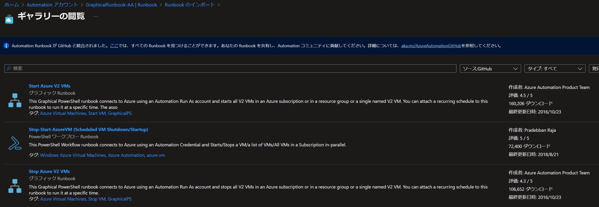
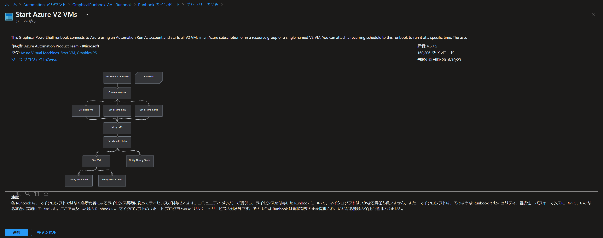
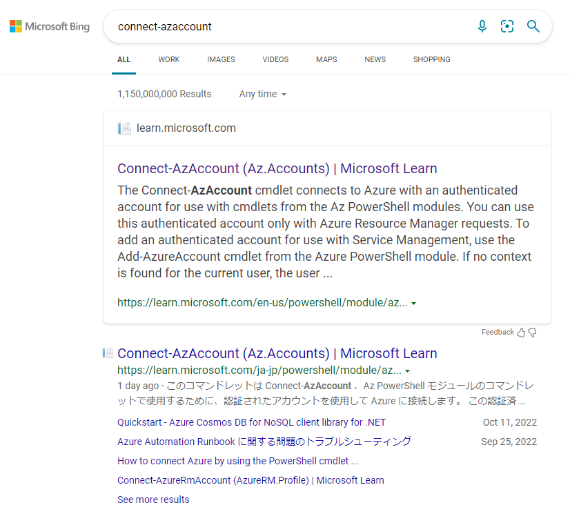

こんにちは！Azure Monitoring サポート チームの趙です。 
今回は、VM を起動・停止する方法をご案内させていただきます。

<!-- more -->

## 目次
- [目次](#目次)
- [VM 起動・停止処理を理解しましょう](#vm-起動停止処理を理解しましょう)
- [なぜ Automation を使うか](#なぜ-automation-を使うか)
- [VM を起動・停止するソリューション](#vm-を起動停止するソリューション)
  - [1.Start/Stop VMs during off-hours ソリューション (v1) (非推奨)](#1startstop-vms-during-off-hours-ソリューション-v1-非推奨)
  - [2.Start/Stop VMs v2 (推奨)](#2startstop-vms-v2-推奨)
  - [3.Start Azure V2 VMs / Stop Azure V2 VMs (非推奨)](#3start-azure-v2-vms--stop-azure-v2-vms-非推奨)
- [VM を起動・停止する Runbook サンプル](#vm-を起動停止する-runbook-サンプル)
  - [免責事項](#免責事項)
  - [サンプル Runbook : システム割り当てマネージド ID を利用し、VM を起動・停止する Runbook](#サンプル-runbook--システム割り当てマネージド-id-を利用しvm-を起動停止する-runbook)
  - [サンプル Runbook の解説](#サンプル-runbook-の解説)
    - [Azure へ認証するコマンド](#azure-へ認証するコマンド)
    - [VM を起動するコマンド](#vm-を起動するコマンド)
    - [VM を停止するコマンド](#vm-を停止するコマンド)
  - [サンプル Runbook の利用方法](#サンプル-runbook-の利用方法)
    - [1.Automation アカウントを作成する](#1automation-アカウントを作成する)
    - [2.Automation アカウントにシステム割り当てマネージド ID を構成する](#2automation-アカウントにシステム割り当てマネージド-id-を構成する)
    - [3.必要なモジュールをインポートする](#3必要なモジュールをインポートする)
    - [4.対象 Runbook を作成する](#4対象-runbook-を作成する)
    - [5.スケジュールを設定する](#5スケジュールを設定する)
    - [6.動作確認する](#6動作確認する)
      - [Runbook 手動実行での動作確認](#runbook-手動実行での動作確認)
      - [スケジュールの動作確認](#スケジュールの動作確認)
  - [トラブルシューティング](#トラブルシューティング)
    - [マネージド ID にロールが割り当てられていないパターン](#マネージド-id-にロールが割り当てられていないパターン)
    - [必要なモジュールがインポートされていないパターン](#必要なモジュールがインポートされていないパターン)

## VM 起動・停止処理を理解しましょう

みなさんは普段 VM を起動・停止する際には、どのような方法で、VM を起動・停止していますか？

最も一般的な方法は、[Azure ポータルから、[開始] ボタン、[停止] ボタンをクリックし、VM を起動・停止する方法](https://jpaztech.github.io/blog/vm/vm-operation/)ですね。 
あるいは、PowerShell コマンド [Start-AzVM](https://learn.microsoft.com/en-us/powershell/module/az.compute/start-azvm?view=azps-8.2.0) 、[Stop-AzVM](https://learn.microsoft.com/en-us/powershell/module/az.compute/stop-azvm?view=azps-8.2.0) を実行し、VM を起動・停止されている方もいると思います。

VM の電源状態の詳細については、[こちらの公開情報](https://docs.microsoft.com/ja-jp/azure/virtual-machines/states-billing)もご参考いただければ幸いです。

Azure Automation では、Runbook というものを使って、VM を起動・停止できます。

Runbook は、簡単に申しますと、Azure 上で実行できるスクリプトです。 
Runbook の詳細は、[Azure Automation での Runbook の実行](https://learn.microsoft.com/ja-jp/azure/automation/automation-runbook-execution) と[Azure Automation の Runbook の種類](https://learn.microsoft.com/ja-JP/azure/automation/automation-runbook-types)をご参考いただければ幸いです。

## なぜ Automation を使うか

Automation は、スクリプトを定期的に実行できるサービスです。

VM 起動・停止を毎日、ポータルから [開始] ボタン、[停止] ボタンを押して、管理することは現実的に難しいと思います。
Azure Automation をご利用いただくことで、VM の起動・停止処理をスケジュールで起動・停止する (自動化する) ことが可能です。Azure Automation では、スケジュールという機能があり、スケジュールに設定した時間に Runbook (スクリプト) を実行できます。

## VM を起動・停止するソリューション

### 1.Start/Stop VMs during off-hours ソリューション (v1) (非推奨)

Azure Automation では、以前は、[Start/Stop VMs during off-hours ソリューション (v1)](https://learn.microsoft.com/ja-jp/azure/automation/automation-solution-vm-management) を提供しておりましたが、現時点では、非推奨の機能です。
なお、認証手段としては、実行アカウントが利用されていたソリューションです。 

また、Start/Stop VMs during off-hours ソリューション (v1) は、非推奨のソリューションであるため、現時点では Start/Stop VMs during off-hours ソリューション (v1) をデプロイすることはできません。 
Start/Stop VMs during off-hours ソリューション (v1) をご検討いただいた方は、後述する Start/Stop VMs v2 のご利用をご検討いただければ幸いです。

### 2.Start/Stop VMs v2 (推奨)

Start/Stop VMs during off-hours ソリューション (v1) とは別の [Start/Stop VMs v2](https://learn.microsoft.com/ja-jp/azure/azure-functions/start-stop-vms/overview) というソリューションがございます。
Start/Stop VMs v2 ソリューションは、現在、一般公開 (GA) されている機能であり、弊社にて推奨する VM 起動・停止ソリューションです。

> [!WARNING]
> Start/Stop VMs v2 ソリューションでは、[Azure Automation](https://learn.microsoft.com/ja-JP/azure/automation/overview) は利用されません。
> [Azure Functions](https://learn.microsoft.com/ja-JP/azure/azure-functions/functions-overview) 及び [Logic Apps](https://learn.microsoft.com/ja-JP/azure/logic-apps/logic-apps-overview)が利用されます。 

また、認証手段としては、マネージド ID が利用されます。

Start/Stop VMs v2 ソリューションをデプロイすることで VM を起動・停止する Azure Functions 及び Logic Apps が自動的にデプロイできます。
このソリューションを利用することで、VM をスケジュールで起動・停止することが可能です。

### 3.Start Azure V2 VMs / Stop Azure V2 VMs (非推奨)

Runbook ギャラリーから入手できる "Start Azure V2 VMs" Runbook 、あるいは、"Stop Azure V2 VMs" Runbook をご利用されている方もいると存じます。




>[!NOTE]
>各 Runbook は、マイクロソフトではなく各所有者によるライセンス契約に従ってライセンスが付与されます。コミュニティ メンバーが提供し、ライセンスを付与した Runbook について、マイクロソフトはいかなる責任も負いません。また、マイクロソフトは、そのような Runbook のセキュリティ、互換性、パフォーマンスについて、いかなる審査も実施していません。ここで言及した類の Runbook は、マイクロソフトのサポート プログラムまたはサポート サービスの対象外です。そのような Runbook は現状有姿のまま提供され、いかなる種類の保証も適用されません。

この Runbook は、あくまでもチュートリアル用の Runbook であり、非推奨の Runbook です。
以下は推奨しない理由です。
非推奨の AzureRM モジュールのコマンドを利用している Runbook であるためです。

> [!NOTE]
> 弊社としては、Az モジュールのコマンドを推奨します。
> 詳細については、[Az モジュールへの移行](https://learn.microsoft.com/ja-JP/azure/automation/shared-resources/modules#migrate-to-az-modules)をご参考いただければ幸いです。


なお、[2016 年以降、修正・アップデートがされていない](https://github.com/azureautomation/start-azure-v2-vms) Runbook であるためです。
また、["The pipeline was not run because a pipeline is already running" エラー発生時の対処方法](https://jpazmon-integ.github.io/blog/automation/ThePipelineWasNotRunBecauseAPipelineIsAlreadyRunningError/) 記事のように、既知のエラーが発生する Runbook です。

そのため、運用にて VM の起動・停止ソリューションのご利用をご検討されている方、あるいは、既にご利用されている方は、Start Azure V2 VMs / Stop Azure V2 VMs Runbook (上記グラフィカル Runbook) ではなく、弊社にて推奨する [Start/Stop VMs v2](https://learn.microsoft.com/ja-jp/azure/azure-functions/start-stop-vms/overview) ソリューション (Azure Functions 及び Logic Apps の機能) のご利用をご検討いただければ幸いです。

## VM を起動・停止する Runbook サンプル

上記にて紹介いたしましたソリューションとは別で、お客様にてカスタムで Runbook を作成し、Azure Automation を利用し、VM を起動・停止することも可能です。

カスタムで Runbook を作成する基本的なガイドラインは、[チュートリアル: マネージド ID を使用して Automation PowerShell Runbook を作成する](https://learn.microsoft.com/ja-jp/azure/automation/learn/powershell-runbook-managed-identity) や、[Azure Automation でのテキスト形式の Runbook の編集](https://docs.microsoft.com/ja-JP/azure/automation/automation-edit-textual-runbook)をご参考いただければ幸いです。

なお、以下に一例として、VM を起動・停止するサンプル Runbook を参考情報としてご案内させていただきます。 
こちらのサンプルについては、お客様のご要件に応じて、適宜、カスタマイズいただければ幸いです。
以下免責事項をご確認いただいたうえで、サンプルをご活用いただければ幸いです。

### 免責事項

- 弊社サポートにて、お客様のご要件のサンプルを作成・編集し、提供することは、サポートしておりません。
-  こちらの Runbook をご利用いただき、スクリプトの修正、スクリプトの追記等が必要な際には、お客様のご要件に応じて、お客様にて直接修正・動作確認いただく必要がございます。そのため、大変恐れ入りますが、スクリプトの修正、スクリプトの追記等をお問い合わせいただいても、ご要望を承ることができない点、予めご理解いただければ幸いです。
- 弊社として推奨する VM 起動・停止ソリューションは、現在、一般公開 (GA) されている  [Start/Stop VMs v2](https://learn.microsoft.com/ja-jp/azure/automation/automation-solution-vm-management) ソリューションです。
- こちらのサンプルは、あくまでも VM 起動・停止のコマンドの説明用のサンプルとなります。


### サンプル Runbook : システム割り当てマネージド ID を利用し、VM を起動・停止する Runbook

```PowerShell
param(
[Parameter(Mandatory=$true,HelpMessage="Enter the value for Action. Values can be either start or stop")][String]$Action = $(throw "Value for Action is missing"),
[Parameter(Mandatory=$true,HelpMessage="Enter the value for VMName.")][String]$VMName = $(throw "Value for VMName is missing"),
[Parameter(Mandatory=$true,HelpMessage="Enter the ResourceGroupName.")][String]$ResourceGroupName = $(throw "Value for ResourceGroupName is missing")
)

[string] $FailureMessage = "Failed to execute the command"
[int] $RetryCount = 3 
[int] $TimeoutInSecs = 20
$RetryFlag = $true
$Attempt = 1
do
{
    #----------------------------------------------------------------------------------
    #---------------------LOGIN TO AZURE AND SELECT THE SUBSCRIPTION-------------------
    #----------------------------------------------------------------------------------
    
    Write-Output "Logging into Azure subscription using Az cmdlets..."
    
    try
    {

        # Ensures you do not inherit an AzContext in your runbook
        Disable-AzContextAutosave -Scope Process
        # Connect to Azure with system-assigned managed identity
        $AzureContext = (Connect-AzAccount -Identity).context
        # set and store context
        $AzureContext = Set-AzContext -SubscriptionName $AzureContext.Subscription -DefaultProfile $AzureContext

        
        Write-Output "Successfully logged into Azure subscription using Az cmdlets..."

        Write-Output "VM action is : $($Action)"
            
        if ($Action.Trim().ToLower() -eq "stop")
        {
            Write-Output "Stopping the VM : $($VMName) in Resource Grpup $($ResourceGroupName)"

            $Status = Stop-AzVM -Name $VMName -ResourceGroupName $ResourceGroupName -Force

            if($Status -eq $null)
            {
                Write-Output "Error occured while stopping the Virtual Machine $($VMName) in Resource Grpup $($ResourceGroupName)"
            }
            else
            {
            Write-Output "Successfully stopped the VM $VMName in Resource Grpup $($ResourceGroupName) in Resource Grpup $($ResourceGroupName)"
            }
        }
        elseif($Action.Trim().ToLower() -eq "start")
        {
            Write-Output "Starting the VM : $($VMName) in Resource Grpup $($ResourceGroupName)"

            $Status = Start-AzVM -Name $VMName -ResourceGroupName $ResourceGroupName

            if($Status -eq $null)
            {
                Write-Output "Error occured while starting the Virtual Machine $($VMName) in Resource Grpup $($ResourceGroupName)"
            }
            else
            {
                Write-Output "Successfully started the VM $($VMName) in Resource Grpup $($ResourceGroupName)"
            }
        }

        $RetryFlag = $false
    }
    catch 
    {
        if ($Attempt -gt $RetryCount) 
        {
            Write-Output "$FailureMessage! Total retry attempts: $RetryCount"

            Write-Output "[Error Message] $($_.exception.message) `n"

            $RetryFlag = $false
        }
        else 
        {
            Write-Output "[$Attempt/$RetryCount] $FailureMessage. Retrying in $TimeoutInSecs seconds..."

            Start-Sleep -Seconds $TimeoutInSecs

            $Attempt = $Attempt + 1
        }   
    }
}
while($RetryFlag)
```

### サンプル Runbook の解説

上記サンプル Runbook は、主に以下 3 つのコマンドを利用し、VM を起動・停止します。

#### Azure へ認証するコマンド
```PowerShell
Connect-AzAccount -Identity
```
[システム割り当てマネージド ID](https://learn.microsoft.com/ja-jp/azure/automation/enable-managed-identity-for-automation) を利用するコマンドです。 
Automation では、このコマンドを利用し、操作対象の Azure リソースへ認証します。
システム割り当てマネージド ID ではなく、ユーザー割当マネージド ID をご利用いただくことも可能です。
ユーザー割り当てマネージド ID をご希望される場合は、[Azure Automation アカウントのユーザー割り当てマネージド ID を使用する](https://learn.microsoft.com/ja-jp/azure/automation/add-user-assigned-identity) をご参考いただければ幸いです。

>[!NOTE]
>マネージド ID は、2 種類あります。システム割り当てマネージド ID と、ユーザー割り当てマネージド ID があります。
>システム割り当てマネージド ID を使えばいいか、ユーザー割り当てマネージド ID を使えばいいかとのお問い合わせをされている方もいます。
>弊社としては、特にこのマネージド ID を使ってくださいとの推奨はございません。
>[マネージド ID のベスト プラクティスに関する推奨事項](https://learn.microsoft.com/ja-jp/azure/active-directory/managed-identities-azure-resources/managed-identity-best-practice-recommendations) をご参考いただき、お客様のご要件に合うマネージド ID をご利用いただければ幸いです。

#### VM を起動するコマンド
```PowerShell
Start-AzVM -Name $VMName -ResourceGroupName $ResourceGroupName
```
VM を起動するコマンドです。
Runbook の入力パラメーターで設定する VM 名と VM 名のリソース グループ名がこのコマンドに利用されます。

#### VM を停止するコマンド
```PowerShell
Stop-AzVM -Name $VMName -ResourceGroupName $ResourceGroupName -Force
```
VM を停止するコマンドです。
Runbook の入力パラメーターで設定する VM 名と VM 名のリソース グループ名がこのコマンドに利用されます。
VM を起動するコマンドとは、-Force オプションを付けている箇所が相違点ですね。
通常、-Force オプションなしで、Stop-AzVM を実行すると、"本当に VM を停止しますか" とユーザーの入力が求められます。
Automation では、このような対話型コマンドはサポートされません。
-Force オプションを付けることによって、ユーザーの入力を必要とせず、サイレントで処理を実行することが可能です。
そのため、Automation の Runbook で、Stop-AzVM を実行する場合は、明示的に -Force オプションを付けております。


### サンプル Runbook の利用方法

#### 1.Automation アカウントを作成する

ご利用いただいている環境に、Automation アカウントがない場合、[スタンドアロン Azure Automation アカウントを作成する](https://learn.microsoft.com/ja-jp/azure/automation/automation-create-standalone-account?tabs=azureportal)をご参考いただき、Automation アカウントを作成いただければ幸いです。


#### 2.Automation アカウントにシステム割り当てマネージド ID を構成する

[Azure Automation アカウントのシステム割り当てマネージド ID を使用する](https://learn.microsoft.com/ja-jp/azure/automation/enable-managed-identity-for-automation)をご参考いただき、Automation アカウントにシステム割り当てマネージド ID を構成いただければ幸いです。

>[!NOTE]
>現時点では、新規 Automation アカウントを作成すると、自動的にシステム割り当てマネージド ID が作成されます。そのため、新規 Automation アカウントを作成した場合は、別途、システム割り当てマネージド ID を作成する必要はございません。
>一方で、システム割り当てマネージド ID へのロールの割り当ては何もされていない状態でシステム割り当てマネージド ID が作成されます。
>そのため、現時点で、新規 Automation アカウントを作成された方は、[Azure Automation アカウントのシステム割り当てマネージド ID を使用する](https://learn.microsoft.com/ja-jp/azure/automation/enable-managed-identity-for-automation)をご参考いただき、必要なロールを割り当てていただければ幸いです。

#### 3.必要なモジュールをインポートする

今回の Runbook にて利用されるコマンドは主に以下 3 つです。

```PowerShell
Connect-AzAccount -Identity
```

```PowerShell
Start-AzVM -Name $VMName -ResourceGroupName $ResourceGroupName
```

```PowerShell
Stop-AzVM -Name $VMName -ResourceGroupName $ResourceGroupName -Force
```

Runbook にて、それぞれのコマンドを実行するには Automation アカウントに対象コマンドのモジュールがインポートされている必要があります。
それぞれのコマンドで必要なモジュールは以下です。

- [Connect-AzAccount](https://learn.microsoft.com/en-us/powershell/module/az.accounts/connect-azaccount?view=azps-8.3.0) の場合、Az.Accounts が必要です。
- [Start-AzVM](https://learn.microsoft.com/en-us/powershell/module/az.compute/start-azvm?view=azps-8.3.0) の場合、Az.Compute が必要です。
- [Stop-AzVM](https://learn.microsoft.com/en-us/powershell/module/az.compute/stop-azvm?view=azps-8.3.0) の場合、Az.Compute が必要です。

[Azure Automation でモジュールを管理する](https://learn.microsoft.com/ja-JP/azure/automation/shared-resources/modules#import-modules:~:text=PowerShell%20%E3%82%AE%E3%83%A3%E3%83%A9%E3%83%AA%E3%83%BC%20%E3%83%A2%E3%82%B8%E3%83%A5%E3%83%BC%E3%83%AB%E3%82%92,%E3%82%92%E9%96%8B%E5%A7%8B%E3%81%97%E3%81%BE%E3%81%99%E3%80%82) をご参考いただき、上記モジュールを Automation アカウントにインポートいただければ幸いです。

>[!NOTE]
>コマンドに必要なモジュールを特定するには、対象コマンドの公開情報に記載されているモジュールをご確認いただければ確認できます。
>対象コマンドの公開情報は、インターネットで対象コマンドを検索すると表示される Microsoft 公開情報にて確認できます。
>例えば、Connect-AzAccount の場合、"Module" に "Az.Accounts" と記載されていることが確認できます。
>
>


>[!NOTE]
>既に、Az.Accounts と Az.Compute モジュールがインポートされている Automation アカウントをご利用されているお客様もいます。この場合、上記モジュール インポートの対応は不要です。
>[Azure ポータル] > [Automation アカウント] > [モジュール] に対象モジュールが存在していれば、上記モジュール インポートの対応は不要です。

#### 4.対象 Runbook を作成する

以下へアクセスします。

```
[Azure ポータル] - [Automation アカウント] - [Runbook] - [Runbook の作成]
```

以下を構成し、[作成] をクリックします。

- Runbook の名前 : <任意に設定>
- Runbook の種類 : PowerShell
- ランタイム バージョン : 5.1

[上記サンプル](#サンプル-runbook--システム割り当てマネージド-id-を利用しvm-を起動停止する-runbook) のスクリプトを貼り付けます。
[保存] と [公開] を押します。[はい] を押します。

#### 5.スケジュールを設定する

[Azure Automation のスケジュールを管理する](https://learn.microsoft.com/ja-jp/azure/automation/shared-resources/schedules) を参考に、スケジュールを作成し、スケジュールを Runbook にリンクします。

>[!WARNING]
>[上記サンプル](#サンプル-runbook--システム割り当てマネージド-id-を利用しvm-を起動停止する-runbook) は、１つの VM のみ指定できます。
そのため、VM の数分、スケジュールを作成し、Runbook へリンクする必要がございます。
Runbook は 1 つだけで問題ございません。
>複数の VM を指定されたい場合は、[Start/Stop VMs v2](https://learn.microsoft.com/ja-jp/azure/azure-functions/start-stop-vms/overview) ソリューション (Azure Functions 及び Logic Apps の機能) のご利用をご検討いただければ幸いです。

今回のサンプルの場合、以下３つのパラメーターで構成されています。

```PowerShell
param(
[Parameter(Mandatory=$true,HelpMessage="Enter the value for Action. Values can be either start or stop")][String]$Action = $(throw "Value for Action is missing"),
[Parameter(Mandatory=$true,HelpMessage="Enter the value for VMName.")][String]$VMName = $(throw "Value for VMName is missing"),
[Parameter(Mandatory=$true,HelpMessage="Enter the ResourceGroupName.")][String]$ResourceGroupName = $(throw "Value for ResourceGroupName is missing")
)
```

スケジュールを Runbook へリンクするタイミングで、パラメーターの指定が求められます。
各パラーメーターに渡す値は、以下のように指定いただければ幸いです。

- ACTION : VM を起動したい場合は、"start"。VM を停止したい場合は、"stop" を入力。
- VMNAME : 対象 VM の VM 名を入力
- RESOURCEGROUPNAME : 対象 VM のリソース グループ名を入力


#### 6.動作確認する

まずは、Runbook を手動で実行し、正常動作することを確認してから、
スケジュールの動作をご確認いただければ幸いです。

##### Runbook 手動実行での動作確認

```
[Azure ポータル] - [Automation アカウント] - [Runbook] - [開始] - [パラメーターの値を入力] - [OK]
```

##### スケジュールの動作確認

スケジュールで設定された時間に Runbook が実行されるかどうかを確認します。

```
[Azure ポータル] - [Automation アカウント] - [ジョブ] - [ジョブ一覧に対象 Runbook のジョブが表示されるかを確認]
```

### トラブルシューティング

#### マネージド ID にロールが割り当てられていないパターン
例えば、以下のようなエラー メッセージが表示され、VM が起動・停止していない場合は、
マネージド ID に必要なロールが割り当てられているかをご確認いただければ幸いです。

```
[Error Message] Cannot validate argument on parameter 'Subscription'. The argument is null or empty. Provide an argument that is not null or empty, and then try the command again. 
```

本サンプルでは、システム割り当てマネージド ID を利用し、Azure へ認証し、VM を起動・停止します。
上記エラーは、システム割り当てマネージド ID が、Azure へ認証できていないことを意味します。
システム割り当てマネージド ID が、Azure へ認証するには、権限があるロールを有している必要がございます。
ロールが割り当てられているかをご確認ください。

#### 必要なモジュールがインポートされていないパターン
例えば、以下のようなエラー メッセージが表示され、VM が起動・停止していない場合は、
対象 Runbook のコマンドのモジュールがインポートされていないことを意味します。
```
The term '<コマンド名>" is not recognized as a name of cmdlet...
```
Automation アカウントにモジュールがインポートされているかご確認いただき、
ない場合は、モジュールをインポートいただければ幸いです。

以上です。