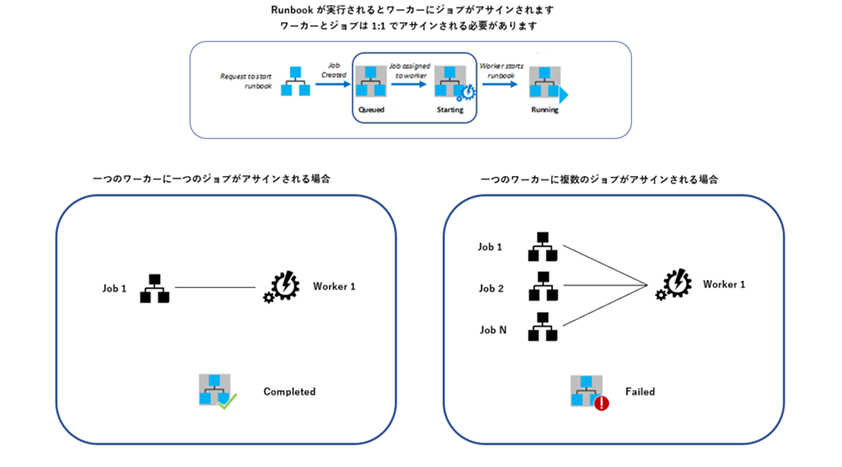

[更新履歴]
- 2021/8/23 ブログ公開
- 2026/1/19 最新情報に更新

こんにちは、Azure Monitoring & Integration サポート チームの趙です。  
本日は、Azure Automation の Runbook 実行時、"The pipeline was not run because a pipeline is already running" のエラーでジョブが失敗する場合の対処方法をご紹介していきます。

<!-- more -->

## 目次
- 事象
  - この事象はどういう事象ですか？
  -  このエラーはいつ発生しますか？
- 原因
  - Automation ジョブの動作
  - 図解
- 対策
  - 1.処理 (例えば、起動する VM) ごとに、 Automation アカウントを分ける
  - 2.スケジュールの時間を数分ずらして実行する
  - 3.Start/Stop VMs v2 ソリューションを利用する

## 事象
### この事象はどういう事象ですか？
以下エラーで、ジョブが失敗する事象です。

      The pipeline was not run because a pipeline is already running. Pipelines cannot be run concurrently.
### このエラーはいつ発生しますか？
**同時に複数のジョブを実行**する際に、タイミングによっては、当該エラーが表示され、ジョブが失敗する場合がございます。
特にグラフィック Runbook [**Start Azure V2 VMs**、**Stop Azure V2 VMs** **(非推奨)**](https://jpazmon-integ.github.io/blog/automation/HowtoStartOrStopVMsbyAutomation/#3-Start-Azure-V2-VMs-Stop-Azure-V2-VMs-%E9%9D%9E%E6%8E%A8%E5%A5%A8) を利用しているお客様から当該エラーのお問い合わせを複数いただいております。  
こちらの Runbook をご利用されている方は、後述する対策をご検討いただけますと幸いです。  

## 原因
以下 Automation ジョブの動作により、発生する事象です。
### Automation ジョブの動作
Automation では、Runbook を実行すると、 Azure 実行基盤上にワーカーというプロセスが作成されます。  
このワーカーに Runbook のジョブが割り当てられ (ジョブ 1 : ワーカー 1) 、実行されます。  
一方で、Runbook による複数のジョブが同一のワーカーにて (ジョブ N : ワーカー 1) 実行されてしまう場合があります。  
このため、タイミングによっては、該当のエラー メッセージが表示され、ジョブが失敗することがございます。  

> [!NOTE]
> お客様から、この動作が修正される予定があるかとのお問い合わせを複数いただいておりますが、  
> こちらの動作は、より多くのお客様が Automation サービスをご利用できるように  
> Azure 実行基盤上のリソースを効率良く割り当てるための仕組みであり、  
> 今後、修正される見込みはないこと、ご了承いただければ幸いです。

> [!TIP]
> Azure Automation の実行基盤は、サンドボックス環境とも呼ばれます。 
> サンドボックス環境の実態は、弊社データセンターにあるサーバー インスタンスでございます。
> Automation でジョブが実行されると、このジョブは、弊社データ センターにあるサーバー インスタンス上で、実行されます。
> 詳しくは、[Runbook の実行環境](https://docs.microsoft.com/ja-jp/azure/automation/automation-runbook-execution#runbook-execution-environment) をご参考いただければ幸いです。

### 図解

図で表すと以下のようになります。

## 対策

以下 3 つの対策の中でいずれかの対策のご利用をご検討いただけますと幸いです。

1. 処理 (例えば、起動する VM) ごとに、 Automation アカウントを分ける
2. スケジュールの時間を数分ずらして実行する
3. Start/Stop VMs during off-hours ソリューションを利用する

### 1. 処理 (例えば、起動する VM) ごとに、 Automation アカウントを分ける
ジョブを実行した Automation アカウントが同一の場合にのみ、  
Runbook のジョブを実行するワーカーが重複する可能性があります。  
回避策として、Runbook で実現する処理ごとに、Automation アカウントを分ける対応をご検討いただければ幸いです。

例えば、VM を起動する Runbook にて、当該エラーが発生した場合、
以下例のように VM ごとに Automation アカウントを分けて Runbook を実行する案をご検討いただけますと幸いです。 

例)

| 対象 VM | Automation アカウント |
| -------- | -------- |
| VM01 | AutomationAccount-A |
| VM02 | AutomationAccount-B |
| VM03 | AutomationAccount-C |
| VM04 | AutomationAccount-D |

### 2. スケジュールの時間を数分ずらして実行する

同時に複数のジョブを実行する場合、  
Runbook のジョブを実行するワーカーが重複する可能性があります。  
回避策として、ジョブの同時実行を回避する対応をご検討いただければ幸いです。  

例えば、VM を起動する Runbook にて、当該エラーが発生した場合、  
以下例のようにスケジュールの時間をずらして、VM を起動する案をご検討いただけますと幸いです。  
ジョブの間隔を 2 ~ 3 分程度、空けていただくことを目安と設定いただければ幸いです。

例)

| 対象 VM | ジョブを実行する時刻 (スケジュール) | Automation アカウント |
| -------- | -------- |--------|
| VM01 | 2021-08-20 08:00 | AutomationAccount-A | 
| VM02 | 2021-08-20 08:02 | AutomationAccount-A | 
| VM03 | 2021-08-20 08:05 | AutomationAccount-A | 
| VM04 | 2021-08-20 08:07 | AutomationAccount-A | 

### 3. Start/Stop VMs v2 ソリューションを利用する

Runbook で VM 起動・停止時に事象が発生する場合は、こちらの策をご検討いただければ幸いです。
[Start/Stop VMs v2 ソリューション](https://learn.microsoft.com/ja-jp/previous-versions/azure/functions/start-stop-vms/overview)では、上記のような動作 (一つのワーカーに複数のジョブがアサインされる動作) が回避できる仕組みがスクリプト レベルで実装されております。  
なお、Start/Stop VMs v2 ソリューションをご利用いただくことで、VM の開始および停止をスケジュールで実行することができます。  
回避策として、Start/Stop VMs v2 ソリューションを利用する案をご検討いただければ幸いです。

> [!NOTE]
> VM を起動・停止するソリューションについて、[VM を起動・停止するソリューション](https://jpazmon-integ.github.io/blog/automation/HowtoStartOrStopVMsbyAutomation/#VM-%E3%82%92%E8%B5%B7%E5%8B%95%E3%83%BB%E5%81%9C%E6%AD%A2%E3%81%99%E3%82%8B%E3%82%BD%E3%83%AA%E3%83%A5%E3%83%BC%E3%82%B7%E3%83%A7%E3%83%B3) をご参考いただければ幸いです。
