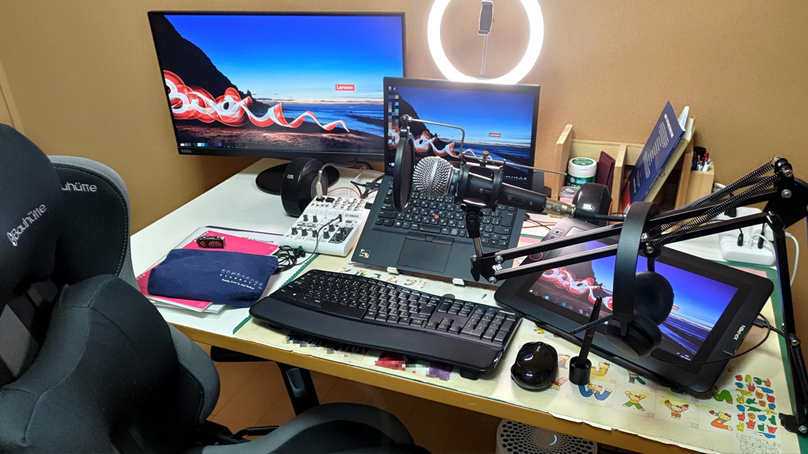
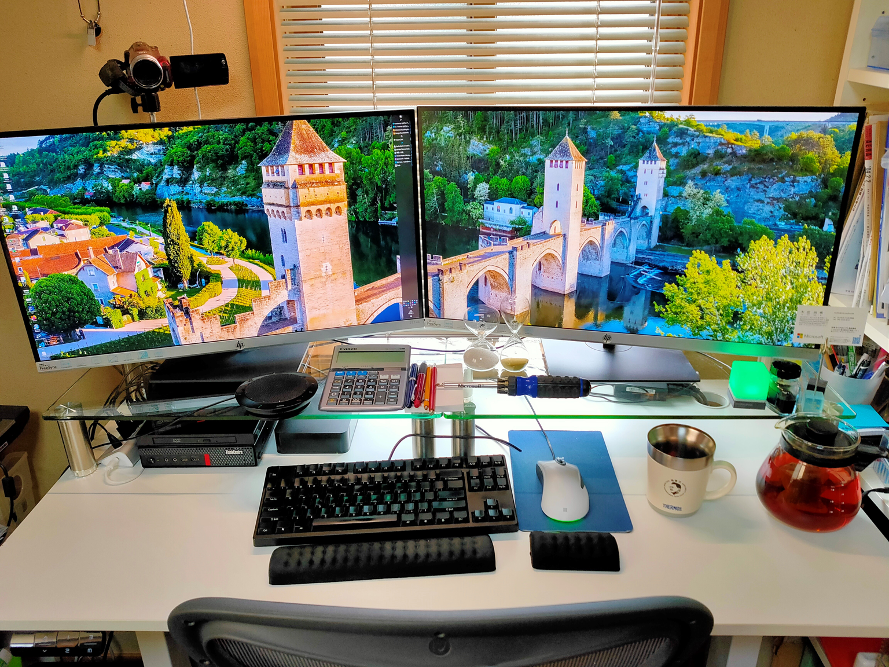
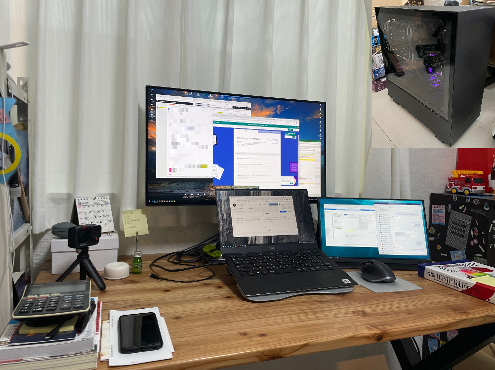

こんにちは！Azure Monitoring & Integration チームの伊東です。
現在わたしたちのチームでは、一緒に Azure サポートを盛り上げていってくださるメンバーを絶賛大募集中です！！
今日は、私たちのチームがどのように働いているのか、少しでも皆さんにイメージしていただき、興味をもっていただけるよう、普段の働き方や仕事環境について紹介いたします。
<!-- more -->

## 目次
- [仕事の流れ](#仕事の流れ)
- [デスク ツアー！](#デスク-ツアー!)
- [リモート ワークの魅力](#リモート-ワークの魅力)
- [休憩時間の過ごし方、気分転換の方法](#休憩時間の過ごし方、気分転換の方法)

## 仕事の流れ
Microsoft のサポート エンジニアはお客様から起票いただいたサポート リクエストを通してお客様の抱える問題を解決するための技術支援を行います。
案件の受付からクローズまで基本的には担当するメンバーがオーナーシップを持って対応します。
基本的な案件対応の流れとしては、**案件の受付 → 調査方針の決定 → 発生している問題の調査 → 回答、事象の解消を確認 → クローズ**、です。
案件の受付から、概ね 14 日程度でクローズとなります。
各エンジニアは 10 ~ 20 件ほどの案件を担当として受け持ち、また同時並行で案件対応を進めていきます。

このように記載すると 1 つの案件を最初から最後まで自分ひとりで対応しなければいけないように感じるかもしれません。
しかし、実際には同じチームのメンバーや、その他の Azure サポート チームのメンバーと非常に密に連携しながら調査を進めています。
クラウド サービスでは、新しい機能の追加や機能の改修が日常的に行われており、もはや一人のスーパー エンジニアが何でも知っている、という時代ではなくなっています。
言い換えれば、新しい機能や未知の問題に直面したとき、あなたがその問題の第一人者です。
このような状況から、各案件でオーナーシップをとる担当者がいるものの、実際には色々なメンバーと支援をし合いながら調査を行っています。

次に、Monitoring & Integration チームのサポート エンジニアのとある 1 日について紹介いたします！

### とある 1 日の流れ
**9:00 - サポート窓口が開きます。**
業務を開始！まずはメール チェックし、今日一日のタスクの洗い出し。
---
**9:30 - チームの朝会に参加します！**
チーム全体への共有事項の展開や、サポート案件対応で困ったポイントを相談します。
---
**10:00 - 新規案件対応。**
その日に新しくお問い合わせいただいた案件について、お客様へ電話をして対応方針をお客様と相談します。
---
**12:00 - お昼休憩！**
家族と一緒にお昼ご飯を食べます！
---
**13:00 - ミーティングに参加します！**
チーム ミーティングや他のサポート チームとのミーティングに参加し、打ち合わせを行います。
---
**14:00 - 案件調査を行います。**
気合を入れて、時間のかかる調査 (ログの解析、再現テスト) を行います。
---
**15:00 - Coffee Break ミーティングに参加。**
Coffee Break ミーティングでは、業務に関連のない雑談もしてリフレッシュ！
また、定期的に各メンバーが自己紹介プレゼンを行います。メンバーの新たな一面を知れて、コミュニケーションを取るきっかけになり案件対応の相談もしやすくなっているように感じます！
---
**15:30 - 調査を再開します！**
サポート窓口が閉まる 17:30 までにお客様へ調査結果を報告できるようラスト スパート！
---
**17:30 - サポート窓口が閉まります。**
気が済むまで、翌日報告予定の案件の調査や、他メンバーの案件の内容を勉強します。
  
  
  
  
## デスク ツアー
Monitoring & Integration チームのメンバーのデスクの様子をご紹介いたします！
実際のメンバーのデスクですので、こちらからメンバーがどのような環境で働いているのか参考になれば嬉しいです！

- *こだわりのキーボードや椅子に囲まれて業務効率 UP！*

- *Simple is the best!*

- *女優ライトでオンライン ミーティングも完璧！*

- *おしゃれ & 実用性のデスク！*

- *こだわりの自作 PC で重い作業もサクサク、快適に作業！*

## リモート ワークの魅力
現在、Monitoring & Integration チームでは、リモート ワーク中心で業務を行っています！
実際にメンバーが感じているリモート ワークの魅力がこちらです！

- 自分の時間が取りやすい (通勤なし、すぐ家族に会える) のは非常に良いポイント。
- 家からでも仕事が出来ました。整えるまで最初は大変ですが、一度環境を作ってしまえば大丈夫。
- 家族との時間が格段に増える。
- 出勤時間が 0 になるので、自由時間が増える。
- 自由なタイミングで休憩時間をとって、役所行ったり子供の面倒を見たり出来る。
- 通勤時間がなくなるので、その分を有意義に使えます。
- 自分の集中できるときに、集中できる場所で行うことができるなどある程度の自由さ。
- 宅配の荷物が受け取れる。
- 入社してからずっとフル リモート ワークですが、自分の環境でゆったり仕事できるので効率的。

## 休憩時間の過ごし方、気分転換の方法
このようなリモート ワークの魅力がある一方、運動不足やちょっとした雑談ができないストレスもあります。
このようなストレスに対して、休憩時間を使ってどのように対応、気分転換をしているかについてもメンバーに聞いてみました！

- コーヒーを入れる。
- (すぐそこにいる) 子供に会いに行く。
- チーム メンバーにくだらないチャットを投げかけて雑談する
- 時々部屋の外に出て猫を揉みに行きます。
- ガムをかむ、目薬をさす、エナジー ドリンクを飲む、チョコレートを食べる、独り言を言う、歌を歌う。
- 顔を洗う、歯を磨く、手を洗う、髪の毛を櫛でとく。
- 音楽、漫画。
- ゲームをしたり、メンバーとチャットや通話します。
- 作曲します。業後にお酒も飲みます。
- 寝る！！ あと筋トレ、散歩、おいしいもの食べる。

以上、Monitoring & Integration チーム紹介 Blog の第二弾でした！
