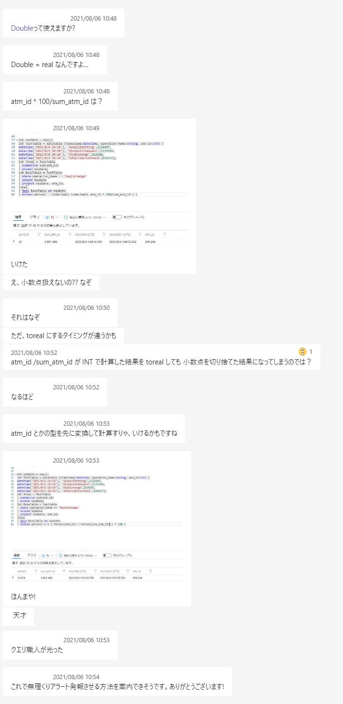
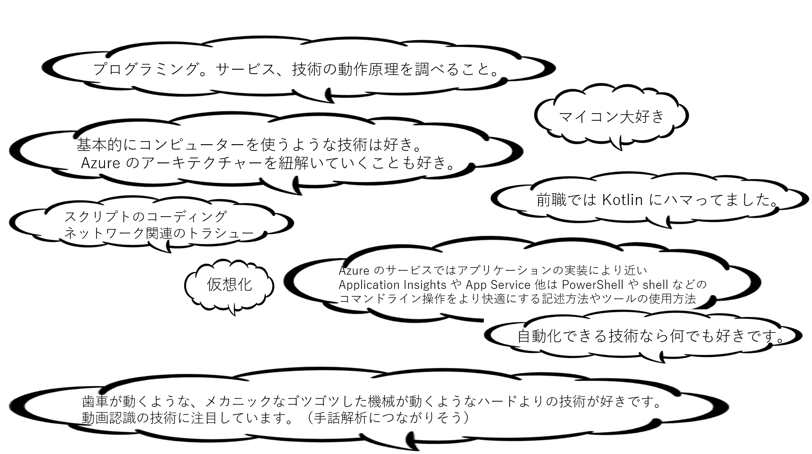

こんにちは！Azure Monitoring & Integration チームの猪股です。
現在わたしたちのチームでは、一緒に Azure サポートを盛り上げていってくださるメンバーを絶賛大募集中です！！
今日は、私たちのチームの普段のようすや雰囲気について紹介いたします。
<!-- more -->

## 目次
- [チームのようす、雰囲気](#チームのようす、雰囲気)
- [Voices from our team](#Voices-from-our-team)
- [このチームを選んだ理由は？？](#このチームを選んだ理由は？？)
- [～ ある日のチャットより ～](#～-ある日のチャットより-～)
- [チーム メンバーの技術志向エリア](#チーム-メンバーの技術志向エリア)

## チームのようす、雰囲気
現在はそれぞれ自宅からフル リモートで仕事しています。わたしも入社して 1 年 4 ヶ月経ちますが、入社してから 2 回 (入社日含む。面接ですら全部オンラインでした) しかオフィスに行ったことないです。ほとんど Teams のチャットや電話で対応できますし、そのような環境が整っており、またチームみんなからのサポートで仕事を進めることができます。

__お陰様で Azure 事業は好調であり、チームも今伸び盛りの状況で更に一緒に Azure Monitoring & Integration サポートを盛り上げていける仲間を募集しています !!!__

## ***Voices from our team***

> 和気藹々とした雰囲気。 困ったこと、相談事があれば、みんなが積極的に助けてくれる。

> 仲良く、冗談を言い合いながらチームみんなで課題に向かっていくよい雰囲気

> 入社歴が短い人が半数以上で、和気あいあいとやっている雰囲気 。冷たい感じは全くしない 。アットホームな職場です＾＾

> みんな協力的で、困ったことがあったらすぐにアドバイスをもらえる。

> あだ名で呼び合っていたり、業務外でのチャットなどでの交流が多かったりと、とても仲の良い雰囲気

> お問い合わせ対応について私から相談すること、相談をチーム宛にいただく事が多いのですが、 普段から業務内外問わず会話が多く皆さん優しいのでお話しやすいです。 ワーク フロム ホームが一般的な時代になっていますが、仲がいいので疎外感等感じる事はないです。

> オープン わきあいあい！

> 意見交換しやすい雰囲気です。さりげなく質問することができて、お互いに助け合う雰囲気です。

> オープン、フレンドリーでカジュアル。みんなでワイワイざっくばらんに盛り上がる感じ

## ***このチームを選んだ理由は？？***

> Azure Autmation に興味を持ったため。

> Monitoring では Azure の様々なサービスの監視を機能なので、Azure を総合的に学ぶのにはとてもいいポジションだと思いました。

> ログを扱うという事でジャンル問わず様々な製品に関連した業務ができると思ったので。

> Azure を Deep に身に着けるためです。

> zabbix とか触っていてサーバー運用していたので、技術エリア的に近いと思ったので

## ***～ ある日のチャットより ～***
Teams のチャットで困りごとや相談事項、雑談などみなそれぞれのペースで気楽にコミュニケーションとっています :-)

## ***チーム メンバーの技術志向エリア***
どんな Tech が好きか、チーム メンバーに聞いてみました！みんないろんな方向性に興味のベクトルがある感じです☆

<!--
> プログラミング。サービス、技術の動作原理を調べること。
> マイコン大好き
> 基本的にコンピューターを使うような技術は好き。 Azure のアーキテクチャーを紐解いていくことも好き。
> 前職では Kotlin にハマってました。
> 歯車が動くような、メカニックなゴツゴツした機械が動くようなハードよりの技術が好きです。 動画認識の技術に注目しています。（手話解析につながりそう）
> 仮想化
> Azure のサービスではアプリケーションの実装により近い Application Insights や App Service 他は PowerShell や shell などのコマンドライン操作をより快適にする記述方法やツールの使用方法
> 自動化できる技術なら何でも好きです。
> スクリプトのコーディング　ネットワーク関連のトラシュー
-->

## 関連記事
Azure Monitoring & Integration チームの紹介記事は第 1 弾から第 5 弾まで公開しています。
以下のリンクから、その他の記事も是非一緒にご覧ください！

- [<第 1 弾> Azure Monitoring & Integration チームについて](https://jpazmon-integ.github.io/blog/general/AboutMonandIntg/)
- [<第 2 弾> Azure Monitoring & Integration チームについて リモート ワークでの働き方](https://jpazmon-integ.github.io/blog/general/HowWeWorkRemotely/)
- [<第 3 弾> Azure Monitoring & Integration チームのようす、雰囲気について](https://jpazmon-integ.github.io/blog/general/OurTeamAtmosphere/)
- [<第 4 弾> インターン生から見た Azure Monitoring & Integration チーム](https://jpazmon-integ.github.io/blog/general/TeamIntroductionfromInternship/)
- [<第 5 弾> Azure Monitoring & Integration チームについて～一緒に働く仲間を募集しています～](https://jpazmon-integ.github.io/blog/general/JoinUs/)

以上、Monitoring & Integration チーム紹介 Blog の第 3 弾でした！
